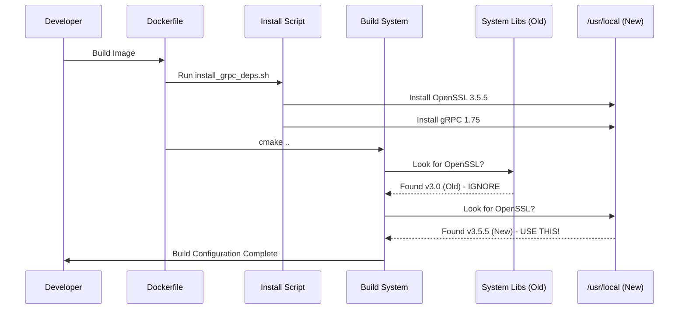

# Chapter 6: PQC Dependency Environment

Welcome to the final chapter of our PQC tutorial series!

In the previous chapter, [TLS Metrics Observer](05_tls_metrics_observer.md), we built a monitoring system to verify that our connections are truly secure. We have a working application that speaks the language of the future.

However, we have a problem.

## The Motivation: "It Works on My Machine"

If you try to send the code we wrote in Chapters 1-5 to a friend, they probably won't be able to run it. Why?

**Post-Quantum Cryptography is bleeding-edge technology.**
*   Standard Linux systems use **OpenSSL 3.0** (or older).
*   Our project requires **OpenSSL 3.5+** to use algorithms like ML-KEM (Kyber).
*   Our project requires a specific version of **gRPC** that links against that specific OpenSSL.

If your friend tries to compile the code using their system's default libraries, it will fail.

**The Solution:** We create a **PQC Dependency Environment**.
Instead of asking the user to "go download 5 different libraries and compile them for 3 hours," we provide an automated environment—a "Space Suit" for our code—that guarantees everything is the correct version.

## Concept 1: The Enforcer (CMake Checks)

The first line of defense is our build system. We need to tell the compiler: "Do not even try to build this unless the computer has the Quantum-Safe libraries."

We use **CMake Modules** to enforce this.

### The Check Logic
In `cmake/FindOpenSSL35.cmake`, we write a strict rule.

```cmake
# Try to find OpenSSL version 3.5 specifically
find_package(OpenSSL 3.5 REQUIRED)

if (NOT OpenSSL_FOUND)
  # Stop the build immediately with a helpful error
  message(FATAL_ERROR "OpenSSL >= 3.5 is required for PQC!")
endif()

# If found, set a flag so our C++ code knows it's safe
add_compile_definitions(OPENSSL_35_AVAILABLE)
```

**Explanation:**
1.  `find_package`: This scans the computer's directories.
2.  `REQUIRED`: If it's missing, CMake crashes intentionally. This saves the user from obscure compilation errors later.

## Concept 2: The Automator (Install Scripts)

Since most computers *don't* have OpenSSL 3.5, we need to provide a way to get it.

Manually compiling OpenSSL and gRPC is very hard. You have to configure flags, paths, and linkers. We abstract this away into a shell script: `scripts/install_grpc_deps.sh`.

This script acts like a "Meal Kit" delivery. Instead of making you hunt for ingredients, we put everything in one box.

### How the Script Works (Simplified)

```bash
#!/bin/bash
# scripts/install_grpc_deps.sh

# 1. Download OpenSSL 3.5 source code
wget https://www.openssl.org/source/openssl-3.5.5.tar.gz

# 2. Compile it with PQC support enabled
./Configure --prefix=/usr/local/pqc
make -j4 install

# 3. Download and Compile gRPC, linking against our new OpenSSL
cmake .. -DgRPC_SSL_PROVIDER=package
make -j4 install
```

**The Result:**
The user just runs one command: `bash scripts/install_grpc_deps.sh`.
Twenty minutes later, their system is ready for Quantum development.

## Concept 3: The Capsule (Docker)

Scripts change the user's computer, which some people don't like. The cleanest solution is **Docker**.

We create a `Dockerfile`. This is a recipe to build a virtual computer inside your computer.

1.  **Start:** Ubuntu 24.04 (Base OS).
2.  **Add:** Our `install_grpc_deps.sh` script.
3.  **Add:** Our PQC Application code.

This creates a **Container**. It guarantees that whether you are on Windows, Mac, or Linux, the code runs in the *exact* same environment.

## Solving the Use Case

Let's look at how a developer uses this environment to build the project safely.

### Option A: The Docker Approach (Recommended)
This is the "Zero-Configuration" method.

```bash
# 1. Build the container (It runs the install scripts inside)
docker build -t pqc-app -f docker/Dockerfile .

# 2. Run the tests inside the container
docker run -it pqc-app
```

**Output:**
```text
[  PASSED  ] 1 test.
```

### Option B: The Local Script Approach
If you want to develop directly on your machine.

```bash
# 1. Run our helper script to set up your PC
sudo bash scripts/install_grpc_deps.sh

# 2. Configure CMake (it will now find the libraries)
cmake -B build

# 3. Build
cmake --build build
```

**Explanation:**
By abstracting the complex installation process, we made a very difficult task (setting up a PQC environment) as simple as running one command.

## Under the Hood: The Dependency Flow

How does the system ensure the application links to the *new* OpenSSL and not the *old* system one?



### The Docker Implementation
Let's look at the actual `Dockerfile` to see how we layer these concepts.

#### Step 1: The Base and Tools
```dockerfile
FROM ubuntu:24.04

# Install basic tools (compiler, curl, git)
RUN apt-get update && apt-get install -y build-essential cmake git curl
```

#### Step 2: The PQC Foundation
Here, we manually build OpenSSL because `apt-get install openssl` would give us the old version.

```dockerfile
# Download and install OpenSSL 3.5.5 manually
RUN wget https://www.openssl.org/source/openssl-3.5.5.tar.gz && \
    tar xzf openssl-3.5.5.tar.gz && \
    cd openssl-3.5.5 && \
    ./Configure --prefix=/usr/local && \
    make install
```

#### Step 3: The Middle Layer (gRPC)
Now we run our helper script. It detects the OpenSSL we just installed and builds gRPC against it.

```dockerfile
COPY . /PQC
RUN bash /PQC/scripts/install_grpc_deps.sh
```

#### Step 4: The Application
Finally, we build our actual project.

```dockerfile
# Build the PQC project using the environment we created
RUN cmake -B build -DCMAKE_PREFIX_PATH=/usr/local && \
    cmake --build build
```

## Why is this an "Abstraction"?

You might think this is just "DevOps." But in the context of PQC, the **Environment is a dependency**.

*   Without the **Service Contracts** ([Chapter 1](01_service_contracts__protobuf_.md)), services can't talk.
*   Without the **Dependency Environment** (Chapter 6), the cryptography code literally cannot exist. The functions `EVP_PKEY_Q_keygen` (used in our Factory) are not present in older libraries.

This environment abstracts away the **Operating System**. It allows our application code to pretend that every computer in the world supports Post-Quantum Cryptography, even if they don't.

## Tutorial Conclusion

Congratulations! You have completed the **PQC Project Tutorial**.

Let's review the system you have built:

1.  **[Service Contracts](01_service_contracts__protobuf_.md):** You defined a strict language for your services using Protobuf.
2.  **[TLS Credentials Factory](02_tls_credentials_factory.md):** You created a centralized place to generate secure, PQC-enabled connection settings.
3.  **[Certificate Loader](03_certificate_loader.md):** You abstracted file I/O to easily load keys from any location.
4.  **[PQC Validation Suite](04_pqc_validation_suite.md):** You built tests to prove the security is real.
5.  **[TLS Metrics Observer](05_tls_metrics_observer.md):** You added visibility into the black box of encryption.
6.  **[PQC Dependency Environment](06_pqc_dependency_environment.md):** You packaged it all into a portable, reproducible container.

You now have a robust, quantum-safe microservice architecture. While the mathematics of Post-Quantum Cryptography are incredibly complex, the software architecture we built here makes using it simple, safe, and maintainable.

**Where to go from here?**
You can now try adding more services, experimenting with different PQC algorithms (like Falcon or Sphincs+), or deploying your Docker container to a cloud cluster!

Thank you for following along!

---

Generated by [Code IQ](https://github.com/adityasoni99/Code-IQ)