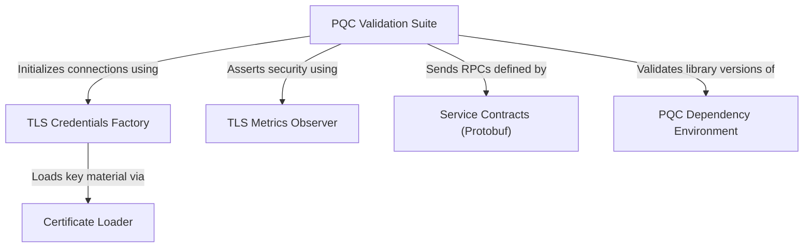

# Tutorial: PQC

This project implements a **Post-Quantum Cryptography (PQC)** enabled microservices architecture using gRPC and C++. It specifically utilizes **OpenSSL 3.5** to upgrade standard TLS connections to use **hybrid key exchange** (combining classical algorithms with Quantum-Safe algorithms like ML-KEM). The system includes a robust infrastructure for managing dependencies, loading certificates, and **verifying** that the cryptographic handshake on the wire is genuinely resistant to future quantum attacks.

**Source Repository:** [https://github.com/adityasoni99/PQC.git](https://github.com/adityasoni99/PQC.git)

## Chapters

1. [Service Contracts (Protobuf)](01_service_contracts__protobuf_.md)
2. [TLS Credentials Factory](02_tls_credentials_factory.md)
3. [Certificate Loader](03_certificate_loader.md)
4. [PQC Validation Suite](04_pqc_validation_suite.md)
5. [TLS Metrics Observer](05_tls_metrics_observer.md)
6. [PQC Dependency Environment](06_pqc_dependency_environment.md)

---

Generated by [Code IQ](https://github.com/adityasoni99/Code-IQ)