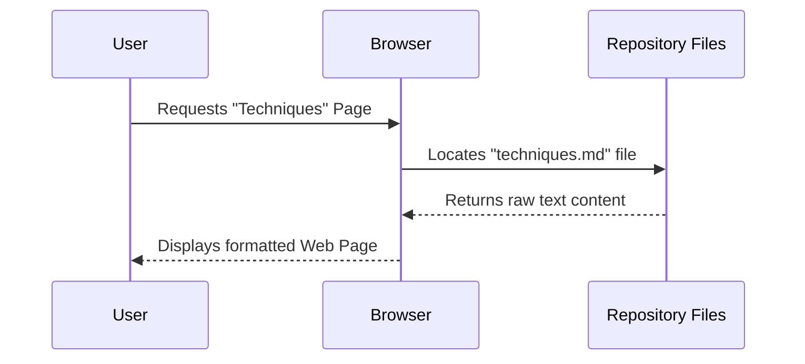

# Chapter 1: Project Overview

Welcome to the **Prompt Engineering Guide**! If you are looking to understand how to talk to Artificial Intelligence (AI) effectively, you have arrived at the right place.

Think of this project as a massive, open-source library dedicated entirely to the art and science of "Prompt Engineering."

### The Motivation: Why does this exist?

Imagine you have a super-smart robot assistant (like ChatGPT or Claude). You ask it to "write a story." The robot writes a generic, boring story. You are disappointed.

Now, imagine you have a manual that tells you exactly how to phrase your request: *"Write a suspenseful sci-fi story set on Mars, focusing on a detective searching for water."* Suddenly, the robot gives you exactly what you wanted.

**The Problem:** Talking to AI (LLMs) is powerful but tricky. Information on how to do it well is scattered all over the internet.

**The Solution:** The **Prompt Engineering Guide** developed by DAIR.AI collects guides, research papers, techniques, and tools into one central repository.

### Key Concepts

Before we dive into the files, let's clarify three main concepts you will see throughout this tutorial.

1.  **Prompt Engineering:** This is simply the skill of crafting inputs (prompts) to get the best possible output from an AI model.
2.  **The Repository:** This is the project folder containing all the text files, images, and website code that make up the guide.
3.  **DAIR.AI:** The organization maintaining this project. It is "Open Source," meaning people from all over the world help improve it.

---

### Use Case: Finding a Solution

Let's look at a concrete example of how to use this project.

**Goal:** You want to summarize a long legal document, but the AI keeps missing important details. You need a better strategy.

**How to use the Guide:**
1.  You navigate to the **Techniques** section of the project.
2.  You find a concept called "Chain-of-Thought."
3.  You apply it to your prompt.

#### Example Input (Your Prompt)

Instead of just pasting the document, the guide teaches you to structure it like this:

```text
Document: [Insert Long Legal Text Here]

Instruction: First, list the key dates mentioned. 
Second, identify the parties involved. 
Finally, write a summary based on those dates and parties.
```

#### High-Level Output

By following the guide, the AI now "thinks" step-by-step (dates -> parties -> summary) and provides a highly accurate summary, solving your problem.

---

### Under the Hood: How the Project Works

While this project looks like a website to the user, under the hood, it is a collection of Markdown (`.md` or `.mdx`) files organized in a specific folder structure.

When you visit the Prompt Engineering Guide website, the technical stack reads these text files and turns them into pretty web pages.

#### Sequence Diagram

Here is a simplified view of what happens when a user wants to read a guide:



### Project Structure

To understand how this repository is organized, we look at the file structure. This helps you know where to look to find specific information or where to contribute if you want to help write the guide.

Here is a simplified view of the project's root folder:

```text
root/
├── pages/              # The actual content of the guide
├── public/             # Images and assets
├── theme.config.tsx    # Website layout settings
├── next.config.js      # Technical configuration
└── README.md           # Introduction file
```

*   **pages/**: This is where the magic happens. All the chapters you read are stored here.
*   **theme.config.tsx**: This controls how the site looks (colors, logo).
*   **next.config.js**: This handles how the site is built.

We will dive deeper into the technical setup in [Technical Stack](09_technical_stack.md).

### The Content Hierarchy

The most important part of this project is the content. The guide is split into several logical sections to help you go from beginner to expert.

In the next few chapters, we will explore these specific folders found inside the `pages/` directory:

1.  **Introduction:** The basics of LLMs.
2.  **Techniques:** Advanced strategies (like Zero-shot, Few-shot).
3.  **Applications:** Real-world use cases (coding, creative writing).
4.  **Models:** Specifics about GPT-4, Llama, etc.

You can learn more about how the introduction is structured in [Content Structure - Introduction](02_content_structure___introduction.md).

### Summary

In this chapter, we learned:
*   **What this project is:** A comprehensive resource for learning how to talk to AI.
*   **Why it helps:** It solves the problem of scattered information by organizing techniques in one place.
*   **How it works:** It is a collection of Markdown files rendered into a website.

You are now ready to explore the contents of the guide!

[Next Chapter: Content Structure - Introduction](02_content_structure___introduction.md)

---

Generated by [Code IQ](https://github.com/adityasoni99/Code-IQ)