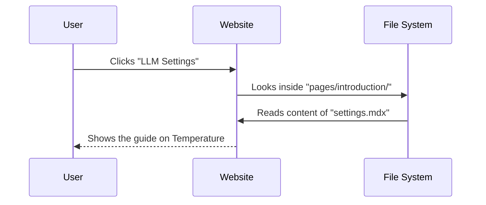

# Chapter 2: Content Structure - Introduction

In the previous chapter, [Project Overview](01_project_overview.md), we looked at the big picture of the Prompt Engineering Guide repository. We learned that this project is a library of text files that gets turned into a website.

Now, we are going to open the first "door" of this library: **The Introduction Section**.

This section handles the absolute basics. If you have ever wondered, "Why did the AI say that?" or "How do I make it more creative?", the answers lie in the files within this chapter.

### The Motivation: Controlling the Chaos

Imagine you are using an AI to write a greeting card for your best friend.

**The Problem:**
You type: *"Write a poem for a friend."*
The AI writes: *"Roses are red, violets are blue, you are my friend, and I like you."*

It is boring and generic. You try again, and it gives you the exact same result. You feel stuck.

**The Solution:**
You need to understand **LLM Settings** (specifically "Temperature"). Think of this as a volume knob for "Creativity." The **Introduction** section of the guide explains how to find and turn this knob.

### Key Concepts

This section of the repository is broken down into three fundamental concepts.

1.  **Prompting Basics:** The "Hello World" of talking to AI. It explains that a prompt is just the text you send to the model.
2.  **Prompt Elements:** The anatomy of a good request. A good prompt usually has an *Instruction* ("Summarize this") and *Context* ("The text is about space").
3.  **LLM Settings:** Technical configurations that change how the AI behaves without changing your words. The most common is **Temperature**.

---

### Use Case: Making the AI "Creative"

Let's solve the greeting card problem using the concepts found in this section.

**Goal:** Generate a wacky, unique poem.

**How to use the Guide:**
1.  Navigate to the `introduction` folder.
2.  Read the guide on **LLM Settings**.
3.  Learn about **Temperature**.

#### The Concept: Temperature

*   **Low Temperature (0.1):** The AI is focused, robotic, and repetitive. Good for math or facts.
*   **High Temperature (0.9):** The AI takes risks. It is creative, surprising, and sometimes random. Good for poetry or brainstorming.

#### Example Input (Configuration)

If you were using code (like Python) to talk to OpenAI, the guide teaches you to setup your request like this:

```python
# We want high creativity, so we set temperature to 0.9
response = openai.ChatCompletion.create(
  model="gpt-3.5-turbo",
  messages=[{"role": "user", "content": "Write a poem for a friend."}],
  temperature=0.9  # <--- The magic setting
)
```

#### High-Level Output

Because we turned the "Temperature" up (as taught in this section), the AI output changes from "Roses are red" to something like:

> *"In the galaxy of friendship, you are a neon star,
> Shining brighter than a quasar, seen from afar!"*

---

### Under the Hood: Folder Structure

How does the project organize these lessons? If you look inside the project repository, you will find a folder named `pages/introduction`.

This folder contains the actual Markdown files that explain these concepts.

```text
pages/
└── introduction/           # The folder for Chapter 2 concepts
    ├── basics.mdx          # Explains what a prompt is
    ├── elements.mdx        # Explains Instruction vs Context
    ├── settings.mdx        # Explains Temperature & Top P
    └── tips.mdx            # General advice
```

When you click "Introduction" on the website sidebar, the system looks into this folder.

#### Sequence Diagram: Fetching the Settings Guide

Here is what happens when a user wants to learn about "Temperature":



### Implementation Details

Let's peek inside one of these files. If you open `pages/introduction/settings.mdx`, you won't see complex code. You will see text explaining technical concepts in simple terms.

However, the file starts with a special header called **Frontmatter**.

#### File: `pages/introduction/settings.mdx`

```markdown
---
title: LLM Settings
description: Understanding Temperature and Top P
---

# LLM Settings

One of the most important settings is **Temperature**.

Think of Temperature as a "Risk-Taking" slider...
```

*   **Between the `---` lines:** This is metadata. The website uses the `title` to label the link in the sidebar.
*   **Below the lines:** This is the content you actually read.

#### Understanding Prompt Elements

Another crucial file in this structure is `elements.mdx`. It teaches that a prompt isn't just one sentence. It breaks a prompt down into parts.

The guide teaches you to structure prompts like this (in your head or code):

```text
[Instruction]: Classify the text below.
[Context]: The text is a customer review.
[Input Data]: "I loved this product!"
[Output Indicator]: Sentiment:
```

*   **Instruction:** What to do.
*   **Context:** Background info.
*   **Input Data:** The actual content to process.

By separating these, the AI understands you better.

### Summary

In this chapter, we explored the **Introduction** section of the Content Structure.

*   **We learned:** That prompts have specific elements (Instruction, Context) and settings (Temperature).
*   **We saw:** That high temperature makes AI creative, and low temperature makes it factual.
*   **We located:** The files for these lessons live in `pages/introduction/`.

Now that we understand the basics of *how* to construct a prompt and configure the model, we are ready to learn specific *strategies* to make the AI smarter.

[Next Chapter: Content Structure - Techniques](03_content_structure___techniques.md)

---

Generated by [Code IQ](https://github.com/adityasoni99/Code-IQ)