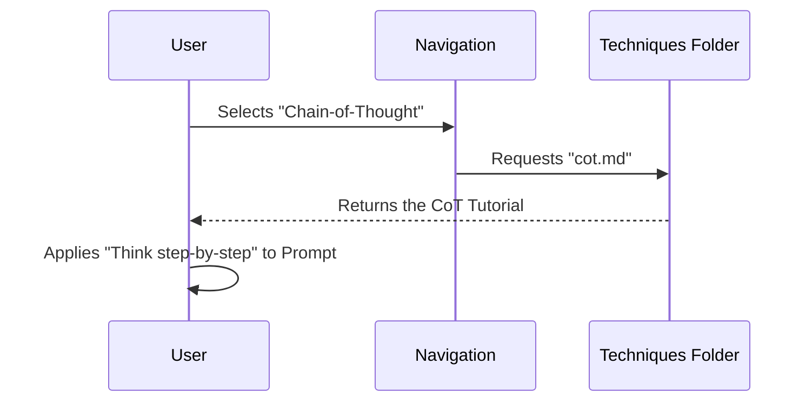

# Chapter 3: Content Structure - Techniques

In the previous chapter, [Content Structure - Introduction](02_content_structure___introduction.md), we learned the basics of a prompt (Instruction and Context) and how to adjust settings like Temperature.

Now, we are entering the "Advanced Kitchen."

If Chapter 2 was about learning how to turn on the stove, **Chapter 3** is about specific recipes. In the context of AI, we call these recipes **Techniques**. These are proven strategies to make the AI solve complex logic, math, and reasoning problems.

### The Motivation: When the AI "Hallucinates"

Imagine you are asking the AI to solve a tricky riddle.

**The Problem:**
You ask: *"I have 3 apples. I eat 2. I buy 5 more. How many do I have?"*
A basic, un-tuned AI might rush to answer and say: *"You have 8 apples."* (It simply did 3+5, missing the subtraction).

**The Solution:**
You need a technique to force the AI to slow down. You don't just want an answer; you want the *reasoning*. This chapter introduces techniques like **Few-Shot Prompting** and **Chain-of-Thought** that force the AI to show its work, drastically increasing accuracy.

### Key Concepts

This section of the repository (`pages/techniques/`) covers a spectrum of strategies, moving from simple to complex.

1.  **Zero-Shot:** asking the AI to do something without any examples.
2.  **Few-Shot:** Giving the AI a few examples of what you want before asking your question.
3.  **Chain-of-Thought (CoT):** Asking the AI to "think step-by-step" to solve logic puzzles.
4.  **Advanced (RAG, ReAct):** Methods where the AI looks up external information or uses software tools.

---

### Use Case: Solving Logic Puzzles

Let's stick with our math problem. We want to ensure the AI gets the answer right every time.

**Goal:** Accurately solve a multi-step word problem.

**How to use the Guide:**
1.  Navigate to the **Techniques** section.
2.  Find the guide on **Few-Shot Prompting**.
3.  Find the guide on **Chain-of-Thought**.

#### Technique 1: Zero-Shot (The Default)

This is what most beginners do. You just throw the question at the model.

```text
Q: Roger has 5 tennis balls. He buys 2 more cans of tennis balls. 
Each can has 3 balls. How many tennis balls does he have now?
A:
```

*Result:* The AI might guess `7` (5 + 2) because it didn't pay attention to the word "cans."

#### Technique 2: Few-Shot Prompting (The Upgrade)

The guide teaches you that providing examples (shots) sets a pattern for the AI to follow.

```text
Q: I have 10 socks. I lose 2. How many do I have?
A: 8

Q: Roger has 5 tennis balls. He buys 2 more cans of tennis balls. 
Each can has 3 balls. How many tennis balls does he have now?
A:
```

*Result:* Because you gave an example of a math Q&A, the AI understands it needs to perform a calculation. It is now more likely to say `11`.

#### Technique 3: Chain-of-Thought (The Expert Mode)

This is the most popular technique in modern prompt engineering. You explicitly tell the AI to break it down.

```text
Q: Roger has 5 tennis balls... (rest of question)

A: Let's think step by step.
1. Roger starts with 5 balls.
2. 2 cans * 3 balls per can = 6 new balls.
3. 5 + 6 = 11.
The answer is 11.
```

*Result:* Perfect accuracy. The phrase "Let's think step by step" acts like a magic spell that improves reasoning.

---

### Under the Hood: File Organization

How is this knowledge organized in the repository? These techniques are stored in the `pages/techniques` folder.

Unlike the Introduction, which was general, these files are highly specific.

```text
pages/
└── techniques/
    ├── zeroshot.md         # The "No Example" method
    ├── fewshot.md          # The "Example-Based" method
    ├── cot.md              # Chain-of-Thought
    ├── rag.md              # Retrieval Augmented Generation
    └── react.md            # Reason + Act
```

When you click "Techniques" in the navigation bar of the website, the system is fetching these specific Markdown files.

#### Sequence Diagram: Learning a Technique

Here is the flow when a user wants to learn how to make an AI "Think":



### Implementation Details

Let's look at how the **Few-Shot** guide is written inside `pages/techniques/fewshot.md`.

The guide uses a standard format to explain the technique: **Definition** -> **Example** -> **Tips**.

#### File Content: `fewshot.md`

```markdown
# Few-Shot Prompting

**Definition:**
Providing a set of examples (shots) to the model to guide its generation.

**Standard Prompt:**
<Example Input 1> -> <Example Output 1>
<Example Input 2> -> <Example Output 2>
<Target Input> ->
```

The guide explains that the "shots" act as training data inside the prompt window.

#### Advanced Technique: RAG (Retrieval Augmented Generation)

The file `rag.md` describes a more complex concept.

*   **Analogy:** If `Zero-Shot` is taking a test from memory, `RAG` is taking an "Open Book" test.
*   **How it works:** You don't just ask the AI a question. You attach the "textbook" (your specific data) to the prompt so the AI can look up the answer.

**Conceptual Code for RAG:**

```python
# Simplified RAG Prompt Structure
query = "What is the company vacation policy?"
context = "Policy Document: Employees get 20 days off..." # Retrieved from database

prompt = f"""
Context: {context}
Question: {query}
Answer using only the context above:
"""
```

The guide explains that by adding the `Context` variable (the retrieved info), you prevent the AI from making things up.

### Summary

In this chapter, we opened the toolbox of **Content Structure - Techniques**.

*   **We learned:** That specific prompting styles change *how* the AI thinks.
*   **The Toolbox:**
    *   **Zero-Shot:** Just asking.
    *   **Few-Shot:** Teaching by example.
    *   **Chain-of-Thought:** Forcing step-by-step logic.
*   **The Files:** These guides are located in `pages/techniques/`.

Now that we know *how* to prompt technically, let's look at *what* we can build with these skills.

[Next Chapter: Content Structure - Applications](04_content_structure___applications.md)

---

Generated by [Code IQ](https://github.com/adityasoni99/Code-IQ)