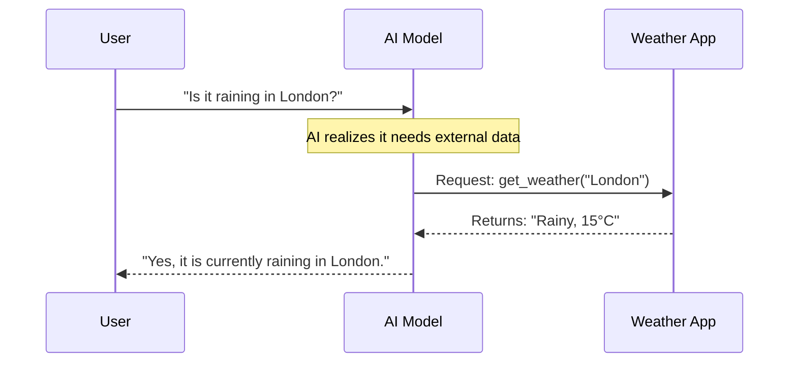

# Chapter 4: Content Structure - Applications

In the previous chapter, [Content Structure - Techniques](03_content_structure___techniques.md), we filled our toolbox with strategies like "Few-Shot" and "Chain-of-Thought." We learned *how* to speak to the AI to make it smarter.

Now, we ask: **"What can we actually build with this?"**

Welcome to **Chapter 4**, where we explore the **Applications** folder. This section moves from theory to practice, showing you how to use AI to write code, generate test data, or even control other software.

### The Motivation: Turning Talk into Action

Knowing how to prompt is like knowing how to use a hammer. It is useful, but only if you have something to build.

**The Problem:**
You have a great AI model. You ask it to "write a program." It writes code that doesn't work. Or, you ask it to "act as a customer service agent," but it doesn't know how to look up order numbers.

**The Solution:**
The **Applications** section of the guide provides specific "blueprints" for real-world tasks. It teaches you not just to chat with the AI, but to use the AI as an engine to power specific jobs.

### Key Concepts

In the `pages/applications` folder of the repository, the guides are grouped into specific use cases. Here are the three most common ones:

1.  **Generating Data:** Using AI to create realistic "fake" data (synthetic data) to test your apps.
2.  **Coding:** Using AI as a pair programmer to write, debug, and explain code.
3.  **Function Calling:** The bridge between AI and code. This allows the AI to "press buttons" in your software (like sending an email or querying a database).

---

### Use Case: Creating Synthetic Data

Let's look at a concrete example. Imagine you are building a new app, and you need a database of 100 users to test it. You cannot use real people's data because of privacy laws.

**Goal:** Generate realistic, fake user profiles immediately.

**How to use the Guide:**
1.  Navigate to the **Applications** section.
2.  Find the guide on **Generating Data**.
3.  Apply the pattern to your prompt.

#### The Prompt Strategy

Instead of asking "Give me some names," the guide teaches you to specify the *format* (like JSON) and the *structure*.

```text
Instruction: Generate 3 synthetic user profiles.
Format: JSON
Fields: id, name, email, job_title
Context: These users work in a tech startup.
```

#### High-Level Output

Because you specified the application (Data Generation) and the format, the AI becomes a data factory:

```json
[
  {"id": 1, "name": "Alice Chen", "job_title": "Frontend Dev"},
  {"id": 2, "name": "Bob Smith", "job_title": "Product Manager"},
  {"id": 3, "name": "Charlie Day", "job_title": "Data Analyst"}
]
```

This data is now ready to be pasted directly into your application for testing. This is also highly useful for **RAG (Retrieval Augmented Generation)**, where you might need to generate documents to test how well your search engine works.

---

### Use Case: Function Calling

This is one of the most powerful applications covered in the guide.

**The Concept:**
Normally, AI just outputs text. But what if you want the AI to check the weather? The AI cannot "see" the sky.

**Function Calling** is a technique where you describe a tool to the AI, and the AI decides if it needs to use it.

#### Conceptual Flow

1.  **You:** "What's the weather in Tokyo?"
2.  **AI (Internal Thought):** "I don't know, but I have a tool called `get_weather`."
3.  **AI (Output):** It outputs a specific code command: `call: get_weather("Tokyo")`.
4.  **Your App:** Runs that code and gives the answer back to the AI.

### Under the Hood: File Structure

Where do these blueprints live? If you explore the project repository, you will find the `pages/applications` directory.

```text
pages/
└── applications/
    ├── generating.md       # How to make synthetic data
    ├── coding.md           # How to use AI for programming
    ├── function_calling.md # Connecting AI to tools
    └── chatbots.md         # Building conversational agents
```

When you browse the "Applications" section on the website, the system loads these files to show you the specific patterns for each job.

#### Sequence Diagram: The Function Calling Flow

Here is a simplified view of how an "Application" type prompt works when connecting to tools:



### Implementation Details

Let's peek inside `pages/applications/coding.md`. This file explains how to handle code generation specifically.

It teaches that when asking for code, you should specify the **Language** and the **Edge Cases**.

#### Example Code Block (From the Guide)

The guide might show you a prompt template like this:

```python
# A prompt template for coding applications
prompt = """
Write a Python function to calculate the Fibonacci sequence.
Requirements:
1. Handle negative input efficiently.
2. Return a list of numbers.
3. Add comments explaining the logic.
"""
```

**Why this works:**
*   **Requirements:** By listing requirements (1, 2, 3), you treat the AI like a junior developer.
*   **Comments:** Explicitly asking for comments ensures the code is understandable.

### Summary

In this chapter, we explored **Content Structure - Applications**.

*   **We learned:** That prompts can do more than chat; they can build.
*   **Key Applications:**
    *   **Data Generation:** creating fake data for testing.
    *   **Coding:** Writing and fixing software.
    *   **Function Calling:** Letting AI trigger actions in other apps.
*   **The Files:** These guides are found in `pages/applications/`.

We have the techniques (Chapter 3) and the applications (Chapter 4). But there is one big variable left: **The Brain**. Not all AI models are created equal. Some are smart but slow; others are fast but simple.

[Next Chapter: Content Structure - Models](05_content_structure___models.md)

---

Generated by [Code IQ](https://github.com/adityasoni99/Code-IQ)