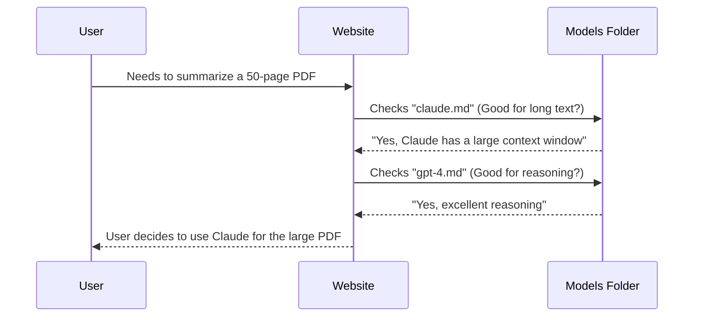

# Chapter 5: Content Structure - Models

In the previous chapter, [Content Structure - Applications](04_content_structure___applications.md), we learned how to use AI to build things like coding assistants and data generators. We focused on the *tasks* we want to perform.

Now, we must look at the *engine* performing those tasks. Welcome to **Chapter 5: Models**.

Just as you wouldn't use a race car to plow a field, you shouldn't use every AI model the same way. This section of the guide (`pages/models/`) helps you understand the specific strengths, weaknesses, and unique "languages" of different AI brains.

### The Motivation: Different Brains, Different Rules

Imagine you have a prompt that works perfectly on ChatGPT (GPT-4). You try to send the exact same prompt to a different model, like Meta's Llama 3 or Google's Gemini.

**The Problem:**
You paste your prompt. The new model gets confused. It gives you a short answer when you wanted a long one, or it refuses to answer at all.

**The Solution:**
Every AI model is trained differently. Some prefer direct commands; others prefer polite conversation. Some utilize special formatting tags (like XML), while others do not. The **Models** section acts as a manual for each specific "species" of AI, ensuring you get the best performance regardless of which one you use.

### Key Concepts

This section covers a wide range of models. We generally categorize them into two groups:

1.  **Proprietary Models:** These are owned by companies. You usually pay to access them via an API.
    *   **GPT-4 (OpenAI):** The famous all-rounder. Good at almost everything.
    *   **Claude 3 (Anthropic):** Known for being safe, handling very long documents, and writing naturally.
    *   **Gemini (Google):** Deeply integrated with Google's ecosystem and strong in reasoning.
2.  **Open Weights Models:** These are models you can often download and run yourself.
    *   **Llama (Meta):** The most popular open standard.
    *   **Mistral / Mixtral:** Highly efficient models from France.
    *   **Gemma:** Google's open version of Gemini.

---

### Use Case: Optimizing for "Claude"

Let's look at a concrete example of how using the **Models** guide helps you change your strategy.

**Goal:** You want the AI to analyze a document and extract specific data.

**How to use the Guide:**
1.  You navigate to the **Models** section.
2.  You select **Claude**.
3.  You learn that Claude loves **XML tags** (text inside `< >` brackets) to separate data.

#### The "Generic" Prompt (Might confuse Claude)

```text
Read the following text and tell me the main character.
Text: "Alice fell down the rabbit hole..."
```

#### The "Claude-Optimized" Prompt

Based on the guide, you rewrite the prompt to use XML tags. This helps Claude clearly see where the instructions end and the text begins.

```text
Please analyze the text provided within the <text> tags.
Extract the name of the main character.

<text>
Alice fell down the rabbit hole...
</text>
```

#### High-Level Output

By following the model-specific guide, Claude understands the boundary perfectly. It ignores the "Alice" inside the text as part of the instruction and treats it purely as data to analyze, resulting in higher accuracy.

---

### Under the Hood: File Organization

Where does this specific knowledge live in the project? If you look inside the repository, you will find the `pages/models` folder.

This folder contains a dedicated Markdown file for each major model family.

```text
pages/
└── models/
    ├── gpt-4.md            # OpenAI's models
    ├── gemini.md           # Google's models
    ├── llama.md            # Meta's Llama models
    ├── claude.md           # Anthropic's Claude
    ├── mistral.md          # Mistral AI
    └── flan.md             # Older research models
```

When you click "Models" -> "Claude" on the website sidebar, the system renders `pages/models/claude.md`.

#### Sequence Diagram: Finding the Right Model

Here is how a user interacts with this section to make a decision:



### Implementation Details

Let's peek inside `pages/models/llama.md`. Open-source models like Llama often require more technical setup than ChatGPT.

The guide for Llama explains that you need to use a specific **Prompt Template**. You cannot just send text; you have to wrap it in special codes so the AI knows who is talking.

#### Example: Llama 2 Format

The guide teaches you that Llama expects `[INST]` tags to mark the user's instruction.

```text
<s>[INST] <<SYS>>
You are a helpful assistant.
<</SYS>>

Hi there! [/INST] Hello! How can I help? </s>
```

*   **`[INST]`**: Starts the user instruction.
*   **`<<SYS>>`**: Starts the "System Prompt" (the hidden rules for the AI).
*   **`</s>`**: Tells the model the turn is over.

If you miss these tags, Llama might just repeat your question back to you instead of answering it! The **Models** chapter provides these templates so you can copy and paste them.

### Benchmarks and Comparisons

Another key feature of the **Models** section is **Performance Benchmarks**.

*   **What are they?** Scores that tell you how smart a model is at math, coding, or language.
*   **Why use them?** If you are building a math app, you don't care if the model writes good poetry. You check the "Math" benchmark score in the guide to pick the winner.

The guide aggregates these scores from research papers so you don't have to hunt for them.

### Summary

In this chapter, we explored **Content Structure - Models**.

*   **We learned:** That "One Prompt Fits All" is a myth.
*   **The Solution:** Different models (Claude, Llama, GPT) need different prompt structures (XML tags, `[INST]` tags).
*   **The Resource:** The `pages/models/` folder contains specific manuals for each AI brain.

Now that we know how to use these powerful models, we must discuss safety. These models can be tricked into saying harmful things or leaking private data.

[Next Chapter: Content Structure - Risks & Misuses](06_content_structure___risks___misuses.md)

---

Generated by [Code IQ](https://github.com/adityasoni99/Code-IQ)