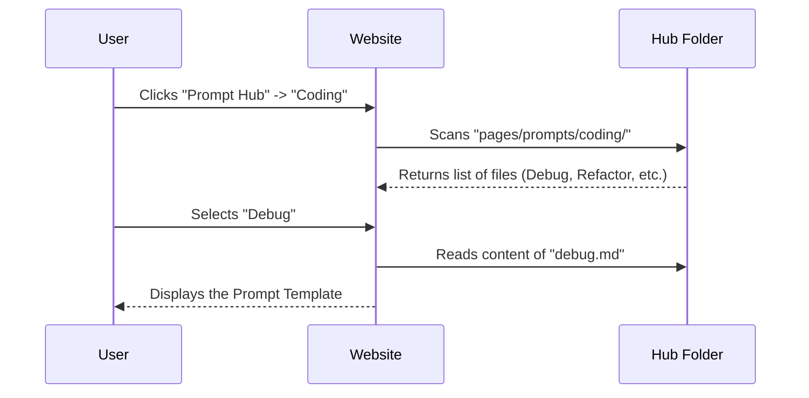

# Chapter 7: Content Structure - Prompt Hub

In the previous chapter, [Content Structure - Risks & Misuses](06_content_structure___risks___misuses.md), we learned how to protect our AI models from attacks and prevent them from making things up. We now know how to write safe, effective prompts.

But where do we put them?

Welcome to **Chapter 7: The Prompt Hub**.

If the previous chapters were about learning *cooking techniques*, this chapter is the **Recipe Book**. You don't want to reinvent the wheel every time you need to summarize an email or write Python code. You want a library of "Gold Standard" prompts that you can copy, paste, and use immediately.

### The Motivation: Preventing "Prompt Amnesia"

Imagine you spend two hours crafting the perfect prompt to fix grammar in a legal document. It works perfectly! You close your browser.

**The Problem:**
A week later, you need to do it again. You try to remember what you wrote: *"Fix grammar please?"* The AI gives you a bad result. You have lost the "magic words" you discovered last week.

**The Solution:**
The **Prompt Hub** is a centralized section of the guide dedicated to storing, organizing, and sharing the best prompts for specific tasks.

### Key Concepts

The Prompt Hub (`pages/prompts/`) is not a tutorial; it is a **Library**. It is organized by *intent*—what you want the AI to do.

Here are the four main shelves in this library:

1.  **Classification:** Prompts that sort things (e.g., "Is this email Spam or Not Spam?").
2.  **Coding:** Prompts for developers (e.g., "Debug this Python script," "Convert SQL to English").
3.  **Creativity:** Prompts for writers (e.g., "Write a sci-fi plot," "Generate a poem").
4.  **Evaluation:** Prompts that grade other AI outputs (e.g., "Did the AI answer the user's question correctly?").

---

### Use Case: The "Code Doctor"

Let's look at a concrete example of how a user interacts with the Prompt Hub.

**Goal:** You have a piece of computer code that is crashing, but you can't find the error. You need an expert eye.

**How to use the Hub:**
1.  Navigate to the **Prompt Hub** section of the website.
2.  Click on the **Coding** category.
3.  Select the **Code Debugger** prompt.
4.  Copy the prompt template.

#### The Prompt Template

Instead of just typing "Help me," the Hub gives you a structured template proven to work:

```text
Please act as a Senior Python Developer.
Analyze the code below for syntax errors and logical bugs.
Explain the error, then provide the fixed code.

Code:
[INSERT YOUR BROKEN CODE HERE]
```

#### High-Level Output

Because you used a prompt from the Hub, the AI adopts the persona of a "Senior Developer." It doesn't just say "It's broken." It explains *why* and fixes it.

**Result:**
> "The error is on line 3. You forgot a colon (`:`) after the `if` statement. Here is the corrected block..."

---

### Under the Hood: How the Hub is Organized

While the Hub looks like a gallery on the website, under the hood, it is a collection of simple text files arranged in folders.

When you contribute to the Prompt Engineering Guide, you are essentially adding a file to this folder structure.

#### The Folder Structure

Navigate to `pages/prompts/` in the repository to see the library:

```text
pages/
└── prompts/
    ├── classification/     # Folder for sorting tasks
    │   └── sentiment.md    # "Is this review happy or sad?"
    ├── coding/             # Folder for programming
    │   └── debug.md        # The "Code Doctor" prompt
    ├── creativity/         # Folder for writing
    │   └── storytelling.md # "Write a hero's journey"
    └── evaluation/         # Folder for grading
        └── truthfulness.md # "Is this text accurate?"
```

#### Sequence Diagram: Fetching a Prompt

Here is what happens when a user wants to find a specific prompt:



### Implementation Details

Let's look inside one of these files to understand how a "Hub Entry" is built. Open `pages/prompts/classification/sentiment.md`.

Each file in the hub has two parts:
1.  **Metadata (Frontmatter):** Information *about* the prompt (tags, description).
2.  **The Prompt:** The actual text you copy-paste.

#### File Content: `sentiment.md`

```markdown
---
title: Sentiment Analysis
description: Classify text as Positive, Neutral, or Negative.
tags: [classification, nlp, beginner]
---

# Sentiment Classifier

Copy the text below into your AI model:

```text
Classify the sentiment of the following text.
Respond with ONLY one word: "Positive", "Negative", or "Neutral".

Text: {Input Text Here}
```
```

**Why this structure matters:**
*   **Title & Description:** These help the website search bar find the prompt when you type "classify."
*   **Tags:** These allow users to filter by category (e.g., "Show me all `beginner` prompts").
*   **The Code Block:** This makes it easy for the user to click a "Copy" button on the website.

### Differentiating Hub vs. Applications

You might be wondering: *"How is this different from Chapter 4 (Applications)?"*

*   **[Content Structure - Applications](04_content_structure___applications.md):** Teaches you the *theory* and *architecture* of building a system (e.g., "How to connect AI to a weather database"). It is a tutorial.
*   **Content Structure - Prompt Hub:** Is a *clipboard*. It doesn't teach you how it works; it just gives you the text to copy. It is a resource.

### Summary

In this chapter, we explored the **Prompt Hub**.

*   **We learned:** That we need a central place to store "Gold Standard" prompts so we don't lose them.
*   **The Categories:** The Hub is split into folders like Classification, Coding, and Creativity.
*   **The Structure:** Each prompt is a Markdown file in `pages/prompts/` containing metadata and the copy-pasteable text.

We have now covered the guides (Introduction through Applications), the models, the risks, and the library of prompts.

But where does all this knowledge come from? It comes from scientific research. In the next chapter, we will look at the academic papers that made all of this possible.

[Next Chapter: Content Structure - Research & Papers](08_content_structure___research___papers.md)

---

Generated by [Code IQ](https://github.com/adityasoni99/Code-IQ)