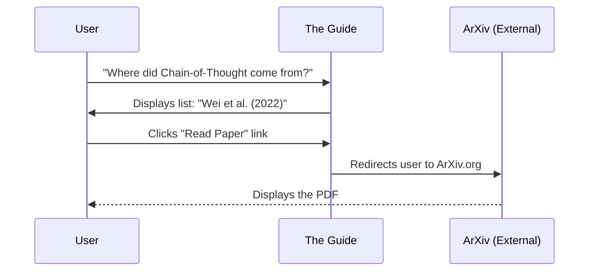

# Chapter 8: Content Structure - Research & Papers

In the previous chapter, [Content Structure - Prompt Hub](07_content_structure___prompt_hub.md), we explored the "Recipe Book" of the project—a library of copy-pasteable prompts to get jobs done quickly.

But where do these recipes come from? Who discovered that asking an AI to "think step-by-step" makes it smarter?

Welcome to **Chapter 8: Research & Papers**.

If the Prompt Hub is the **Kitchen** where we cook, the Research section is the **Laboratory** where the science is discovered. This section of the guide tracks the academic papers that define the field of Prompt Engineering.

### The Motivation: Separating Science from Rumors

Artificial Intelligence moves incredibly fast. Every day, people on Twitter or Reddit claim to have found a "magic word" that fixes everything.

**The Problem:**
You see a post claiming: *"If you tell the AI to take a deep breath, it solves math better."* Is this true? Or is it just a random guess?

**The Solution:**
The **Research & Papers** section is the source of truth. It curates peer-reviewed academic studies. When you read a technique here, you know it has been tested, measured, and proven by scientists at places like Google, OpenAI, or major universities.

### Key Concepts

This section of the repository (`pages/research/`) is less about "how-to" guides and more about "bibliography." It is organized to help you trace the history of ideas.

1.  **The Paper:** The original PDF document written by scientists describing a new discovery.
2.  **The Abstract:** A short summary of what the paper achieved (e.g., "We improved math scores by 20%").
3.  **The Citation:** The formal credit, listing the authors and the year (e.g., *Wei et al., 2022*).

---

### Use Case: Verifying a Technique

Let's say you are using the **Chain-of-Thought** technique we learned about in [Content Structure - Techniques](03_content_structure___techniques.md). You want to know if it works on *all* models or just big ones.

**Goal:** Find the original source of "Chain-of-Thought" to understand its limitations.

**How to use the Research Section:**
1.  Navigate to the **Research** page of the guide.
2.  Search for "Chain-of-Thought."
3.  Click the link to the original paper (hosted on ArXiv, a free paper repository).

#### Example Input (What you look for)

You browse the list and find an entry like this:

> **Chain-of-Thought Prompting Elicits Reasoning in Large Language Models**
> *Jason Wei, et al. (2022)*
> [Read Paper](https://arxiv.org/abs/2201.11903)

#### High-Level Output (What you learn)

By opening that link and reading the "Abstract" or "Conclusion," you learn a crucial fact: **Chain-of-Thought only works well on models larger than 100 Billion parameters.**

If you are using a tiny model on your laptop, this research tells you *not* to bother with this technique. You just saved yourself hours of frustration by checking the science!

---

### Under the Hood: Structure of the Bibliography

While this section looks like a list on the website, it is built using Markdown files, just like the rest of the guide.

The repository typically organizes these by topic or by year.

#### The Folder Structure

If you look inside the project folder, you might see:

```text
pages/
└── research/
    ├── references.md       # The main list of papers
    ├── llm-papers.md       # Papers specifically about Models
    └── techniques.md       # Papers specifically about Prompting
```

When you click "Research" in the navigation bar, the website renders the `references.md` file.

#### Sequence Diagram: From Guide to Source

Here is the flow of information when a user wants to verify a claim:



### Implementation Details

How do we add a new paper to the guide? It is very simple. We edit the Markdown file and add a link.

However, to keep it clean, the guide uses a specific format.

#### File: `pages/research/references.md`

Open this file, and you will see a list of bullet points.

```markdown
# Research & Papers

## 2023

- [Tree of Thoughts: Deliberate Problem Solving](https://arxiv.org/abs/2305.10601) - Yao et al. (2023)
- [Automatic Prompt Engineering (APE)](https://arxiv.org/abs/2211.01910) - Zhou et al. (2022)

## 2022

- [Chain-of-Thought Prompting Elicits Reasoning](https://arxiv.org/abs/2201.11903) - Wei et al. (2022)
```

**Breakdown of a Research Entry:**
1.  **The Link:** `[Title](URL)` - This makes the title clickable.
2.  **The Credit:** `- Authors (Year)` - This tells the reader who wrote it and when.

#### Connecting Research to Techniques

The beauty of this project is how the **Research** chapter connects to the **Techniques** chapter.

In `pages/techniques/cot.md` (Chain-of-Thought), the author will include a link back to this research file.

```markdown
<!-- Inside the Techniques Chapter -->

# Chain-of-Thought

This technique was first introduced by [Wei et al. (2022)](../research/references.md).
```

This creates a web of knowledge. You can learn *how* to do it (Techniques), and then click the link to learn *why* it works (Research).

### Summary

In this chapter, we explored **Content Structure - Research & Papers**.

*   **We learned:** That specific prompting techniques are based on scientific studies, not just guesses.
*   **The Purpose:** This section acts as a bibliography to verify claims and understand the limits of AI models.
*   **The Structure:** It is a curated list of links to academic PDFs (usually on ArXiv), organized by year or topic.

---

**We have now finished exploring the Content.**

We have covered the Introduction, Techniques, Applications, Models, Risks, Prompt Hub, and finally, the Research behind it all.

Now, we are going to change gears. How does this text actually become a website? What software turns these Markdown files into the beautiful pages you see in your browser?

It is time to look at the **Code** behind the content.

[Next Chapter: Technical Stack](09_technical_stack.md)

---

Generated by [Code IQ](https://github.com/adityasoni99/Code-IQ)