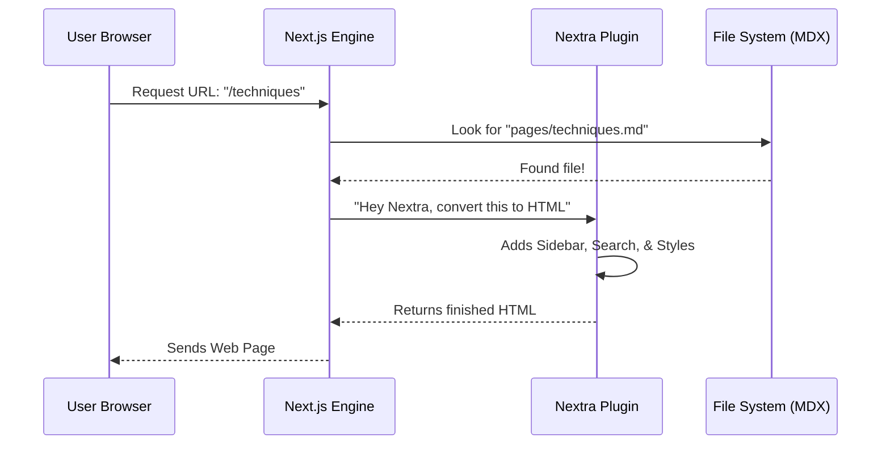

# Chapter 9: Technical Stack

In the previous chapter, [Content Structure - Research & Papers](08_content_structure___research___papers.md), we explored the academic roots of prompt engineering. We looked at the content—the text, the guides, and the citations.

Now, we are going to look behind the curtain. How does a folder full of text files turn into a beautiful, searchable, and interactive website?

Welcome to **Chapter 9: The Technical Stack**.

If the content is the "soul" of this project, the Technical Stack is the "body." It is the software machinery that builds the website you see in your browser.

### The Motivation: Why not just write HTML?

Imagine you want to create a website with 100 pages of documentation.

**The Problem:**
If you wrote raw HTML code for every page (`<div class="sidebar">...</div>`), it would take forever. If you wanted to change the sidebar color, you would have to edit 100 different files.

**The Solution:**
We use a **Technical Stack**—a combination of tools that act like a factory.
1.  You write simple text (Markdown).
2.  The factory (Next.js + Nextra) automatically builds the menus, adds the search bar, and styles the pages.

### Key Concepts: The "Four Pillars"

This project is built on four main technologies. Think of them as a construction team.

1.  **Next.js (The Architect):** This is the framework. It handles the "routing" (turning a file into a URL like `website.com/guide`).
2.  **Nextra (The Specialist):** This is a library specifically for documentation. It sits on top of Next.js and turns Markdown files into pretty documentation pages automatically.
3.  **Tailwind CSS (The Painter):** This handles the styling. Instead of writing long CSS files, we use short codes to make things look good.
4.  **TypeScript (The Safety Inspector):** This is the programming language. It is like JavaScript, but it prevents bugs by checking your code before the website runs.

---

### Use Case: Creating a Page without Coding

Let's look at how this stack makes life easy for a contributor.

**Goal:** Add a new chapter called "Robots" to the website.

**How the Stack works:**
You don't need to write any website code. You just create a file.

1.  You create a file named `robots.md` inside the `pages/` folder.
2.  You write standard text.

#### Input (Your File)

```markdown
# Robots
Robots are cool.
```

#### Output (The Website)

Because of **Next.js** and **Nextra**:
1.  A new URL is created: `prompt-guide.com/robots`.
2.  A link "Robots" automatically appears in the sidebar.
3.  The search bar now indexes the word "Robots."

You focused on the content; the stack handled the engineering.

---

### Component 1: Next.js (The Engine)

Next.js is a "React Framework." In simple terms, it takes pieces of code (components) and assembles them into a website.

Its most important feature for us is **File-System Routing**.

*   **The Rule:** If you put a file in the `pages/` folder, it becomes a web page.
*   **The Benefit:** We don't need a complex database to manage links. The folder structure *is* the website structure.

#### Minimal Example

If your folder looks like this:

```text
pages/
├── index.md        -> Becomes the Homepage
└── about.md        -> Becomes /about
```

Next.js does the heavy lifting to make those links work instantly.

### Component 2: Nextra (The Documentation Theme)

Next.js is generic (it can build e-commerce sites, blogs, etc.). **Nextra** is what makes this project look like a *documentation* site.

Nextra is a "theme" for Next.js. It adds:
*   The Sidebar (on the left).
*   The Table of Contents (on the right).
*   The Dark Mode toggle.
*   Support for `.md` and `.mdx` files.

#### How Nextra reads Markdown

Nextra allows us to use **MDX**. This is Markdown with superpowers. You can put interactive code *inside* your text.

```jsx
// This is an MDX file
# Hello World

Here is a counter button:

<button onClick={() => alert('Clicked!')}>
  Click Me
</button>
```

Nextra turns that `<button>` code into a real, clickable button on the documentation page.

### Component 3: Tailwind CSS (The Styling)

How do we make the text blue or the background gray? We use **Tailwind CSS**.

In traditional web design, you write a separate stylesheet. In Tailwind, you write the style directly on the element.

#### Traditional CSS (The Old Way)

```css
/* style.css */
.my-button {
  background-color: blue;
  color: white;
  padding: 10px;
}
```

#### Tailwind CSS (The Project's Way)

```jsx
// No separate file needed!
<button className="bg-blue-500 text-white p-2">
  Click Me
</button>
```

*   `bg-blue-500`: Make background blue.
*   `text-white`: Make text white.
*   `p-2`: Add padding.

This makes it very easy to tweak the design of the guide without breaking things elsewhere.

---

### Under the Hood: How a Page is Built

When a user visits the Prompt Engineering Guide, what happens inside the server?

Here is the flow from the moment you request a page to when you see it.

#### Sequence Diagram



### Implementation Details

Let's look at the configuration that ties these tools together. The heart of this technical stack is a file called `next.config.js`.

This file tells Next.js: "Please use the Nextra plugin."

#### File: `next.config.js` (Simplified)

```javascript
// 1. Import the Nextra plugin
const withNextra = require('nextra')({
  theme: 'nextra-theme-docs',
  themeConfig: './theme.config.tsx',
})

// 2. Export the configuration
module.exports = withNextra({
  // Next.js specific settings go here
  reactStrictMode: true,
})
```

**Explanation:**
*   `require('nextra')`: We load the tool.
*   `theme: 'nextra-theme-docs'`: We tell it to look like a documentation site.
*   `module.exports`: We tell Next.js to use these settings.

#### TypeScript Integration

You will notice files ending in `.tsx` (like `theme.config.tsx`). This means we are using **TypeScript**.

TypeScript is just JavaScript with "Rules."

*   **JavaScript:** `const add = (a, b) => a + b` (If `a` is a word, this crashes).
*   **TypeScript:** `const add = (a: number, b: number)` (The computer warns you if `a` is not a number).

This ensures that when we configure the project, we don't make silly spelling mistakes that break the site.

### Summary

In this chapter, we learned about the **Technical Stack** that powers the Prompt Engineering Guide.

*   **We learned:** That the website is an automated factory, not a collection of hand-coded HTML files.
*   **The Stack:**
    *   **Next.js:** The engine that handles routing.
    *   **Nextra:** The library that handles documentation layout.
    *   **Tailwind:** The tool for styling.
    *   **TypeScript:** The language for safety.
*   **The Result:** Writers can focus on Markdown (`.md`), and the stack handles the rest.

Now that we know *what* tools we are using, how do we control them? How do we change the logo, the title, or the footer links?

[Next Chapter: Configuration Files](10_configuration_files.md)

---

Generated by [Code IQ](https://github.com/adityasoni99/Code-IQ)