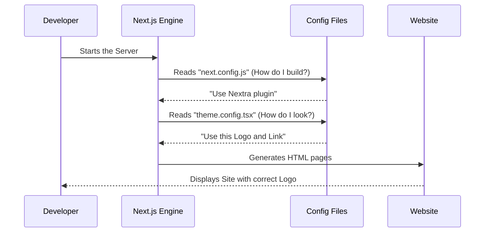

# Chapter 10: Configuration Files

In the previous chapter, [Technical Stack](09_technical_stack.md), we looked at the engine room. We learned that **Next.js** and **Nextra** are the machinery that builds this website.

But imagine you buy a new car. You don't need to know how the engine pistons work to drive it. You just need the **Dashboard**. You need to know where the buttons are to turn on the lights, change the radio station, or adjust the mirrors.

Welcome to **Chapter 10: Configuration Files**.

These files are the "Dashboard" of the Prompt Engineering Guide. They allow you to control the look, feel, and behavior of the website without rewriting the complex code behind it.

### The Motivation: Changing the Global Settings

Imagine you want to change the name of the website from "Prompt Engineering Guide" to "My AI Notebook."

**The Problem:**
If you didn't have configuration files, you would have to open every single page (Chapter 1, Chapter 2, etc.) and type the new name in the header manually. It would take hours.

**The Solution:**
You open **one** file (`theme.config.tsx`), change the text in one line, and the software automatically updates the header on all 100+ pages of the site.

### Key Concepts

In this project, there are four "Control Panels" you need to know about.

1.  **`theme.config.tsx` (The Designer):** Controls the visual look—logos, navigation links, and footer text.
2.  **`next.config.js` (The Mechanic):** Controls the build process—how the code is compiled and which plugins are used.
3.  **`CITATION.cff` (The ID Card):** A special file for researchers. It tells them how to credit this project in academic papers.
4.  **`.github/workflows` (The Robot):** A folder of instructions that runs automatic checks every time you save a file.

---

### Use Case: Customizing the Brand

Let's look at the most common task: Changing the logo and the link to the GitHub repository.

**Goal:** You want the top right corner of the website to link to *your* GitHub profile, not the default one.

**How to use the Config:**
1.  Open the file `theme.config.tsx` in the root folder.
2.  Find the `project` section.
3.  Change the URL.

#### Code Snippet: `theme.config.tsx`

```tsx
import React from 'react'

export default {
  logo: <span>My AI Notebook</span>,
  project: {
    // Change this link to your own repository
    link: 'https://github.com/my-username/my-project',
  },
  // ... other settings
}
```

#### High-Level Output

When you save this file, the website rebuilds.
*   **Before:** The top bar said "Prompt Engineering Guide" and linked to DAIR.AI.
*   **After:** The top bar says "My AI Notebook" and links to your profile.

You changed the entire site's branding with just 3 lines of code!

---

### Under the Hood: Internal Implementation

How does the website know to look at these files?

When the Technical Stack (Next.js) starts up, it follows a specific sequence. It looks for these "Config" files before it looks at any content.

#### Sequence Diagram: The Build Process

Here is what happens when you run the command `npm run dev` to start the website:



### Component 1: The Mechanic (`next.config.js`)

This file is the bridge between Next.js (the framework) and Nextra (the documentation theme).

It tells Next.js: *"Hey, please treat `.md` and `.mdx` files as pages, and use the theme settings found in the other file."*

#### Code Snippet: `next.config.js`

```javascript
// Import the documentation theme plugin
const withNextra = require('nextra')({
  theme: 'nextra-theme-docs',
  themeConfig: './theme.config.tsx',
})

// Export the configuration
module.exports = withNextra()
```

*   **`themeConfig`**: This line connects the Mechanic to the Designer. It points to the visual settings file.

### Component 2: The ID Card (`CITATION.cff`)

In [Chapter 8: Content Structure - Research & Papers](08_content_structure___research___papers.md), we discussed the importance of academic citations.

This project is often used by scientists. They need a standard way to cite it. The `CITATION.cff` file provides this metadata in a machine-readable format.

#### Code Snippet: `CITATION.cff`

```yaml
cff-version: 1.2.0
message: "If you use this software, please cite it as below."
authors:
- family-names: "Saravia"
  given-names: "Elvis"
title: "Prompt Engineering Guide"
url: "https://github.com/dair-ai/Prompt-Engineering-Guide"
```

**Why is this useful?**
GitHub detects this file automatically. On the repository homepage, it creates a specialized "Cite this repository" button. A researcher can click it and get the citation in APA or BibTeX format instantly.

### Component 3: The Robot (`.github/workflows`)

This is the most "magical" part of the configuration. These are **CI/CD** (Continuous Integration / Continuous Deployment) files.

Think of this as a robot butler that lives inside GitHub. Every time you save a file (push code), the robot wakes up and checks your work.

**Common Workflow: The "Deploy" Robot**
1.  **Trigger:** You push code to the `main` branch.
2.  **Action:** The robot downloads your code.
3.  **Action:** It builds the website.
4.  **Action:** It publishes the new version to the internet (e.g., via Vercel or Next.js hosting).

#### Code Snippet: `.github/workflows/ci.yml` (Simplified)

```yaml
name: CI Process
on: [push]  # Trigger: When code is pushed

jobs:
  build:
    runs-on: ubuntu-latest
    steps:
      - name: Checkout Code
        uses: actions/checkout@v3
        
      - name: Install Dependencies
        run: npm install
        
      - name: Build Website
        run: npm run build
```

*   **`on: [push]`**: This is the "Start Button."
*   **`run: npm run build`**: The robot runs the build command to make sure you didn't break the site. If this fails, you get an email alert.

### Summary

In this chapter, we explored the **Configuration Files**.

*   **We learned:** That we don't need to be code experts to change the site settings.
*   **The Files:**
    *   **`theme.config.tsx`**: Changes the visuals (Logo, Links).
    *   **`next.config.js`**: Connects the tools together.
    *   **`CITATION.cff`**: Helps researchers cite the guide.
    *   **Workflows**: Robots that automate checking and publishing the site.

We have configured the English version of the site perfectly. But the internet is global. How do we make this guide accessible to people who speak Spanish, Chinese, or Portuguese?

[Next Chapter: Internationalization (i18n)](11_internationalization__i18n_.md)

---

Generated by [Code IQ](https://github.com/adityasoni99/Code-IQ)