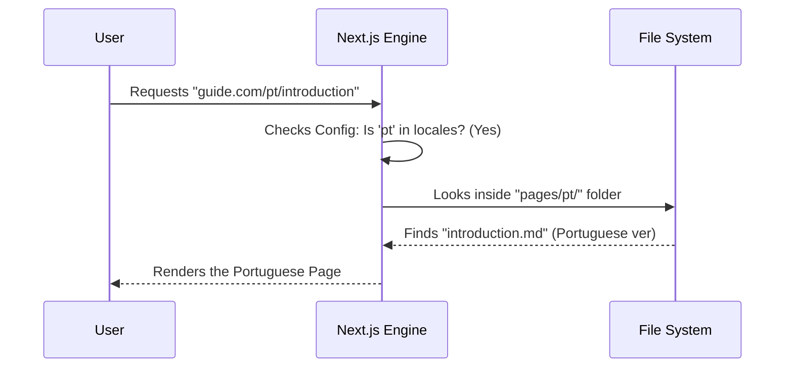

# Chapter 11: Internationalization (i18n)

In the previous chapter, [Configuration Files](10_configuration_files.md), we learned how to control the "dashboard" of our website. We tweaked settings in `next.config.js` and `theme.config.tsx` to change the logo and project links.

Now, we are going to use those same configuration files to unlock a superpower: **Going Global.**

Welcome to **Chapter 11: Internationalization**.

The Prompt Engineering Guide isn't just for English speakers. It is read by people in Brazil, China, Japan, and the Middle East. This chapter teaches you how to structure your project so it can speak multiple languages at once.

### The Motivation: Breaking the Language Barrier

Imagine you have written the perfect guide on how to talk to AI.

**The Problem:**
You publish your website. A researcher from Brazil visits it. They want to learn, but they struggle because the content is only in English. To reach them, you would normally have to build a completely separate website (like `brazil-prompt-guide.com`).

**The Solution:**
We use **Internationalization** (often abbreviated as **i18n** because there are 18 letters between 'i' and 'n').

Instead of building new websites, we configure our existing Next.js engine to detect the user's language and serve the correct version of the page automatically.

### Key Concepts

1.  **Locale:** A code that represents a language and region. For example:
    *   `en`: English
    *   `zh`: Chinese (Simplified)
    *   `pt`: Portuguese
    *   `ar`: Arabic
2.  **Routing:** How the URL looks.
    *   Default: `guide.com/introduction`
    *   Portuguese: `guide.com/pt/introduction`
3.  **RTL (Right-to-Left):** Some languages, like Arabic, are read from right to left. The site needs to mirror its layout (sidebar on the right) for these users.

---

### Use Case: Adding a Portuguese Translation

Let's look at a concrete example. We want to translate the "Introduction" page for our Brazilian readers.

**Goal:** When a user visits `/pt/introduction`, they see the content in Portuguese.

**How to use i18n:**
1.  We tell the **Configuration File** that we support Portuguese.
2.  We create a specific **Folder** for Portuguese files.

#### Step 1: The Configuration

We open `next.config.js` (the Mechanic we met in Chapter 10). We add a list of "locales" we want to support.

```javascript
// next.config.js
const withNextra = require('nextra')({ ... })

module.exports = withNextra({
  i18n: {
    // The list of all supported languages
    locales: ['en', 'zh', 'jp', 'pt', 'ar'],
    // The default language if we don't know who the user is
    defaultLocale: 'en'
  }
})
```

**What happened?**
By adding `'pt'` to the list, Next.js now knows that `website.com/pt/` is a valid address.

#### Step 2: The Content Structure

Now we need to actually write the translated text. We don't overwrite the English file. We create a copy inside a specific folder.

**The English File:**
`pages/introduction.md`

**The Portuguese File:**
`pages/pt/introduction.md`

#### High-Level Output

*   **User A (USA):** Visits `/introduction` -> Sees English.
*   **User B (Brazil):** Visits `/pt/introduction` -> Sees Portuguese.

The website engine automatically picks the file from the `pt` folder because of the URL.

---

### Under the Hood: How Routing Works

How does the technical stack know which file to pick?

When a request hits the server, Next.js looks at the **URL Prefix** (the first part of the address).

#### Sequence Diagram: Fetching a Translated Page

Here is the flow when a user requests the Portuguese version of the guide:



### Implementation Details

Let's look deeper into how we make the website friendly for users switching languages.

Configuring the engine (`next.config.js`) handles the *urls*, but we also need a **Language Switcher** button in the navigation bar so users can click to change languages.

This is handled in the **Designer** file: `theme.config.tsx`.

#### The Language Switcher Configuration

We define a list of options that will appear in a dropdown menu on the top right of the site.

```tsx
// theme.config.tsx
export default {
  // ... other settings
  i18n: [
    { locale: 'en', text: 'English' },
    { locale: 'zh', text: '中文' },
    { locale: 'pt', text: 'Português' },
    { locale: 'ar', text: 'العربية', direction: 'rtl' }
  ]
}
```

**Why this code matters:**
*   **`text`**: This is what the user sees in the button (e.g., "Português").
*   **`direction: 'rtl'`**: This is crucial for Arabic (`ar`). It tells the theme to flip the entire layout so the sidebar and text flow correctly for Arabic readers.

### Handling "Prompt" Translations

Translating the *guide* is easy, but translating the *prompts* (from [Chapter 7: Content Structure - Prompt Hub](07_content_structure___prompt_hub.md)) requires care.

A prompt that works in English might fail in Japanese if translated word-for-word.

**Best Practice:**
When creating `pages/jp/prompts/coding.md`, do not just use Google Translate. You often need to re-engineer the prompt for that specific language model.

**Example: Japanese Prompting**
Japanese prompts often work better if you include specific politeness levels (Keigo), which doesn't exist in English.

```markdown
# English Prompt
"Write a polite email."

# Japanese Prompt (in pages/jp/...)
"Write a business email using 'Sonkeigo' (respectful language)."
```

The i18n structure allows us to have completely different prompt strategies for different languages, stored in their respective folders.

### Summary

In this chapter, we explored **Internationalization (i18n)**.

*   **We learned:** How to reach a global audience without building separate websites.
*   **The Config:** We used `next.config.js` to define our locales (`en`, `pt`, `zh`, etc.).
*   **The Structure:** We organize content by creating folders for each language (e.g., `pages/pt/`).
*   **The UI:** We used `theme.config.tsx` to add a language dropdown menu.

We have built a powerful, secure, and global documentation site. But a project this big isn't just about code and text—it's about the **Community** around it.

How do people contribute? How does this project sustain itself?

[Next Chapter: Ecosystem & Monetization](12_ecosystem___monetization.md)

---

Generated by [Code IQ](https://github.com/adityasoni99/Code-IQ)