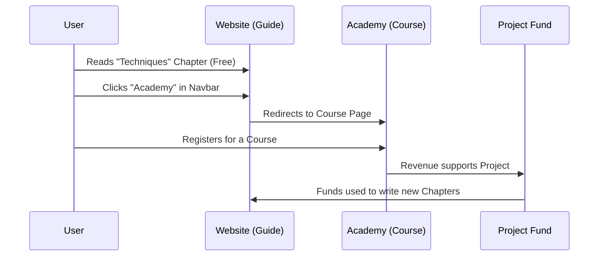

# Chapter 12: Ecosystem & Monetization

In the previous chapter, [Internationalization (i18n)](11_internationalization__i18n_.md), we learned how to make our guide accessible to the whole world by translating it into different languages.

Now, we face a practical reality. Creating content, hosting a website, and managing a community takes time and money.

Welcome to **Chapter 12: Ecosystem & Monetization**.

This chapter explains how an open-source project like the Prompt Engineering Guide sustains itself. It isn't just a website; it is the center of a larger ecosystem that includes education, consulting, and corporate partnerships.

### The Motivation: The "Free Museum" Model

Think of this project like a public museum.

**The Problem:**
The museum (the website) is free for everyone to enter. But the museum needs to pay for electricity, cleaning, and new exhibits. If everything is free, how does the museum stay open?

**The Solution:**
We build an **Ecosystem** around the museum.
1.  **The Guide (Free):** The core knowledge is free for everyone.
2.  **The Academy (Paid):** We offer guided tours (courses) for people who want a structured learning experience.
3.  **Consulting (Paid):** We help companies build their own private museums (internal AI tools).
4.  **Sponsorships (Paid):** Companies pay to put their name on a plaque near the entrance.

This model ensures the free guide stays free, while the paid services fund the development.

### Key Concepts

The **DAIR.AI** ecosystem consists of four main pillars that support the project:

1.  **DAIR.AI Academy:** Cohort-based courses where students learn prompt engineering in a classroom setting with instructors.
2.  **Corporate Training:** Private workshops for companies (like banks or tech firms) that need to train their employees on AI safety and usage.
3.  **Consulting Services:** One-on-one expert advice to help businesses implement the techniques found in [Chapter 3: Content Structure - Techniques](03_content_structure___techniques.md).
4.  **Sponsorships:** Partnerships with AI tool providers (like Vector Databases or Model providers) who want visibility in the community.

---

### Use Case: The Corporate Workshop

Let's look at a concrete example of how the ecosystem works in real life.

**Goal:** A large financial bank wants to use AI to summarize reports, but they are afraid of data leaks (as discussed in [Chapter 6: Content Structure - Risks & Misuses](06_content_structure___risks___misuses.md)).

**The Process:**
1.  **Discovery:** The bank's CTO reads the free **Prompt Engineering Guide** and trusts the quality of the content.
2.  **Engagement:** They realize they need hands-on help, so they click the "Services" link on the site.
3.  **Action:** DAIR.AI provides a 2-day corporate training workshop.

#### The Result
*   **For the Bank:** They get a safe, custom AI strategy.
*   **For the Project:** The revenue from the training pays for the developers who maintain the open-source guide.

---

### Under the Hood: Integrating the Ecosystem

How do we technically integrate these business aspects into the open-source documentation site?

We don't want to turn the guide into a giant advertisement. We want to integrate these services subtly into the navigation.

#### Sequence Diagram: The Sustainability Loop

Here is how a user flows from the free guide to the paid ecosystem, creating a cycle of sustainability.



### Implementation Details

To make these services visible, we modify the **Configuration Files** we learned about in [Chapter 10: Configuration Files](10_configuration_files.md).

We primarily use `theme.config.tsx` to add links to the Academy and Sponsorships in the navigation bar or the footer.

#### 1. Adding Navigation Links

We want a button in the top menu that says "Academy."

**File:** `theme.config.tsx`

```tsx
// Inside the configuration object
export default {
  // ... other settings
  project: {
    link: 'https://github.com/dair-ai/Prompt-Engineering-Guide',
  },
  // We add a chat link to our community (Discord/Slack)
  chat: {
    link: 'https://discord.gg/dair-ai', 
  },
  // We add extra navigation buttons
  navbar: {
    extraContent: (
      <a href="https://academy.dair.ai" target="_blank">
        <button>DAIR.AI Academy</button>
      </a>
    )
  }
}
```

*   **`navbar`**: This controls the top menu.
*   **`extraContent`**: Allows us to insert custom HTML (like a button) that links to the paid courses.

#### 2. Displaying Sponsors

Open-source projects often display a "Banner" to thank their sponsors. Nextra (our technical stack) allows us to add a banner easily.

**File:** `theme.config.tsx`

```tsx
// Configuring a sponsorship banner
export default {
  banner: {
    key: 'sponsor-release',
    text: (
      <a href="https://sponsor-link.com" target="_blank">
        🎉 Supported by Our Sponsor. Click to learn more!
      </a>
    )
  },
  // ... rest of config
}
```

*   **`banner`**: This creates a notification bar at the very top of the website.
*   **`text`**: The message users see. This is a non-intrusive way to monetize traffic.

### Strategic Content Placement

Apart from configuration files, we can also mention services inside the content files (Markdown).

For example, at the end of [Chapter 3: Content Structure - Techniques](03_content_structure___techniques.md), we might add a "Call to Action" (CTA).

**File:** `pages/techniques.md`

```markdown
# Summary of Techniques

We have learned Zero-Shot and Few-Shot prompting.

---

**Want to master these skills?** 
Join our live cohort at the [DAIR.AI Academy](https://academy.dair.ai) for hands-on practice.
```

By placing these links contextually, we help users who want to dive deeper without blocking users who just want the free text.

### Summary

In this chapter, we explored the **Ecosystem & Monetization**.

*   **We learned:** That a healthy open-source project needs a business model to survive.
*   **The Pillars:**
    *   **Academy:** Courses for individuals.
    *   **Corporate Training:** Workshops for companies.
    *   **Consulting:** Expert advice.
    *   **Sponsorships:** Brand partnerships.
*   **The Implementation:** We used `theme.config.tsx` to place links and banners that guide users from the free content to the premium ecosystem.

We have now covered everything from the first line of text to the business model that keeps the servers running. There is only one thing left: **Legal Rights**.

Who actually owns this content? Can you copy it? Can you sell it?

[Next Chapter: License](13_license.md)

---

Generated by [Code IQ](https://github.com/adityasoni99/Code-IQ)