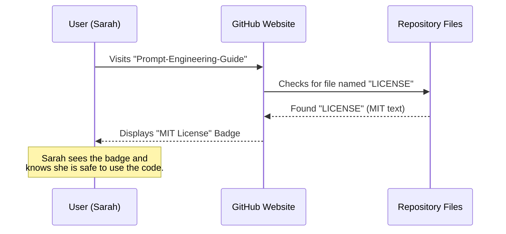

# Chapter 13: License

In the previous chapter, [Ecosystem & Monetization](12_ecosystem___monetization.md), we discussed how an open-source project can sustain itself financially through courses and sponsorships.

But this raises a big question: **"If I give my code away for free, can people steal it?"**

Welcome to **Chapter 13: License**.

This is the final piece of the puzzle. A license is the legal "rulebook" that tells the world exactly what they can and cannot do with your hard work. It turns a folder of files into a legally protected open-source project.

### The Motivation: The "Free Recipe" Problem

Imagine you invent a delicious cookie recipe and post it on a bulletin board.

**The Problem:**
Someone takes your recipe, bakes the cookies, and sells them at a bakery. Another person takes the recipe, changes one ingredient, and claims *they* invented it.
Without a written rule, you might feel cheated, or they might be afraid to use your recipe at all because they don't want to get in trouble.

**The Solution:**
You pin a note to the recipe: *"You can bake these, sell them, or change them. You just have to say the original recipe came from me."*

In the software world, this note is called a **License**. The **Prompt Engineering Guide** uses the **MIT License**, which is one of the most popular and permissive "notes" in the world.

### Key Concepts

The MIT License is very short and simple. It boils down to three main points:

1.  **Permission (The "Yes" List):** You can use this code for anything. You can copy it, modify it, merge it, publish it, and even **sell** it (Commercial Use).
2.  **Condition (The "But" List):** The only catch is that you **must** include the original copyright notice in your copy. You have to give credit.
3.  **Limitation (The "No" List):** The authors are not liable. If you use this code and it breaks your computer or loses your money, you cannot sue the authors. The software is provided "as is."

---

### Use Case: Creating a "Prompt Engineering App"

Let's look at a concrete example of how this license empowers other developers.

**Goal:** A developer named Sarah wants to build a mobile app called "AI Tutor." She wants to use the text from the **Techniques** chapter of this guide inside her app. She plans to charge $5 for the app.

**Is this allowed?**
Yes! Because of the MIT License.

**How Sarah complies with the License:**
1.  She copies the text from [Content Structure - Techniques](03_content_structure___techniques.md).
2.  She pastes it into her app.
3.  Inside her app's "About" or "Legal" screen, she pastes a copy of the **DAIR.AI MIT License**.

#### The Result
*   **Sarah:** Gets high-quality content for her app for free.
*   **DAIR.AI:** Gets credit (Attribution) inside Sarah's app, which spreads the brand.
*   **Users:** Get to learn prompt engineering on their phones.

Everyone wins. This is the power of Open Source.

---

### Under the Hood: The `LICENSE` File

Where does this legal magic live? It isn't hidden in a government vault. It is just a text file sitting in the main folder of the project.

When you create a repository on GitHub, you usually add this file alongside `README.md`.

#### Sequence Diagram: How GitHub Checks Rights

Here is what happens when a user visits the repository to see if they can use the code:



### Implementation Details

Let's look at the actual content of the file. It is a standard template. You don't need a lawyer to write it; you just copy the standard MIT text and change the year and name.

#### File: `LICENSE`

This file is located at the very root of the project (next to `package.json` and `next.config.js`).

```text
MIT License

Copyright (c) 2023 DAIR.AI

Permission is hereby granted, free of charge, to any person obtaining a copy
of this software and associated documentation files (the "Software"), to deal
in the Software without restriction...
```

**Breakdown of the Text:**

1.  **The Copyright Line:** `Copyright (c) 2023 DAIR.AI`. This asserts *who* wrote it.
2.  **The Permission:** `...to deal in the Software without restriction`. This grants freedom.
3.  **The Requirement:** `The above copyright notice... shall be included in all copies`. This ensures credit is kept.

#### Why "No Warranty"?

The file ends with a section usually written in ALL CAPS.

```text
THE SOFTWARE IS PROVIDED "AS IS", WITHOUT WARRANTY OF ANY KIND...
IN NO EVENT SHALL THE AUTHORS BE LIABLE FOR ANY CLAIM...
```

This is the "Safety Shield." Since DAIR.AI is giving this away for free, they cannot be held responsible if a bank uses the [Risks & Misuses](06_content_structure___risks___misuses.md) chapter and still gets hacked. The user accepts the risk.

### Connecting License to Citation

While the **License** handles the *legal* right to use the code, the **Citation** (which we set up in [Configuration Files](10_configuration_files.md)) handles the *academic* credit.

*   **LICENSE file:** "You can use this code, just keep this file with it." (Legal)
*   **CITATION.cff:** "If you write a paper about this, please reference us like this." (Academic courtesy)

Together, these two files protect the creators while enabling the community.

### Summary

In this final chapter, we explored the **License**.

*   **We learned:** That open source doesn't mean "no rules." It means "generous rules."
*   **The MIT License:**
    *   Allows commercial use and modification.
    *   Requires you to keep the copyright notice.
    *   Protects the author from lawsuits (No Warranty).
*   **The Implementation:** It is a simple text file named `LICENSE` in the root directory.

---

### Conclusion: Your Journey is Complete

Congratulations! You have navigated the entire architecture of the **Prompt Engineering Guide**.

1.  We started with the **Overview** (Chapter 1).
2.  We explored the **Content** (Introduction, Techniques, Applications, Models, Risks).
3.  We built the **Library** (Prompt Hub, Research).
4.  We engineered the **Website** (Technical Stack, Configuration, i18n).
5.  We learned how to **Sustain** it (Monetization, License).

You now understand not just *how to prompt*, but *how to build a massive, collaborative, multi-lingual documentation platform* to teach the world.

Whether you are here to learn how to talk to AI, or here to contribute code to the repository: **Welcome to the community.**

**[Back to Project Overview](01_project_overview.md)**

---

Generated by [Code IQ](https://github.com/adityasoni99/Code-IQ)