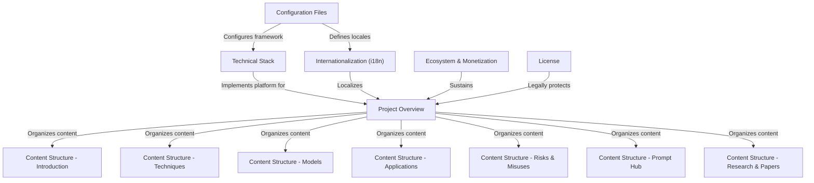

# Tutorial: Prompt-Engineering-Guide

The **Prompt Engineering Guide** is a comprehensive, open-source educational resource designed to help developers and researchers master interactions with **Large Language Models (LLMs)**. It organizes a vast library of *prompting techniques*, model-specific guides, and practical applications into a structured, multilingual documentation site. Built with modern web technologies, it serves as a central hub for learning about the latest papers, tools, and safety risks in the rapidly evolving field of *Generative AI*.

**Source Repository:** [https://github.com/dair-ai/Prompt-Engineering-Guide](https://github.com/dair-ai/Prompt-Engineering-Guide)

## Chapters

1. [Project Overview](01_project_overview.md)
2. [Content Structure - Introduction](02_content_structure___introduction.md)
3. [Content Structure - Techniques](03_content_structure___techniques.md)
4. [Content Structure - Applications](04_content_structure___applications.md)
5. [Content Structure - Models](05_content_structure___models.md)
6. [Content Structure - Risks & Misuses](06_content_structure___risks___misuses.md)
7. [Content Structure - Prompt Hub](07_content_structure___prompt_hub.md)
8. [Content Structure - Research & Papers](08_content_structure___research___papers.md)
9. [Technical Stack](09_technical_stack.md)
10. [Configuration Files](10_configuration_files.md)
11. [Internationalization (i18n)](11_internationalization__i18n_.md)
12. [Ecosystem & Monetization](12_ecosystem___monetization.md)
13. [License](13_license.md)

---

Generated by [Code IQ](https://github.com/adityasoni99/Code-IQ)