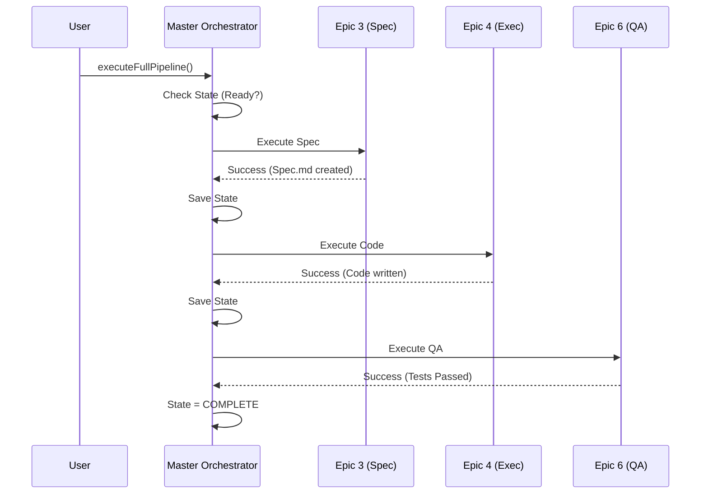

# Chapter 1: Master Orchestrator

Welcome to the `aios-core` tutorial! We are starting at the very top of the command chain.

## The Motivation: Why do we need a Boss?

Imagine you ask an AI to "Build a To-Do List app with React."

If the AI tries to do everything at once—write requirements, set up the project, code the CSS, write the logic, and fix bugs—it usually hallucinates or gets lost halfway through. It forgets what files it created or loses context of the original goal.

To fix this, we need a **Project Manager**. In `aios-core`, this is the **Master Orchestrator**.

The Master Orchestrator doesn't write the code itself. Instead, it breaks the massive goal into manageable chunks called **Epics**, assigns them to workers, and makes sure they finish one step before starting the next.

**Use Case:**
You want to transform a one-sentence feature request ("Add a dark mode toggle") into a fully tested feature in your codebase. The Master Orchestrator ensures this happens in a specific order: Plan -> Code -> Test.

---

## Core Concepts

Before we look at code, let's understand the three pillars of the Orchestrator.

### 1. The Epics (The Steps)
The Orchestrator runs a sequential pipeline. In `aios-core`, we number these steps specifically:

*   **Epic 3 (Spec):** Reads your request and writes a detailed plan.
*   **Epic 4 (Execution):** Writes the actual code based on the plan.
*   **Epic 6 (QA):** Runs tests to make sure the code works.
*   **Epic 5 (Recovery):** A special safety net that only runs if something breaks.

### 2. The State Machine (The Traffic Light)
The Orchestrator always knows its status. It ensures you don't start coding (Execution) before you have a plan (Spec).
*   `INITIALIZED`: Setting up.
*   `READY`: Good to go.
*   `IN_PROGRESS`: Currently working.
*   `BLOCKED`: Something went wrong, needs help.
*   `COMPLETE`: Finished successfully.

### 3. State Persistence (The Save Game)
If the AI crashes or your computer restarts, the Orchestrator saves its progress to a JSON file (e.g., `.aios/master-orchestrator/STORY-101.json`). When you restart, it picks up exactly where it left off.

---

## How to Use It

Let's see how to start the engine. You will typically find the logic in `.aios-core/core/orchestration/master-orchestrator.js`.

### Step 1: Initialization
First, we create an instance of the orchestrator. We give it the root folder of our project and a "Story ID" (a unique name for this task).

```javascript
const MasterOrchestrator = require('./core/orchestration/master-orchestrator');

// Create the manager
const orchestrator = new MasterOrchestrator(process.cwd(), {
  storyId: 'STORY-101', // Our ticket ID
  autoRecovery: true    // If it fails, try to fix it automatically
});

// Prepare the system (checks tech stack, loads saves)
await orchestrator.initialize();
```
*Explanation:* When `initialize()` runs, the Orchestrator checks if there is a saved file for `STORY-101`. If there is, it loads it. It also scans your `package.json` to understand if you are using React, Vue, or Node.js.

### Step 2: Running the Pipeline
Now we tell the manager to do the work.

```javascript
// Run the full development cycle (Epics 3 -> 4 -> 6)
try {
  const result = await orchestrator.executeFullPipeline();
  
  if (result.success) {
    console.log("Feature complete!");
  }
} catch (error) {
  console.log("Orchestration failed:", error);
}
```
*Explanation:* `executeFullPipeline()` is the "Magic Button." It triggers the sequential flow. It returns a result object telling you how long it took and which files were changed.

---

## Internal Implementation: How it Works

What happens inside that "Magic Button"? The Orchestrator acts like a strict conductor.

### Visual Flow
Here is the lifecycle of a feature request:



### Deep Dive: The Code Loop
Inside `.aios-core/core/orchestration/master-orchestrator.js`, the core logic resides in `executeFullPipeline`. It simply loops through the Epics.

```javascript
// Inside MasterOrchestrator.js
async executeFullPipeline() {
  // The roadmap: Spec -> Execution -> QA
  const epicSequence = [3, 4, 6]; 

  for (const epicNum of epicSequence) {
    // Run the specific epic
    const result = await this.executeEpic(epicNum);

    // If a critical step fails, stop immediately
    if (!result.success) {
      this._transitionTo('blocked');
      break; 
    }
    
    // Save progress after every step!
    await this._saveState();
  }
}
```
*Explanation:* This loop is the heartbeat of the system. Notice that **Epic 5 (Recovery)** is not in the list. It is special—it is triggered *inside* `executeEpic` only if an error occurs.

### Deep Dive: Context Building
When the Orchestrator passes work to an Epic, it needs to provide context. Epic 4 (Coding) needs the output from Epic 3 (Spec).

```javascript
// Inside _buildContextForEpic(epicNum)
_buildContextForEpic(epicNum) {
  // All epics get basic info
  const baseContext = {
    storyId: this.storyId,
    projectRoot: this.projectRoot
  };

  // Epic 4 needs the Spec written by Epic 3
  if (epicNum === 4) {
    return {
      ...baseContext,
      spec: this.executionState.epics[3].result.specPath
    };
  }
}
```
*Explanation:* The Orchestrator acts as a courier. It grabs the result from the previous step (stored in `this.executionState`) and hands it to the next step.

---

## Handling Failure

The Master Orchestrator is resilient. If Epic 4 (Coding) fails (e.g., a syntax error), the Orchestrator doesn't give up immediately.

1.  It catches the error.
2.  It calls the `RecoveryHandler`.
3.  If recovery works, it retries the Epic.
4.  If it fails too many times (defined by `maxRetries`), only then does it stop.

We will learn more about how decisions are made to pass or fail a step in [Chapter 5: Quality Gate Manager](05_quality_gate_manager.md).

---

## Summary

The **Master Orchestrator** is the brain of the operation.
1.  It maintains the **State** (Ready, In Progress, Blocked).
2.  It runs **Epics** in a strict sequence (3 → 4 → 6).
3.  It **Saves** progress so work is never lost.
4.  It passes **Context** from one stage to the next.

But the Orchestrator is just a manager. It doesn't actually write code or requirements itself. For that, it hires specialized workers.

[Next Chapter: Specialized Agents](02_specialized_agents.md)

---

Generated by [Code IQ](https://github.com/adityasoni99/Code-IQ)