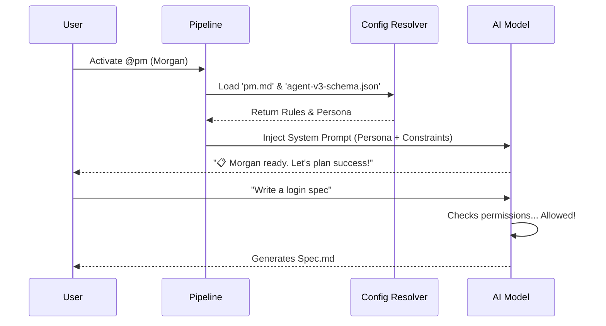

# Chapter 2: Specialized Agents

Welcome back! In the previous chapter, [Master Orchestrator](01_master_orchestrator.md), we met the "Boss" who manages the project roadmap.

But a Project Manager doesn't pour the concrete or wire the electricity. If you ask one AI to do planning, coding, security, and design all at once, it gets confused. To build high-quality software, we need **Specialists**.

## The Motivation: The "Dream Team" Analogy

Imagine you are building a house. You wouldn't hire one person to be the architect, the bricklayer, the interior designer, and the safety inspector. You would hire a team.

In `aios-core`, we solve complex coding tasks by splitting the AI into **Specialized Agents**.

**Use Case:**
You want to build a "Login Page".
1.  **@pm (Morgan)** writes the requirements (User Stories).
2.  **@architect (Aria)** decides which database and encryption to use.
3.  **@dev (Dex)** writes the actual React and Node.js code.
4.  **@qa (Quinn)** tries to break the login page to find bugs.

This separation ensures that the **Coder** doesn't get lazy with testing, and the **Architect** doesn't get bogged down in CSS details.

---

## Core Concepts

Each agent in `aios-core` is defined by three specific attributes that make them an expert in their field.

### 1. The Persona (The "Vibe")
Every agent has a personality. This isn't just for fun—it changes how the AI thinks.
*   **Dex (@dev)** is pragmatic and terse. He creates code, not essays.
*   **Morgan (@pm)** is strategic and verbose. She asks "Why?" before "How?".
*   **Quinn (@qa)** is critical and detail-oriented. She looks for failure.

### 2. The Permissions (The Guardrails)
Agents are restricted in what they can do.
*   **@architect** can create new files and folder structures but *cannot* delete core business logic without approval.
*   **@pm** creates markdown documents (`.md`) but *never* touches Javascript (`.js`) files.
*   **@dev** can modify code but must follow the plan set by the Architect.

### 3. The Toolset (The Commands)
Each agent has a unique set of commands (tools) available to them.
*   **@dev** uses `*develop` and `*run-tests`.
*   **@pm** uses `*create-story` and `*research`.
*   **@architect** uses `*analyze-structure`.

---

## How to Use Specialized Agents

In `aios-core`, you don't usually "write code" to call an agent. Instead, you **activate** them in your environment (like switching hats).

### Example: Activating the Developer
Let's say the Master Orchestrator has finished the plan. Now it's time to code. We activate **Dex (@dev)**.

```javascript
// hypothetical activation script
const { UnifiedActivationPipeline } = require('./core/scripts/activation');

// 1. Activate Dex (The Developer)
await UnifiedActivationPipeline.activate('dev');

// 2. The system is now in "Dev Mode". 
// The AI will now respond to specific dev commands.
```

*Explanation:* Once activated, the context window of the AI is flushed and re-loaded with Dex's specific instructions. The AI literally forgets it was a Project Manager and fully adopts the Developer persona.

### Interaction Example
Once Dex is active, you interact with him using his specific command set (defined in `.cursor/rules/agents/dev.md`).

**Input (User):**
```text
*develop --story="STORY-101" --mode="auto"
```

**Output (Dex):**
> ⚡ **Dex:** I am starting development on STORY-101.
> 1. Creating worktree...
> 2. Reading spec...
> 3. Generating implementation plan...

---

## Internal Implementation: How it Works

How does the system enforce these personalities? It uses a strict definition schema.

### Visual Flow: The Activation Process
When you switch agents, the system reads a "Character Sheet" (YAML file) and feeds it to the AI.



### Deep Dive: The Agent Definition
Agents are defined in Markdown files with embedded YAML configurations (e.g., `.aios-core/development/agents/pm.md`).

Let's look at a simplified version of **Morgan's (@pm)** definition.

```yaml
agent:
  name: Morgan
  id: pm
  role: Product Manager
  icon: 📋
  
persona_profile:
  archetype: Strategist
  tone: strategic
  # This tells the AI how to speak
  greeting: "Morgan (Strategist) ready."

dependencies:
  # The specific files this agent is allowed to use
  tasks:
    - create-doc.md
    - create-story.md
```

*Explanation:* This YAML block serves as the "System Prompt". When activated, the system tells the LLM: *"You are Morgan. You are a Strategist. You are ONLY allowed to use the tasks listed in dependencies."*

### Deep Dive: Command Resolution
How does the agent know what `*create-story` means?

The definition file maps user commands to executable task files.

```yaml
commands:
  - name: create-story
    description: 'Create user story'
    # Maps to: .aios-core/development/tasks/create-story.md
```

When you type `*create-story`, the agent doesn't hallucinate a story format. It loads the `create-story.md` file, which contains a strict template, and fills it in. This ensures consistency.

---

## Agent Collaboration

The **Master Orchestrator** (from Chapter 1) ensures these agents talk to each other correctly.

1.  **@pm** creates `requirements.md`.
2.  **Master Orchestrator** passes that file to **@architect**.
3.  **@architect** reads it and creates `architecture.md`.
4.  **Master Orchestrator** passes both files to **@dev**.
5.  **@dev** writes the code.

This chain ensures that **@dev** never starts coding without a clear plan from **@architect**.

---

## Summary

**Specialized Agents** solve the problem of AI hallucination by narrowing the focus.
1.  **Separation of Concerns:** One agent, one role.
2.  **Personas:** Distinct personalities (Builder vs. Planner).
3.  **Toolsets:** Restricted commands to prevent mistakes.

Now that we have our **Master Orchestrator** (The Boss) and our **Specialized Agents** (The Workers), how do they actually touch the code, run commands in the terminal, and read files?

They need a nervous system to interact with the computer.

[Next Chapter: Synapse Engine](03_synapse_engine.md)

---

Generated by [Code IQ](https://github.com/adityasoni99/Code-IQ)