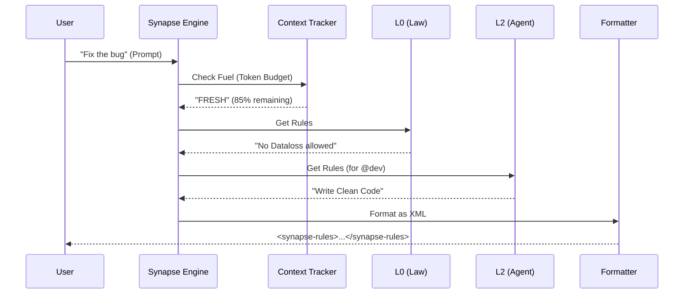

# Chapter 3: Synapse Engine

Welcome back! 

In [Chapter 1: Master Orchestrator](01_master_orchestrator.md), we met the Boss who plans the project. In [Chapter 2: Specialized Agents](02_specialized_agents.md), we met the Specialists (like `@dev` and `@pm`) who do the work.

However, LLMs (Large Language Models) have a major weakness: **Limited Memory**.

If you dump the entire project history, every coding rule, every database schema, and every conversation into the AI's prompt, it will "forget" the beginning or get confused. This is called **Context Overflow**.

We need a system that filters information, giving the AI *exactly* what it needs for the current moment, and nothing else. That system is the **Synapse Engine**.

## The Motivation: The "Heads-Up Display"

Imagine you are Iron Man. 
*   When you are flying high, your HUD shows altitude and map data.
*   When you are fighting, it shows power levels and targets.
*   It **never** shows you a recipe for lasagna while you are fighting aliens.

The **Synapse Engine** is that HUD for your AI. It intercepts every message you send and injects a hidden layer of rules (Context) specific to what you are doing *right now*.

**Use Case:**
You are working with **@dev (Dex)**. You type: "Fix the CSS on the button."
The Synapse Engine realizes:
1.  You are in **Dev Mode**.
2.  You are asking about **UI/CSS**.
3.  Your context window is **Fresh** (plenty of space).

It injects the "React CSS Best Practices" rule but *hides* the "Backend SQL Security" rules. This keeps the AI focused and compliant.

---

## Core Concepts

The Synapse Engine isn't just one filter; it's a waterfall of 8 specific layers.

### 1. The 8-Layer Pipeline
The engine processes rules in a strict order (L0 to L7).

1.  **L0: Constitution (The Law):** Non-negotiable rules. e.g., "Never delete user data."
2.  **L1: Global:** Rules that apply to everyone. e.g., "Use TypeScript."
3.  **L2: Agent:** Specific to the active persona. e.g., @dev sees code rules; @pm sees planning rules.
4.  **L3: Workflow:** Specific to the phase. e.g., "We are currently writing Tests."
5.  **L4: Task:** Details about the specific Jira ticket.
6.  **L5: Squad:** Rules for the specific team (more on this in [Chapter 4](04_squads.md)).
7.  **L6: Keyword:** Triggers based on words. If you say "AWS", it loads cloud rules.
8.  **L7: Star Commands:** Manual overrides (e.g., `*brief`).

### 2. The Context Bracket (The Fuel Gauge)
The engine constantly checks how much "brain space" (tokens) the AI has left.
*   **FRESH:** Empty memory. Load all rules!
*   **MODERATE:** Half full. Be selective.
*   **DEPLETED:** Almost full. Load *only* L0 (Constitution) and L7 (Commands). Drop everything else to prevent a crash.

---

## How to Use It

Typically, the Synapse Engine runs automatically in the background via a hook (middleware). However, to understand it, let's see how we would run it manually in code.

You will find the core logic in `.aios-core/core/synapse/engine.js`.

### Step 1: Initialize the Engine
We create the engine and point it to our `.synapse` folder (where our rule files live).

```javascript
const { SynapseEngine } = require('./core/synapse/engine');

// Point to the folder containing your rule definitions
const synapsePath = './.synapse';

// Start the engine
const engine = new SynapseEngine(synapsePath);
```
*Explanation:* The engine scans the folder and prepares the 8 layers (L0-L7). It handles missing layers gracefully (if you don't have L5 Squads yet, it just skips that step).

### Step 2: Processing a Prompt
Now, we ask the engine to calculate the rules for a specific situation.

```javascript
// The user input
const userPrompt = "Write a login component";

// The current state of the AI
const sessionState = {
  activeAgent: 'dev',  // We are Dex
  prompt_count: 5      // We haven't talked much yet (Fresh)
};

// Run the pipeline
const result = await engine.process(userPrompt, sessionState);

console.log(result.xml); 
```

**What happens in the output?**
The `result.xml` isn't a chat response. It's a hidden block of instructions that gets attached to your prompt before the AI sees it.

It looks like this:
```xml
<synapse-rules>
  [CONSTITUTION] DO NOT INVENT LIBRARIES.
  [AGENT: @dev] Use Functional React Components.
  [BRACKET: FRESH] All layers active.
</synapse-rules>
```

---

## Internal Implementation: How it Works

What happens inside that `engine.process()` call? It's a filtering pipeline.

### Visual Flow



### Deep Dive: The Loop
The heart of the Synapse Engine is a loop that iterates through the layers. If a layer is "too heavy" for the current memory bracket, it gets skipped.

```javascript
// Inside engine.js

async process(prompt, session) {
  // 1. Check how much memory we have left
  const bracket = calculateBracket(session.prompt_count);
  
  // 2. Decide which layers are allowed in this bracket
  const activeLayers = getActiveLayers(bracket); 
  // e.g., if DEPLETED, activeLayers = [0, 7] only.

  const results = [];

  // 3. The Waterfall Loop
  for (const layer of this.layers) {
    
    // Skip if this layer isn't allowed right now
    if (!activeLayers.includes(layer.layer)) {
      continue; 
    }

    // Get the rules from this layer
    const result = layer._safeProcess({ prompt, session });
    results.push(result);
  }

  // 4. Format the final XML block
  return formatSynapseRules(results);
}
```
*Explanation:* This code ensures strict discipline. Even if the **Keyword Layer (L6)** really wants to add rules about AWS, if the `bracket` says "DEPLETED", the engine ignores L6 to save space for the essential **Constitution (L0)**.

### Deep Dive: The Time Limit
Speed is critical. We don't want the user waiting for the HUD to load. The engine enforces a strict time limit (timeout).

```javascript
const PIPELINE_TIMEOUT_MS = 100; // 0.1 seconds

for (const layer of this.layers) {
  // Check if we have taken too long
  if (elapsedTime > PIPELINE_TIMEOUT_MS) {
    console.log("Too slow! Skipping remaining layers.");
    break; 
  }
  // ... process layer ...
}
```
*Explanation:* If processing takes longer than 100ms, the engine creates a "Cut-off." It delivers whatever rules it has gathered so far and sends the prompt immediately. It prioritizes **User Experience** over perfection.

---

## Summary

The **Synapse Engine** is the gatekeeper of context.
1.  It uses **8 Layers** to organize rules (from Constitution to Commands).
2.  It monitors **Context Health** (Fresh vs. Depleted) to prevent overflow.
3.  It produces a **Hidden XML Block** (`<synapse-rules>`) that guides the AI.
4.  It fails gracefully (Timeouts) to keep the system fast.

Now that our AI has a Boss (Orchestrator), specialized Workers (Agents), and a working Brain (Synapse), we need to organize our workers into larger teams to handle massive features.

[Next Chapter: Squads](04_squads.md)

---

Generated by [Code IQ](https://github.com/adityasoni99/Code-IQ)