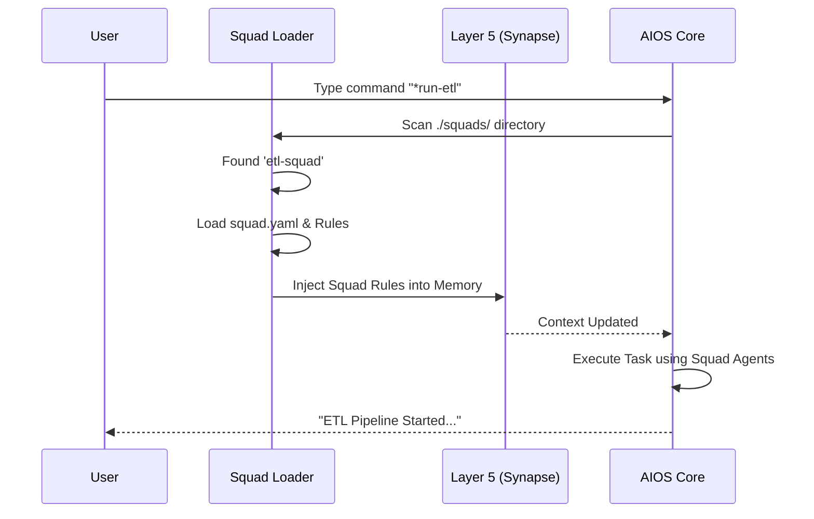

# Chapter 4: Squads

Welcome back! 

In [Chapter 1: Master Orchestrator](01_master_orchestrator.md), we hired a Project Manager. In [Chapter 2: Specialized Agents](02_specialized_agents.md), we hired individual workers like `@dev`. In [Chapter 3: Synapse Engine](03_synapse_engine.md), we gave them a brain to manage context.

But imagine you want to start a completely new department, like "Data Science" or "Video Production." 

Do you really want to manually create every single agent, write every rule, and configure every tool from scratch? No. You want to hire a full team that already knows how to work together.

In `aios-core`, we call these teams **Squads**.

## The Motivation: The "Expansion Pack" Analogy

Think of `aios-core` like a video game. The core game lets you build basic software. 

**Squads are downloadable Expansion Packs (DLCs).**

When you install a Squad, you don't just get one character. You get a bundle containing:
1.  **New Agents:** (e.g., `@data-engineer`, `@analyst`).
2.  **New Workflows:** Pre-planned missions (e.g., "Run ETL Pipeline").
3.  **New Templates:** Boilerplate code specific to that domain.
4.  **New Rules:** Specific coding standards for that industry.

**Use Case:**
You need to process 1,000 CSV files and put them into a database. Instead of teaching `@dev` how to do data engineering, you install the `etl-squad`. It comes with a `@data-engineer` agent who already knows Python, Pandas, and SQL optimization.

---

## Core Concepts

A Squad is a directory that lives in your `./squads/` folder. It is self-contained. Here are its three main components.

### 1. The Manifest (`squad.yaml`)
This is the ID card of the squad. It tells the system who is in the team and what they can do. It follows a "Task-First" architecture—meaning it focuses on *what needs to be done* rather than just *who does it*.

### 2. The Task-First Architecture
In older AI systems, you pick an agent and hope they know what to do. In Squads, you pick a **Task** (e.g., `process-data.md`), and the Squad automatically assigns the right agent (`@data-engineer`) to do it.

### 3. Distribution Levels
Squads can be found in three places:
*   **Level 1 (Local):** Private squads on your computer (`./squads/my-squad`).
*   **Level 2 (Public):** Open-source squads (GitHub).
*   **Level 3 (Marketplace):** Verified squads from the Synkra API.

---

## How to Use It

Creating and using a squad is handled by a special built-in agent: **@squad-creator**.

### Step 1: Designing a Squad
Let's say we want to build a "Content Marketing" squad. We don't need to write code yet. We ask `@squad-creator` to help us design it.

**Input (User):**
```bash
# Activate the creator
@squad-creator

# Ask it to design a squad based on your requirements file
*design-squad --docs ./requirements/marketing-team.md
```

**Output (AI):**
> 🤖 **Squad Creator:** I have analyzed your requirements. I recommend a squad with:
> 1. Agent: `@copywriter` (Writes blogs)
> 2. Agent: `@editor` (Reviews grammar)
> 3. Task: `generate-newsletter`

### Step 2: Creating the Squad
Once we like the design, we run the create command.

```bash
# Create the folder structure automatically
*create-squad content-team --from-design
```
*Explanation:* This generates a folder at `./squads/content-team/` with all the necessary YAML and Markdown files.

### Step 3: Validating the Squad
Before we use it, we must ensure the squad is valid (no missing files or syntax errors).

```bash
*validate-squad content-team
```
*Output:* `✅ Squad Valid. 2 Agents, 4 Tasks loaded.`

---

## Internal Implementation: How it Works

How does `aios-core` know that putting files in a folder creates a new team? 

It uses the **Squad Loader** and plugs into the **Synapse Engine** (from Chapter 3).

### Visual Flow



### Deep Dive: Layer 5 (L5) Processing
Remember the 8 Layers of the Synapse Engine? **Layer 5** is reserved specifically for Squads.

The code below is a simplified version of `.aios-core/core/synapse/layers/l5-squad.js`. It runs every time you send a message to the AI.

```javascript
// Inside l5-squad.js
class L5SquadProcessor extends LayerProcessor {
  
  process(context) {
    // 1. Find where the squads live
    const squadsDir = path.join(context.projectRoot, 'squads');

    // 2. Scan the folder for 'squad.yaml' files
    const manifests = this._scanSquads(squadsDir);

    // 3. If we are currently using a squad agent, load their rules
    const activeSquad = context.session.active_squad;
    
    if (activeSquad && manifests[activeSquad]) {
       // Load specific rules (e.g., "Always use Python for ETL")
       return this._loadSquadRules(activeSquad);
    }
  }
}
```
*Explanation:* This script checks if you are currently "wearing the hat" of a Squad member. If you are, it dynamically injects that Squad's expertise into the AI's brain.

### Deep Dive: The Manifest Schema
The `squad.yaml` file controls everything. Here is what a simple one looks like:

```yaml
# ./squads/etl-squad/squad.yaml
name: etl-squad
version: 1.0.0
description: "Data processing team"

# The "Task-First" components
components:
  agents:
    - agents/data-engineer.md
  tasks:
    - tasks/process-csv.md

# Configuration Inheritance
config:
  extends: extend # Keep core rules, but ADD squad rules
```

*Explanation:* 
*   `components`: Lists the files that make up the squad.
*   `extends`: Crucial setting. It tells the system "Don't forget the main project rules, just add these new data rules on top."

---

## Extending a Squad

You don't just install squads; you can upgrade them. The `*extend-squad` command allows you to add new capabilities to an existing team.

```javascript
const { SquadExtender } = require('./scripts/squad-extender');

// Add a new task to an existing squad programmatically
await SquadExtender.addComponent('etl-squad', {
  type: 'task',
  name: 'clean-data',
  agentId: 'data-engineer',
  description: 'Removes null values from dataset'
});
```
*Explanation:* This script updates the `squad.yaml` manifest and creates a blank template file `tasks/clean-data.md` for you to fill in.

---

## Summary

**Squads** are the ultimate modularity tool in `aios-core`.
1.  They group **Agents**, **Tasks**, and **Rules** into one package.
2.  They use a **Task-First** architecture.
3.  They plug into **Layer 5** of the Synapse Engine to provide instant expertise.
4.  You can **Design**, **Create**, and **Validate** them using simple commands.

Now we have a Master Orchestrator, Specialized Agents, a Synapse Brain, and Squads of workers. But there is one big risk: **What if the Squad produces bad code?**

We need a quality inspector.

[Next Chapter: Quality Gate Manager](05_quality_gate_manager.md)

---

Generated by [Code IQ](https://github.com/adityasoni99/Code-IQ)