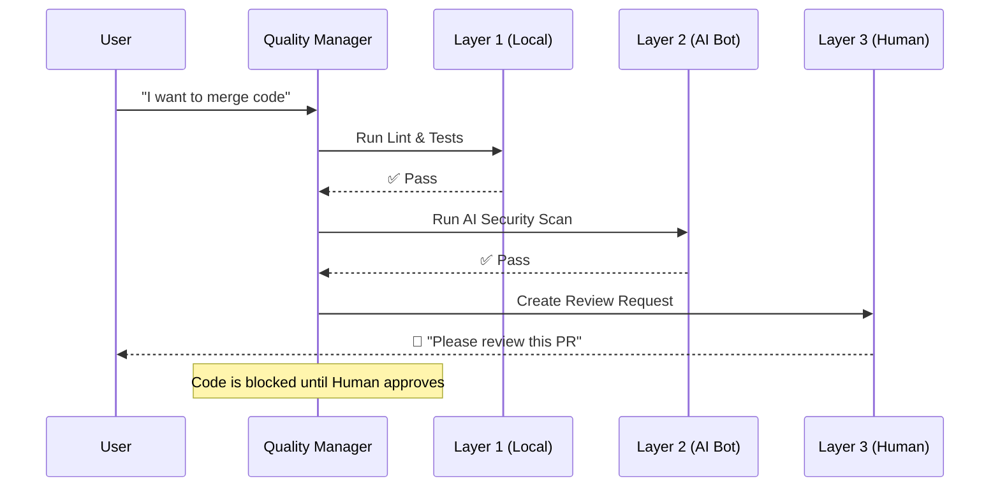

# Chapter 5: Quality Gate Manager

Welcome back! 

In the previous chapters, we built a powerful factory. We have a [Master Orchestrator](01_master_orchestrator.md) managing the plan, [Specialized Agents](02_specialized_agents.md) doing the work, a [Synapse Engine](03_synapse_engine.md) providing the memory, and [Squads](04_squads.md) grouping them into teams.

But there is a danger. If you have a team of fast robots writing code at lightning speed, they can also create **bugs** at lightning speed.

We need an Inspector. We need a system that says, "I don't care how fast you worked; if this code breaks the app, it is not going in."

This is the **Quality Gate Manager**.

## The Motivation: The Airport Security Analogy

Imagine you are at an airport. You cannot just walk onto a plane because you bought a ticket. You have to pass through security.

The **Quality Gate Manager** acts exactly like airport security for your code. It uses three distinct layers of defense:

1.  **The Metal Detector (Layer 1):** Fast and automated. It beeps immediately if you have keys in your pocket (Syntax errors).
2.  **The Baggage Scanner (Layer 2):** Slower and thorough. An AI scans your luggage for prohibited items (Logic bugs, security flaws).
3.  **The Immigration Officer (Layer 3):** A human being. They look at your passport and ask, "Why are you visiting?" (Does this feature actually solve the user's problem?).

**Use Case:**
Your agent `@dev` writes a function to calculate prices.
*   It works, but the variables are named `x` and `y` (messy).
*   It has no unit tests.
*   It accidentally exposes a database password.

Without Quality Gates, this bad code gets merged. With Quality Gates, the system blocks it before it even leaves the agent's computer.

---

## Core Concepts

The system is designed to **Fail Fast**. We don't want to waste a human's time reviewing code that has a syntax error.

### Layer 1: The "Speed Bump" (Pre-Commit)
This runs locally on your machine. It checks for the basics:
*   **Linting:** Is the code formatted correctly?
*   **Type Checking:** Are we sending text to a math function?
*   **Unit Tests:** Do the basic functions return the right values?

### Layer 2: The "Robot Inspector" (PR Automation)
If Layer 1 passes, the code is sent to the cloud (GitHub/GitLab). Here, specialized AI tools (like CodeRabbit or our agent **Quinn**) review the code.
*   They look for security vulnerabilities.
*   They check for "code smells" (bad practices).
*   They verify that the documentation matches the code.

### Layer 3: The "Human Gatekeeper" (Strategic Review)
If the robots are happy, the code is finally flagged for Human Review.
*   The system generates a summary for the human.
*   It highlights "Focus Areas" (e.g., "The AI thinks this logic is complex, please double-check").
*   The code **cannot** merge until a human signs off.

---

## How to Use It

Unlike the Agents or the Orchestrator, you rarely "call" the Quality Gate Manager. It sits in the background, intercepting your actions.

### Configuration
First, we tell the system which gates are active in `.aios-core/core/quality-gates/quality-gate-config.yaml`.

```yaml
# Quality Gate Configuration
layers:
  layer1: 
    enabled: true   # Run Lint/Tests
    failFast: true  # Stop immediately if this fails
  layer2:
    enabled: true   # Run AI Review (CodeRabbit)
  layer3:
    enabled: true   # Require Human Sign-off
```

### Manual Trigger
Sometimes, you want to check your code manually before trying to commit it. You can run the manager directly.

```javascript
const { QualityGateManager } = require('./core/quality-gates/quality-gate-manager');

// Load settings
const manager = await QualityGateManager.load();

// Run the checks
const result = await manager.orchestrate({ 
  verbose: true 
});
```

**Output:**
```text
🔍 Quality Gate Pipeline
━━━━━━━━━━━━━━━━━━━━━━━━━━━━━━━━━━━━━━━━━━━━━━━━━━
✅ Layer 1 (Lint/Test) - PASSED
✅ Layer 2 (AI Review) - PASSED
⏳ Layer 3 (Human)     - PENDING REVIEW
━━━━━━━━━━━━━━━━━━━━━━━━━━━━━━━━━━━━━━━━━━━━━━━━━━
🚫 BLOCKED: Awaiting Human Sign-off.
```

---

## Internal Implementation: How it Works

The Quality Gate Manager is an orchestrator of tests. It runs them in a strict sequence.

### Visual Flow



### Deep Dive: The Orchestration Loop
The code logic is simple but strict. It creates a "Fail Fast" pipeline. You can find this in `.aios-core/core/quality-gates/quality-gate-manager.js`.

```javascript
// Inside QualityGateManager.js

async orchestrate(context) {
  // 1. Layer 1: The Basics
  const l1Result = await this.runLayer1(context);
  
  // If basics fail, STOP HERE. Don't waste AI tokens.
  if (!l1Result.pass) {
    return this.failFast(l1Result);
  }

  // 2. Layer 2: AI Analysis
  const l2Result = await this.runLayer2(context);

  if (!l2Result.pass) {
    return this.escalate(l2Result);
  }

  // 3. Layer 3: Human Review
  return this.orchestrateHumanReview(context);
}
```
*Explanation:* The `failFast` function ensures that if you have a typo (Layer 1), you fix it immediately. The system won't bother the AI or the Human until the basics are correct.

### Deep Dive: Blocking the Process
How does it actually stop the code? It generates a "Block Result" object.

```javascript
failFast(result) {
  return {
    pass: false,
    status: 'failed',
    stoppedAt: 'layer1',
    message: 'Layer 1 failed - Fix lint errors before proceeding',
    exitCode: 1 // This tells the computer "Error!"
  };
}
```
*Explanation:* When this object is returned with `exitCode: 1`, the git commit command or the CI/CD pipeline is cancelled. The code physically stays on your branch and cannot move forward.

---

## The "Story 3.5" Feature: Smart Human Review

Layer 3 isn't just a notification. The Quality Gate Manager prepares a "Briefing" for the human reviewer so they don't have to read every single line.

It uses the data from Layer 1 and 2 to say:
> *"Human, Layers 1 and 2 passed. The AI found no security bugs, but the database schema changed. **Focus your review on file: /models/User.js**."*

This turns the human from a "Code Reader" into a "Strategic Reviewer."

---

## Summary

The **Quality Gate Manager** ensures our factory produces high-quality goods.
1.  **3 Layers of Defense:** Local Checks, AI Review, Human Review.
2.  **Fail Fast:** Stops bad code immediately at Layer 1.
3.  **Automation:** Runs automatically in the background.
4.  **Strategic Review:** Helps humans focus on what matters.

Now our code is clean, tested, and approved. But as our project grows to thousands of files, our agents might get lost. They need a GPS to navigate the project structure.

[Next Chapter: Codebase Mapper](06_codebase_mapper.md)

---

Generated by [Code IQ](https://github.com/adityasoni99/Code-IQ)