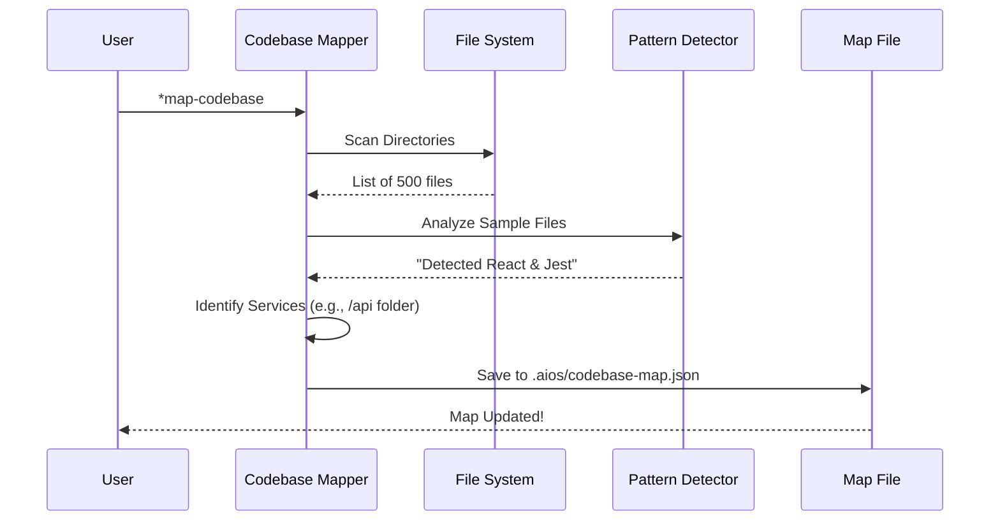

# Chapter 6: Codebase Mapper

Welcome back!

In the previous chapter, [Quality Gate Manager](05_quality_gate_manager.md), we set up security checkpoints to ensure our code is high quality.

But as your project grows from 10 files to 1,000 files, a new problem emerges: **Navigation**.

If you hire a new human developer, it takes them weeks to understand where the "User Logic" lives or how the "Database" connects to the "API." Agents face the same problem. If an agent has to read every single file to find one function, it wastes time and money (tokens).

We need a GPS. In `aios-core`, this is the **Codebase Mapper**.

## The Motivation: The "City Map" Analogy

Imagine dropping a stranger into the middle of a massive city and saying, "Buy me a coffee." Without a map, they have to walk down every street looking for a sign.

The **Codebase Mapper** acts like a satellite. It scans your entire project folder and creates a high-level map (a JSON file).

**Use Case:**
You ask the agent: *"Update the user payment logic."*
*   **Without Mapper:** The agent blindly opens random files hoping to find "payment".
*   **With Mapper:** The agent looks at the map, sees `src/services/payment-service.js`, and goes straight there.

---

## Core Concepts

The Mapper doesn't just list files; it understands them. It looks for three specific layers of information.

### 1. The Territory (File Structure)
It creates a tree of your folders but smartly summarizes them. It knows that `node_modules` is irrelevant junk, but `src/` is important territory.

### 2. The Landmarks (Services)
It identifies "Places of Interest." It knows that a folder named `api/` likely contains backend routes, and a file named `store.ts` likely handles data state.

### 3. The Culture (Patterns & Conventions)
It detects the "local customs" of your code:
*   **Tech Stack:** Are we using React, Vue, or Angular?
*   **Testing:** Do we use Jest or Cypress?
*   **Naming:** do-we-use-dashes or DoWeUseCamelCase?

This ensures that when an agent writes new code, it looks exactly like the code you wrote yourself.

---

## How to Use It

The Codebase Mapper is usually triggered automatically by the **Master Orchestrator**, but you can also run it manually to see what the AI sees.

You will find the logic in `.aios-core/infrastructure/scripts/codebase-mapper.js`.

### Step 1: Generating the Map
You can run this via the command line or programmatically.

```javascript
const { CodebaseMapper } = require('./infrastructure/scripts/codebase-mapper');

// Initialize the mapper
const mapper = new CodebaseMapper(process.cwd(), {
  maxDepth: 5 // Don't look too deep, just the high-level structure
});

// Generate and save the map to .aios/codebase-map.json
await mapper.saveMap();
```
*Explanation:* This scans your project and creates a file at `.aios/codebase-map.json`.

### Step 2: The Output (What the AI Sees)
The output is a compressed JSON file. It looks something like this:

```json
{
  "project": "my-app",
  "services": [
    {
      "name": "auth-service",
      "type": "internal",
      "entrypoint": "src/services/auth/index.js"
    }
  ],
  "patterns": {
    "stateManagement": "redux",
    "testing": "jest"
  }
}
```
*Explanation:* The Agent reads this file in milliseconds. It instantly knows: *"This is a Redux project, and the Auth logic is in `src/services/auth`."*

---

## Internal Implementation: How it Works

The Mapper is a specialized scanner. It doesn't read every line of code (that would be too slow). Instead, it "samples" files to guess what they are.

### Visual Flow



### Deep Dive: Pattern Detection
How does it know you are using React? It uses Regex (Regular Expressions) to look for clues.

In `.aios-core/infrastructure/scripts/codebase-mapper.js`:

```javascript
// Inside PatternDetectors object
stateManagement: {
  'redux': {
    // If we see these words, it's Redux
    patterns: [/createSlice\(/, /configureStore\(/],
    files: ['**/store/**', '**/slices/**']
  },
  'mobx': {
    patterns: [/import.*from ['"]mobx['"]/],
    files: ['**/stores/**']
  }
}
```
*Explanation:* The Mapper checks a few files against these patterns. If it matches `createSlice(`, it flags the project as a **Redux** project.

### Deep Dive: Service Identification
It also looks for folder names to understand the architecture.

```javascript
// Inside identifyServices()
const serviceIndicators = [
  { dir: 'src/services', type: 'internal' },
  { dir: 'src/api',      type: 'api' },
  { dir: 'packages',     type: 'package' } // Monorepo support
];

for (const indicator of serviceIndicators) {
  // If this folder exists, log it as a Service
  if (fs.existsSync(path.join(this.rootPath, indicator.dir))) {
     services.push({ name: indicator.dir, type: indicator.type });
  }
}
```
*Explanation:* This allows the AI to understand "Monorepos" (projects with multiple apps inside) automatically.

---

## The "Live Traffic" Layer (Project Status)

A map is static, but a project changes every minute. We need a "Live Traffic" layer to see what is currently happening.

This is handled by a companion script: `.aios-core/infrastructure/scripts/project-status-loader.js`.

### What it Tracks
It looks at your **Git** history to answer:
1.  **Branch:** What feature are we working on?
2.  **Modified Files:** What files did you just touch?
3.  **Recent Work:** What was the last commit message?

### How it Works (Caching)
Checking Git status can be slow. To keep the AI fast, this loader uses a smart caching system.

```javascript
// Inside ProjectStatusLoader.js

async loadProjectStatus() {
  // 1. Check if Git changed since last time (Fast check)
  const currentFingerprint = await this.getGitStateFingerprint();

  // 2. If same, return cached version (0ms)
  if (this.isCacheValid(cached, currentFingerprint)) {
    return cached.status;
  }

  // 3. If changed, run 'git status' (Slow check)
  return await this.generateStatus();
}
```
*Explanation:* This ensures that when you talk to the agent, it instantly knows you are on the `feature/login` branch without waiting for a git command to finish.

---

## Summary

The **Codebase Mapper** gives our agents a bird's-eye view of the project.
1.  It generates a **JSON Map** of services and file structures.
2.  It detects **Patterns** (React, Jest, Redux) so agents write matching code.
3.  It adds a **Live Status** layer to track Git branches and recent changes.

With this system, a fresh Agent can drop into a 5-year-old project and start contributing immediately, adhering to all local conventions.

But... as we complete more and more tasks, how do we ensure the AI learns from its mistakes and improves its process over time?

[Next Chapter: Workflow Intelligence (WIS)](07_workflow_intelligence__wis_.md)

---

Generated by [Code IQ](https://github.com/adityasoni99/Code-IQ)