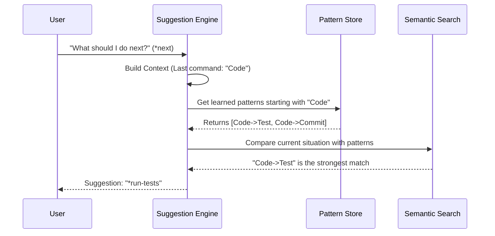

# Chapter 7: Workflow Intelligence (WIS)

Welcome to the final chapter of the `aios-core` tutorial!

In [Chapter 6: Codebase Mapper](06_codebase_mapper.md), we gave our agents a map to navigate the file system. They know *where* things are.

But knowing where the kitchen is doesn't mean you know how to cook a meal. You need a recipe. You need to know that **after** you chop the onions, you must sauté them.

This is where **Workflow Intelligence (WIS)** comes in. It is the "Smart Autocomplete" for your entire job.

## The Motivation: The "What Next?" Problem

Imagine you are working with an AI agent. You just finished writing a complex React component. You lean back and think... *"Okay, what now? Do I run tests? Do I update the documentation? Do I push to Git?"*

If you (or the AI) forget a step, the project breaks.

**Workflow Intelligence (WIS)** is an engine that watches everything you do. It analyzes your history to predict the most logical **Next Task**.

**Use Case:**
1.  You run `*develop --feature="login"`.
2.  You finish coding.
3.  You type `*next`.
4.  WIS analyzes the situation and suggests: **"Run Unit Tests (Confidence: 95%)"**.

It stops you from missing steps and helps new agents act like experienced seniors.

---

## Core Concepts

WIS isn't just guessing; it uses three specific technologies to make predictions.

### 1. The Suggestion Engine (The Brain)
This is the central processor. It looks at your **Context** (what you just did, what branch you are on, what files are open) and calculates probabilities for what should happen next.

### 2. Semantic Search (The Translator)
Computers are usually literal. To a normal computer, "Fix Bug" and "Repair Issue" are completely different commands.
WIS uses **Semantic Search**. It understands that "Fix", "Repair", and "Patch" mean the same thing. This allows it to recognize patterns even if you use different words.

### 3. Pattern Store (The Memory)
Every time you successfully complete a sequence of tasks (e.g., Code -> Test -> Commit), WIS saves it.
Over time, it builds a library of "Success Patterns." If you deviate from the pattern, it nudges you back on track.

---

## How to Use It

For the end-user, WIS is usually invisible. It powers the suggestions you see in your terminal. However, you can interact with it directly using the `*next` command logic.

### Getting a Prediction
Let's see how we ask the engine for help in code. You typically interact with `.aios-core/workflow-intelligence/engine/suggestion-engine.js`.

```javascript
const { SuggestionEngine } = require('./workflow-intelligence/engine/suggestion-engine');

// 1. Initialize the engine
const wis = new SuggestionEngine();

// 2. Build the current context (Who am I? What did I just do?)
const context = await wis.buildContext({
  agentId: 'dev',
  lastCommand: '*create-file' 
});

// 3. Ask for the magic prediction
const result = await wis.suggestNext(context);

console.log(`Suggestion: ${result.suggestions[0].command}`);
console.log(`Confidence: ${result.confidence * 100}%`);
```

**Output:**
```text
Suggestion: *run-tests
Confidence: 85%
```
*Explanation:* The engine saw that you just created a file. Based on past successful workflows, it knows that creating a file usually requires testing it next.

---

## Internal Implementation: How it Works

How does WIS actually choose between "Run Tests" and "Go to Sleep"? It follows a specific pipeline.

### Visual Flow



### Deep Dive: Semantic Search
The `SemanticSearch` class (in `semantic-search.js`) is responsible for fuzzy matching. It doesn't just look for exact string matches; it assigns scores based on synonyms.

```javascript
// Inside semantic-search.js
_scorePattern(query, pattern) {
  // 1. Check for exact match (e.g., "test" == "test")
  const exactScore = this._exactMatch(query, pattern);
  
  // 2. Check for synonyms (e.g., "verify" ~= "test")
  // It uses a built-in synonym list
  const semanticScore = this._semanticMatch(query, pattern);

  // Return the highest score found
  return Math.max(exactScore, semanticScore);
}
```
*Explanation:* This ensures that if one developer types `*verify` and another types `*test`, the system learns from both of them equally.

### Deep Dive: Pattern Learning
The `PatternStore` (in `pattern-store.js`) saves successful sequences. It uses a "Success Rate" to rank suggestions.

```javascript
// Inside pattern-store.js
save(pattern) {
  // Check if we have seen this sequence before
  const existing = this.findPattern(pattern.sequence);

  if (existing) {
    // We've seen it! Increase confidence.
    existing.occurrences += 1;
    existing.successRate = this.recalculateSuccess(existing);
  } else {
    // New pattern discovered. Save it.
    this.patterns.push(pattern);
  }
}
```
*Explanation:* If you run `Code -> Test` 100 times, the `occurrences` count goes up. The Suggestion Engine sees this high number and prioritizes this suggestion over a rare sequence like `Code -> Deploy`.

### Deep Dive: The Suggestion Loop
Finally, the `SuggestionEngine` combines everything. It even adds a "Boost" if the pattern is well-learned.

```javascript
// Inside suggestion-engine.js
async suggestNext(context) {
  // Get raw suggestions from the pattern store
  let suggestions = this.wis.getSuggestions(context);

  // Apply the "Learned Pattern Boost"
  if (this.useLearnedPatterns) {
    suggestions = suggestions.map(s => {
      // If this suggestion is backed by history, boost confidence!
      if (s.source === 'learned_pattern') {
        s.confidence += 0.15; // 15% Bonus
      }
      return s;
    });
  }

  // Return the winner
  return suggestions.sort((a, b) => b.confidence - a.confidence)[0];
}
```
*Explanation:* This code rewards consistency. The more you follow a workflow, the more confident the AI becomes in suggesting it.

---

## Summary

**Workflow Intelligence (WIS)** is the final piece of the `aios-core` puzzle.
1.  It predicts the **Next Task** to keep you in flow.
2.  It uses **Semantic Search** to understand intent, not just keywords.
3.  It uses **Pattern Learning** to get smarter the more you use it.
4.  It ensures that the [Master Orchestrator](01_master_orchestrator.md) and [Specialized Agents](02_specialized_agents.md) follow best practices automatically.

## Conclusion

Congratulations! You have completed the **aios-core** tutorial.

You now understand the full architecture:
1.  **Orchestrator:** The Boss who plans.
2.  **Agents:** The Specialists who execute.
3.  **Synapse:** The Brain that manages context.
4.  **Squads:** The Teams that group agents.
5.  **Quality Gates:** The Security that stops bugs.
6.  **Codebase Mapper:** The GPS for files.
7.  **WIS:** The Assistant that predicts the next step.

With these 7 pillars, you can build an AI operating system capable of handling complex, real-world software development. Happy coding!

---

Generated by [Code IQ](https://github.com/adityasoni99/Code-IQ)