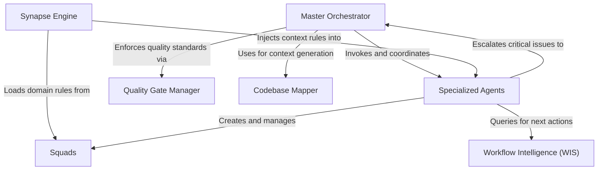

# Tutorial: aios-core

**AIOS-Core** is a comprehensive framework designed to treat AI agents as a cohesive, professional software development team. It utilizes a **Master Orchestrator** to manage complex project lifecycles ("Epics") and a **Synapse Engine** to dynamically inject strictly relevant rules and context into the AI's memory. The system ensures reliability through **Quality Gates**, extends functionality via modular **Squads**, and empowers **Specialized Agents** with tools to map codebases and predict intelligent next steps.

**Source Repository:** [https://github.com/SynkraAI/aios-core](https://github.com/SynkraAI/aios-core)

## Chapters

1. [Master Orchestrator](01_master_orchestrator.md)
2. [Specialized Agents](02_specialized_agents.md)
3. [Synapse Engine](03_synapse_engine.md)
4. [Squads](04_squads.md)
5. [Quality Gate Manager](05_quality_gate_manager.md)
6. [Codebase Mapper](06_codebase_mapper.md)
7. [Workflow Intelligence (WIS)](07_workflow_intelligence__wis_.md)

---

Generated by [Code IQ](https://github.com/adityasoni99/Code-IQ)