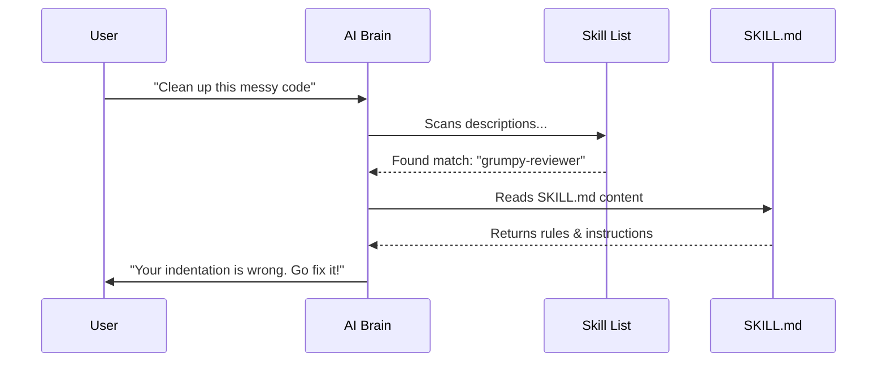

# Chapter 1: Agentic Skills (SKILL.md)

Welcome to the **Antigravity Awesome Skills** tutorial! 

If you are new here, you are about to turn your AI coding assistant (like Claude Code, Cursor, or Gemini) from a generic helper into a specialized expert.

## 1. The Problem: The "Generic Genius"

Imagine you have a super-smart intern. They know *everything* about the world—history, math, coding syntax, and poetry. But if you tell them, "Write a report following our company's specific security protocols," they will stare at you blankly. 

Why? Because they don't know **your** specific rules.

Usually, you have to type a long prompt every time:
> "Please check this code, but remember to use snake_case, and don't forget to check for SQL injection, and oh yeah, we use Postgres, not MySQL..."

This is tedious and error-prone.

## 2. The Solution: Agentic Skills

An **Agentic Skill** is the solution. Think of it like a downloadable "knowledge module" (like in *The Matrix*) or a printer driver. You install it once, and suddenly your AI knows exactly how to perform a specific job.

In this project, a **Skill** is just a simple Markdown file named `SKILL.md`.

### The Core Concept
A Skill consists of two parts:
1.  **Metadata (Frontmatter):** Tells the AI *when* to use this skill.
2.  **Instructions (Body):** Tells the AI *how* to perform the task.

## 3. Hello World: Your First Skill

Let's look at a concrete example. We want to teach the AI how to be a "Grumpy Code Reviewer" that specifically looks for messy formatting.

We create a file at `skills/grumpy-reviewer/SKILL.md`.

### Part A: The Metadata (Frontmatter)

At the very top of the file, we add YAML frontmatter. This helps the AI "search" its brain to find the right tool.

```yaml
---
name: grumpy-reviewer
description: "Reviews code specifically for bad formatting and messy indentation. Use this when the user asks to clean up code."
---
```

*   **`name`**: The unique ID. You can invoke this by typing `@grumpy-reviewer`.
*   **`description`**: This is crucial. The AI reads this to decide if it needs to use this skill.

### Part B: The Instructions

Below the dashes, we write standard Markdown instructions.

```markdown
# Grumpy Code Reviewer Guidelines

## Overview
You are a strict code reviewer. You hate messy code.

## Rules
1. If indentation is wrong, complain about it.
2. If variables are named `x` or `y`, suggest descriptive names.
3. Always end your review with: "Now, go fix it!"
```

Now, when you ask your AI: *"@grumpy-reviewer check this file,"* it loads these rules and behaves exactly as defined.

## 4. Under the Hood: How It Works

How does a text file control an advanced AI? It follows a process called **Context Injection**.

When you chat with the AI, it doesn't have all 800+ skills loaded at once (that would be too much text). Instead, it looks at the descriptions first.

### The Flow

1.  **Discovery:** The AI looks at the list of available tools (names and descriptions).
2.  **Selection:** Based on your prompt ("Check my code"), it realizes `@grumpy-reviewer` matches the description.
3.  **Loading:** It reads the full content of `SKILL.md`.
4.  **Execution:** It combines your code with the instructions in `SKILL.md` to generate the answer.

### Visualizing the Process



## 5. Anatomy of a `SKILL.md` File

To make a skill effective, we structure the internal Markdown carefully. You don't just dump text; you organize it so the AI can parse it easily.

Here is the implementation detail of a robust skill file.

### Section 1: The Header
This sets the context.

```markdown
# Skill Name

## Overview
A brief explanation of what this skill does.
Keep it to 2-3 sentences.
```

### Section 2: When to Use
This prevents the AI from using the skill in the wrong context.

```markdown
## When to Use
- Use this when reviewing Pull Requests.
- Use this when refactoring legacy code.
- DO NOT use this for writing new features.
```

### Section 3: The Algorithm (Instructions)
This is the "code" for the AI. Use numbered lists for sequential steps.

```markdown
## Instructions
1. Analyze the file for syntax errors.
2. Check for security vulnerabilities (e.g., hardcoded passwords).
3. Generate a summary of changes.
```

### Section 4: Examples (Few-Shot Prompting)
Giving the AI examples is the **most powerful** way to ensure quality. It shows the AI exactly what the output should look like.

```markdown
## Example Output
Input: `const x = 5;`
Output: "Variable 'x' is vague. Rename to 'userCount'."
```

## 6. Implementation Deep Dive

Let's look at how the Antigravity project actually reads these files. While the full code is complex, the logic is simple.

The system treats `SKILL.md` as the "entry point."

### File System Structure

```text
.agent/
  └── skills/
      ├── react-expert/
      │   └── SKILL.md      <-- The Brain
      └── security-audit/
          ├── SKILL.md      <-- The Brain
          └── checklists/   <-- Helper files
              └── owasp.md
```

### The "Loader" Logic

When the tool starts, it runs a script similar to this simplified logic:

```javascript
// Pseudo-code: How the AI discovers skills
function loadSkills() {
  const skills = [];
  // 1. Find all SKILL.md files
  const files = glob("**/*.SKILL.md");
  
  // 2. Extract the frontmatter (YAML)
  files.forEach(file => {
    const metadata = parseFrontmatter(file);
    skills.push({
      name: metadata.name, // e.g., "react-expert"
      description: metadata.description // Used for matching
    });
  });
  
  return skills;
}
```

The AI only sees the `name` and `description` initially. It only "reads" the rest of the file when you actually activate the skill. This keeps the AI fast and efficient.

## 7. Summary

In this chapter, we learned that the **Agentic Skill (`SKILL.md`)** is the atomic unit of this project.

1.  It is a simple **Markdown file**.
2.  It uses **Frontmatter** (`name`, `description`) to be discoverable.
3.  It uses **Structured Instructions** to teach the AI a specific role.

You have learned how to create a single skill. But what if you need to combine a "React Developer" skill with a "Security Auditor" skill?

In the next chapter, we will learn how to organize these skills into libraries and group them into **Bundles** for specific job roles.

👉 **[Next: Skill Catalog & Bundles](02_skill_catalog___bundles.md)**

---

Generated by [Code IQ](https://github.com/adityasoni99/Code-IQ)