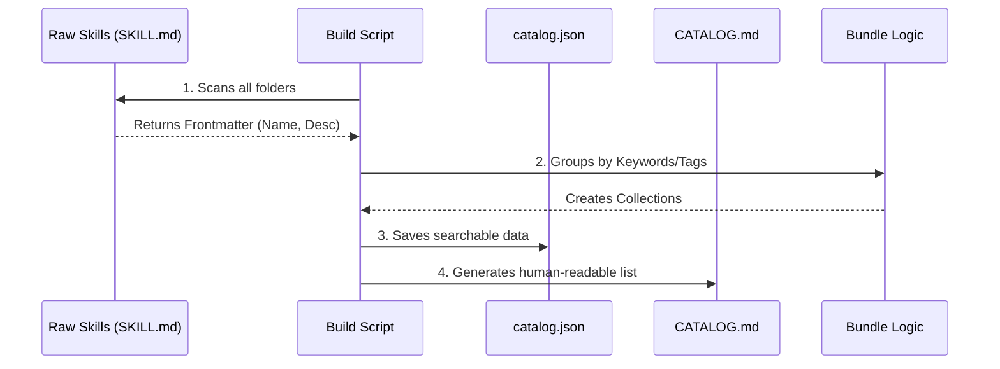

# Chapter 2: Skill Catalog & Bundles

In the previous chapter, **[Agentic Skills (SKILL.md)](01_agentic_skills__skill_md_.md)**, we learned that a single text file can teach an AI how to perform a specific task, like reviewing code or writing documentation.

But here is the catch: **We have over 800 of these files.**

If you dumped 800 text files into an AI's context window, it would get confused, slow down, and cost a fortune. We need a way to organize this library.

## 1. The Motivation: The "App Store" Problem

Imagine your smartphone didn't have an App Store. Imagine all 2 million available apps were just loose files in a giant folder. finding a calculator would be a nightmare.

This is the problem the **Skill Catalog** solves.

1.  **Discoverability:** How does the user (or the AI) know what tools are available?
2.  **Organization:** How do we group related tools (like "Python tools" vs. "Marketing tools")?
3.  **Context Management:** How do we load *only* the skills we need for the current project?

## 2. Key Concept: The Catalog

The **Catalog** is the central index. It is an automated system that scans every single `SKILL.md` file in the repository and builds a "menu" for the AI.

Instead of reading the full instructions of every skill, the Catalog just reads the **Metadata** (the YAML header we wrote in Chapter 1).

### The Catalog Entry
The build system turns a raw skill file into a lightweight JSON entry like this:

```json
{
  "id": "grumpy-reviewer",
  "description": "Reviews code specifically for bad formatting.",
  "tags": ["code-quality", "review"],
  "path": "skills/grumpy-reviewer/SKILL.md"
}
```

This allows the AI to "browse" the catalog quickly without reading the heavy instruction manuals until it actually needs to use one.

## 3. Key Concept: Bundles (The "Spotify Playlist")

Searching the catalog one by one is still tedious.

If you are a **Web Developer**, you probably need:
-   `react-expert`
-   `css-modules`
-   `accessibility-checker`
-   `jest-testing`

Selecting these manually every time you start a project is annoying.

A **Bundle** is simply a curated collection of skills—like a Spotify Playlist for a specific job role.

### Examples of Bundles
*   **Web Wizard:** Includes React, CSS, HTML, and Frontend patterns.
*   **Security Guard:** Includes OWASP checks, SQL injection scanning, and auth audits.
*   **Essentials:** Includes brainstorming, file management, and basic git operations.

## 4. How to Use Bundles

In the Antigravity system, you don't need to write code to use a bundle. You simply tell the installer or the agent which "persona" you want to adopt.

### Conceptual Usage
When you initialize the system, you might see a prompt like this:

```bash
? Which starter pack do you want?
> [x] Web Wizard (Recommended for Frontend)
  [ ] DevOps Engineer
  [ ] Python Data Scientist
```

### The Output
Once a bundle is selected, the system symlinks (connects) only those specific 20-30 skills into your active `.agent/skills` folder.

**Result:** Your AI is now a specialized Web Developer, not a confused generalist trying to know everything about everything.

## 5. Under the Hood: The Build System

How does the system create this Catalog and these Bundles? It uses a build script (written in Node.js) that acts as a librarian.

Here is the flow of data:



### 1. Scanning the Skills
The script looks for every file ending in `SKILL.md`. It extracts the YAML header.

```javascript
// scripts/build-catalog.js (Simplified)
const fs = require('fs');

function readSkill(filePath) {
  const content = fs.readFileSync(filePath, 'utf8');
  // We only grab the top part (YAML)
  const frontmatter = parseFrontmatter(content); 
  return frontmatter;
}
```

*Explanation:* We read the file but stop after the header to keep things fast. We now have the `name` and `description`.

### 2. Auto-Tagging
To categorize skills, the system is smart. It looks at the description for keywords.

```javascript
// Detect category based on keywords
function detectCategory(skill) {
  const text = (skill.name + " " + skill.description).toLowerCase();
  
  if (text.includes("react") || text.includes("css")) {
    return "frontend";
  }
  if (text.includes("docker") || text.includes("k8s")) {
    return "infrastructure";
  }
  return "general";
}
```

*Explanation:* If a skill description mentions "Docker", it automatically gets tagged as `infrastructure`. This allows dynamic sorting without manual data entry.

### 3. Creating the Bundles
Finally, the script groups these skills into bundles defined in `scripts/build-catalog.js`.

```javascript
const BUNDLE_RULES = {
  "web-wizard": {
    keywords: ["react", "vue", "html", "css", "frontend"]
  },
  "security-engineer": {
    keywords: ["owasp", "vulnerability", "auth", "security"]
  }
};
```

*Explanation:* The script loops through all skills. If a skill matches the `web-wizard` keywords, it gets added to that bundle's list.

## 6. The Result: `CATALOG.md`

The final output of this process is the `CATALOG.md` file you see in the root of the repository. It is a generated file—humans don't edit it directly.

It looks like this:

| Skill | Description | Tags |
| :--- | :--- | :--- |
| `grumpy-reviewer` | Reviews code for formatting | `review`, `quality` |
| `react-expert` | React best practices | `frontend`, `react` |

This ensures that the documentation **never** falls out of sync with the actual code.

## 7. Summary

In this chapter, we learned that having raw skills isn't enough; we need an **Organizational Layer**.

1.  **The Catalog** indexes all skills so they can be searched.
2.  **Bundles** act as "Job Roles" (Starter Packs) to quickly equip the AI with the right tools.
3.  **The Build Script** automates this process by scanning keywords.

Now that we have our skills organized and bundled, how do we make the AI execute complex tasks that require *multiple* skills in a specific order?

In the next chapter, we will learn how to chain these skills together into **Workflows**.

👉 **[Next: Antigravity Workflows](03_antigravity_workflows.md)**

---

Generated by [Code IQ](https://github.com/adityasoni99/Code-IQ)