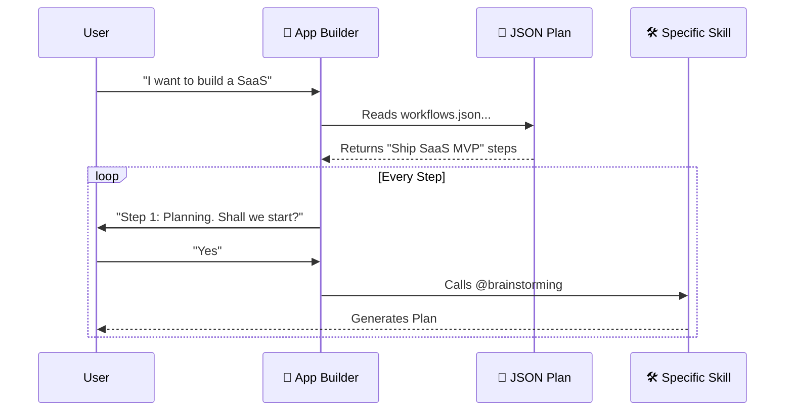

# Chapter 3: Antigravity Workflows

In the previous chapter, **[Skill Catalog & Bundles](02_skill_catalog___bundles.md)**, we organized our library of tools. We learned how to group skills into **Bundles** (like "Web Wizard" or "Security Engineer") so we have the right toolbox for the job.

But owning a toolbox doesn't make you a Master Builder.

If you have a hammer, a saw, and a drill, but no blueprints, you can't build a house. You need a plan. You need to know **what** to do, **in what order**, and **which tool** to use for each step.

## 1. The Problem: "What do I do next?"

Imagine asking your AI: *"Build me a SaaS MVP."*

Without a workflow, the AI might:
1.  Start writing random React components.
2.  Forget to set up the database.
3.  Realize halfway through it forgot authentication.
4.  Write code that isn't secure.

This happens because the AI is "reacting" to your prompt rather than following a plan. It has the skills, but it lacks the **Strategy**.

## 2. The Solution: Antigravity Workflows

An **Antigravity Workflow** is a strategic blueprint. It is a structured file (JSON) that breaks a massive goal into small, logical steps.

While a **Skill** tells the AI *how* to do a task (e.g., "How to write a React component"), a **Workflow** tells the AI *when* to do it (e.g., "First plan, then database, then frontend").

### The Analogy

*   **Skill (`SKILL.md`):** The Hammer.
*   **Bundle:** The Toolbox.
*   **Workflow (`workflows.json`):** The Construction Blueprint.

## 3. Anatomy of a Workflow

Workflows are defined in a file called `data/workflows.json`. This makes them readable by both humans and machines.

Let's look at a simplified example of what a Workflow looks like inside the system.

```json
{
  "id": "ship-saas-mvp",
  "name": "Ship a SaaS MVP",
  "steps": [
    {
      "title": "Plan the scope",
      "goal": "Define the problem and user persona.",
      "recommendedSkills": ["brainstorming", "writing-plans"]
    },
    {
      "title": "Build backend",
      "goal": "Implement API and Database.",
      "recommendedSkills": ["api-patterns", "database-design"]
    }
  ]
}
```

### Key Components

1.  **`id`**: A unique computer-friendly name.
2.  **`steps`**: An ordered list of tasks.
3.  **`goal`**: The "Definition of Done" for that specific step.
4.  **`recommendedSkills`**: The specific tools the AI should pick up for this phase.

## 4. Example: The "SaaS MVP" Workflow

Let's walk through a real scenario included in the Antigravity project: **Shipping a SaaS MVP**.

Instead of flailing around, the Workflow forces the AI to follow a professional development lifecycle.

### Step 1: The Planning Phase
The workflow explicitly stops the AI from coding immediately.

*   **Goal:** Convert the idea into a clear plan.
*   **Active Skills:** `@brainstorming`, `@concise-planning`.
*   **Result:** The AI asks you questions about your user persona before writing a single line of code.

### Step 2: The Backend Phase
Once the plan is approved, the workflow moves to the foundation.

*   **Goal:** Implement core data model and API.
*   **Active Skills:** `@backend-dev-guidelines`, `@auth-implementation-patterns`.
*   **Result:** A solid database schema and secure login system.

### Step 3: The Testing Phase
Before finishing, the workflow mandates a quality check.

*   **Goal:** Catch bugs and ensure key flows work.
*   **Active Skills:** `@go-playwright`, `@browser-automation`.
*   **Result:** The AI writes automated tests to verify the app actually works.

> **Note:** Notice how specific the skills are? In Step 3, it suggests `@go-playwright`. The AI wouldn't know to use that specific tool without the workflow suggesting it.

## 5. The Conductor: The "App Builder" Skill

You might be wondering: *Who reads this JSON file?*

There is a special "Master Skill" called the **App Builder** (`skills/app-builder/SKILL.md`). Think of this skill as the Project Manager.

When you say "Help me build an app," the App Builder:
1.  Reads the `workflows.json`.
2.  Selects the right workflow (e.g., SaaS MVP).
3.  Tells you what the first step is.

### Visualizing the Flow



## 6. Implementation Deep Dive

How does the code actually process these steps? Let's look at a simplified version of the logic used in the `App Builder` to process a workflow.

The system treats the workflow as a simple "To-Do List" array.

### Loading the Workflow

First, the system needs to find the specific workflow by its ID.

```javascript
// Simplified logic to find a workflow
const workflows = require('./data/workflows.json');

function getWorkflow(workflowId) {
  // Find the specific plan in the list
  const plan = workflows.find(w => w.id === workflowId);
  return plan; 
}
```

*Explanation:* We load the JSON file and look for a match, like `ship-saas-mvp`.

### Executing a Step

Once we have the plan, the Agent needs to know what tools to recommend to the user.

```javascript
function getCurrentStepAdvice(step) {
  // Create a prompt for the AI
  return `
    Current Phase: ${step.title}
    Goal: ${step.goal}
    Tools to use: ${step.recommendedSkills.join(", ")}
  `;
}
```

*Explanation:* The system injects this text into the AI's context. Now, even if the AI "forgot" what it was doing, this prompt reminds it: *"You are currently in the Planning Phase. Use the Brainstorming tool."*

## 7. Why This Matters for Beginners

If you are new to AI coding, **Context Window** is your enemy.

If you try to do everything at once, the AI "forgets" earlier instructions. By using **Workflows**:
1.  **Focus:** The AI focuses on *only* one step at a time.
2.  **Quality:** It uses the best tool for that specific step (e.g., using `@go-playwright` only during testing).
3.  **Completion:** You don't end up with half-finished projects because the checklist keeps you honest.

## 8. Summary

In this chapter, we learned:

1.  **Workflows** are JSON blueprints that define a sequence of steps.
2.  They bridge the gap between having tools (Skills) and finishing a project.
3.  They map specific phases (Plan, Build, Test) to specific skills (`@brainstorming`, `@react-patterns`, `@go-playwright`).
4.  The **App Builder** skill acts as the conductor, guiding you through the list.

Currently, **you** (the human) still have to act as the "Next Button," approving each step. But what if the AI could run through this checklist on its own?

In the next chapter, we will introduce **Loki Mode**, where the AI takes the workflow and executes it autonomously.

👉 **[Next: Autonomous Orchestration (Loki Mode)](04_autonomous_orchestration__loki_mode_.md)**

---

Generated by [Code IQ](https://github.com/adityasoni99/Code-IQ)