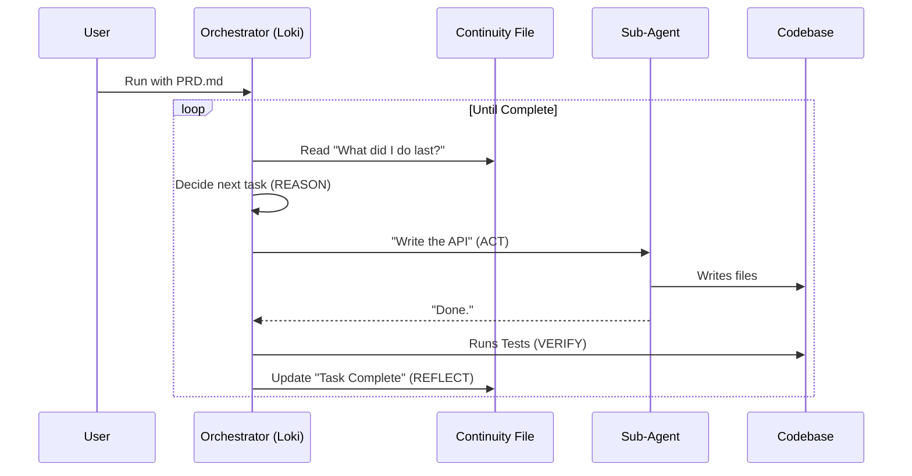

# Chapter 4: Autonomous Orchestration (Loki Mode)

In the previous chapter, **[Antigravity Workflows](03_antigravity_workflows.md)**, we learned how to give the AI a blueprint (a `workflows.json` file). This ensured the AI knew *what* to do.

However, there was still a bottleneck: **You.**

In a standard workflow, the AI does step 1, then stops and asks, "What next?" You have to click "Approve" or type "Continue" for every single step. If you want to build a complex app, you might have to approve 50 different actions.

What if the AI could click "Next" for itself?

## 1. The Goal: The "Virtual CTO"

**Autonomous Orchestration (Loki Mode)** removes the human from the loop. 

Instead of an assistant that waits for orders, Loki Mode turns the AI into a **Virtual CTO** (Chief Technology Officer). You give it a high-level goal (like a Product Requirements Document), and it manages the entire project lifecycle—hiring sub-agents, writing code, running tests, and fixing bugs—while you sleep.

## 2. Core Concept: The RARV Cycle

How does an AI run autonomously without hallucinating or destroying your codebase? It follows a strict recursive loop called **RARV**.

This is the "heartbeat" of Loki Mode.

1.  **Reason:** The AI looks at the plan and decides the next logical step.
2.  **Act:** It spawns a specialized sub-agent (e.g., a "React Coder") to do the work.
3.  **Reflect:** It looks at what was just done. Did it work?
4.  **Verify:** It runs automated tests. If they fail, it fixes them *before* moving on.

### The Self-Healing Loop
Most AI scripts fail because they keep coding blindly. Loki Mode is different because of the **Verify** step. If the AI writes code that breaks the build, the Verify step catches it, and the AI enters a "Fix it" loop automatically.

## 3. How to Use Loki Mode

Using Loki Mode is deceptively simple. You don't write code; you provide a **Product Requirements Document (PRD)**.

### Step 1: Create the Goal
Create a file named `my-app-idea.md`:

```markdown
# Todo App PRD
Build a simple Todo App using React and Node.js.
- Users must be able to add tasks.
- Tasks should be saved to a SQLite database.
- Use Tailwind CSS for styling.
```

### Step 2: Run the Command
In your terminal, you invoke the autonomous runner.

```bash
# The magic command
./autonomy/run.sh ./my-app-idea.md
```

### Step 3: Watch (or Sleep)
The system wakes up. It reads your file, creates a plan, and starts spawning agents. You will see logs like this:

```text
[Orchestrator] Plan approved. Phase 1: Setup.
[Agent: Architect] Creating folder structure...
[Agent: Engineer] Installing React dependencies...
[Agent: QA] Running tests... Failed.
[Agent: Engineer] Fixing bug in package.json...
[Agent: QA] Tests passed. Moving to Phase 2.
```

## 4. Under the Hood: The Orchestrator

How does a shell script manage a team of AI agents? Let's break down the architecture.

### The Infinite Loop
At its core, Loki Mode is a `while` loop that runs until the project is marked "Complete."



### The "Continuity" File
Since AI models have short memories, Loki Mode uses a special file called `.loki/CONTINUITY.md`.

Think of this as the **Project Board**. Every time an agent finishes a task, they *must* write a summary into this file. Before the next agent starts, they *must* read this file.

**Example Content of `CONTINUITY.md`:**
```markdown
## Current Phase: Development
## Last Action
- Agent "Backend-Dev" created the database schema.
- Status: Success.

## Next Steps
1. Create the API Routes (Pending)
2. Connect Frontend to API (Pending)

## Mistakes & Learnings
- Do not use port 3000, it is occupied. Use 8080.
```

## 5. Implementation Deep Dive

Let's look at the actual logic used in the `autonomy/run.sh` script (simplified for clarity).

### The Loop Logic
The script calls the AI, feeds it the current context, and executes the tools the AI asks for.

```bash
#!/bin/bash
# Simplified pseudo-code of the runner

while [ "$PROJECT_STATUS" != "COMPLETE" ]; do
  # 1. Build the prompt with history
  PROMPT="Read CONTINUITY.md. What is the next step?"
  
  # 2. Call the AI (Claude/GPT)
  OUTPUT=$(call_ai_model "$PROMPT")
  
  # 3. Execute the tool the AI requested
  execute_tool "$OUTPUT"
  
  # 4. Check for errors and loop again
  update_continuity_file
done
```

### Swarm Dispatching
Loki Mode is smart about *who* does the work. It doesn't use the expensive "Smartest Model" for everything.

*   **Architect Task:** Uses `Opus` (High intelligence, slow).
*   **Coding Task:** Uses `Sonnet` (Balanced).
*   **Unit Tests:** Uses `Haiku` (Fast, cheap).

It dynamically selects the model based on the task complexity.

```python
# Pseudo-code for agent dispatching
def dispatch_agent(task_type):
    if task_type == "PLANNING":
        return spawn_agent(model="claude-3-opus")
    
    if task_type == "TESTING":
        # We can run 5 testers in parallel!
        return spawn_agent(model="claude-3-haiku")
```

This allows Loki Mode to be fast and cost-effective, running multiple "Haiku" agents in parallel to write tests while the "Opus" agent thinks about architecture.

## 6. The "Verify" Step: Why It Matters

The most important part of Loki Mode is the **Verify** step in the RARV cycle.

If you ask a standard AI to "write code," it outputs text and says "Done."
Loki Mode does not trust the output.

1.  **Generate:** The agent writes `server.js`.
2.  **Verify:** The orchestrator immediately runs `node server.js`.
3.  **Correction:** If it crashes, the orchestrator feeds the error log back to the agent: *"You forgot to import express. Fix it."*

This recursive self-healing is what allows the system to run for hours without human intervention.

## 7. Summary

In this chapter, we unlocked the highest level of automation: **Autonomous Orchestration**.

1.  **Loki Mode** acts as a Virtual CTO.
2.  It uses the **RARV Cycle** (Reason, Act, Reflect, Verify) to ensure quality.
3.  It maintains state using a **Continuity File** so it doesn't get lost.
4.  It spawns specialized **Sub-agents** (Opus for planning, Haiku for testing).

We now have an AI that can think, plan, and execute. But as the project grows, a single `CONTINUITY.md` file isn't enough to remember everything. How does the AI remember the file structure of a massive project or the specific design decisions made three days ago?

In the next chapter, we will look at how the system uses the file system itself as a long-term memory.

👉 **[Next: File-Based Planning & Memory](05_file_based_planning___memory.md)**

---

Generated by [Code IQ](https://github.com/adityasoni99/Code-IQ)