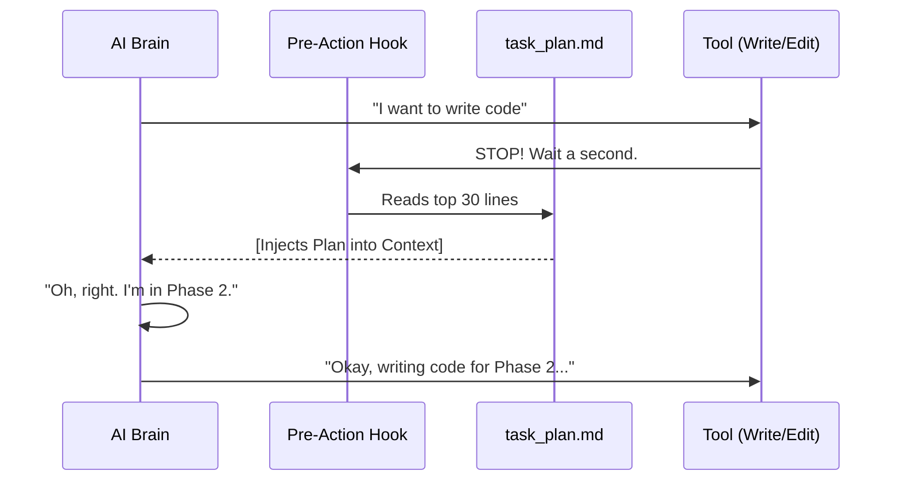

# Chapter 5: File-Based Planning & Memory

In the previous chapter, **[Autonomous Orchestration (Loki Mode)](04_autonomous_orchestration__loki_mode_.md)**, we turned our AI into a Virtual CTO that can execute complex projects.

But even the smartest CTO has a weakness: **Memory.**

As your project grows, the conversation history gets too long. The AI hits its "Context Window" limit (its short-term memory). It starts forgetting earlier instructions, hallucinating filenames, or losing track of the original goal.

It needs a way to store thoughts permanently.

## 1. The Problem: The "Goldfish" Effect

Imagine trying to write a novel, but every time you turn the page, the previous pages are erased. You would forget the main character's name by Chapter 3.

This is how Large Language Models (LLMs) work.
*   **Context Window (RAM):** Fast, smart, but expensive and temporary. When it fills up, old info falls off the edge.
*   **File System (Hard Drive):** Cheap, permanent, and unlimited.

If we keep the project plan inside the Chat History, it will eventually disappear. We need to move the plan **out of the brain and onto the disk**.

## 2. The Solution: File-Based Planning

The **File-Based Planning** pattern forces the AI to maintain its state in Markdown files inside your project folder.

Instead of "remembering" what it did, the AI simply **reads** a file to see what it did.

### The "External Brain" Files
We use three specific files to act as the AI's long-term memory.

1.  **`task_plan.md` (The Map):** A checklist of phases and steps. The AI reads this to know *where* it is.
2.  **`findings.md` (The Notebook):** A place to store research, API snippets, and decisions so they don't get lost.
3.  **`progress.md` (The Diary):** A log of what happened in each session (e.g., "Tried to install X, failed, fixed it by doing Y").

## 3. How to Use It

You don't need to manually create these files. We have a skill for that: `@planning-with-files`.

### Step 1: Initialization
When you start a complex task, tell the AI to initialize its memory.

> **User:** "@planning-with-files Let's build a weather dashboard."

The AI runs a script that generates the three empty Markdown files in your folder.

### Step 2: The Planning Loop
The AI fills in `task_plan.md` first.

```markdown
<!-- task_plan.md content -->
# Project: Weather Dashboard

## Phase 1: Setup
- [x] Initialize Node.js project
- [ ] Install React
- [ ] Set up Tailwind CSS

## Phase 2: API
- [ ] Get API Key from OpenWeather
```

### Step 3: Execution with Memory
Here is the magic. Before the AI writes any code, it **reads the plan**.

1.  **AI:** *Reads `task_plan.md`* -> "Ah, I see I finished Node.js setup. Next is installing React."
2.  **AI:** *Installs React.*
3.  **AI:** *Updates `task_plan.md`* -> Marks "Install React" as `[x]`.

Even if you restart the computer, the AI knows exactly where it left off.

## 4. Under the Hood: Skill Hooks

How do we force the AI to look at the plan? We can't just hope it remembers to do so.

We use a feature called **Skill Hooks** in the `SKILL.md` file. These are automated triggers (like database triggers) that run before or after the AI does something.

### The Workflow Diagram



### The Implementation Code
Let's look at `skills/planning-with-files/SKILL.md`.

```yaml
# SKILL.md Frontmatter (Simplified)
name: planning-with-files
hooks:
  PreToolUse:
    - matcher: "Write|Edit"
      hooks:
        - type: command
          # Force the AI to see the plan before acting
          command: "cat task_plan.md | head -30"
```

*Explanation:*
1.  **`matcher`**: Watches for when the AI tries to `Write` code or `Edit` a file.
2.  **`command`**: Before allowing the write, it runs `cat task_plan.md`.
3.  **Result**: The content of the plan is printed into the chat invisible to you, but visible to the AI, refreshing its memory immediately before it acts.

## 5. The "Findings" Pattern

Why do we need `findings.md`?

Imagine the AI reads a documentation page to learn how a specific API library works.
*   **Without Memory:** It uses the library once. 10 minutes later, the "Context Window" erases that knowledge. It has to read the documentation again.
*   **With Memory:** It saves the code snippet to `findings.md`.

```markdown
<!-- findings.md -->
## Research: Date Library
We are using `date-fns`.
Format used: `format(new Date(), 'yyyy-MM-dd')`
```

Now, when the AI needs to format a date 20 turns later, it checks `findings.md` instead of browsing the web again. This saves time, money (tokens), and prevents errors.

## 6. Internal Logic: The Init Script

When you first invoke the skill, it runs a simple bash script to set up the files. This ensures the files follow a strict template that the AI is trained to understand.

Here is a simplified version of `scripts/init-session.sh`:

```bash
#!/bin/bash
# simplified init script

# 1. Create the Plan
if [ ! -f "task_plan.md" ]; then
    echo "# Task Plan\n\n## Phase 1\n- [ ] Todo" > task_plan.md
fi

# 2. Create the Findings
if [ ! -f "findings.md" ]; then
    echo "# Findings\n\n## Key Decisions" > findings.md
fi

echo "Memory initialized. I am ready to plan."
```

*Explanation:* It checks if the files exist. If not, it creates them with the correct headers. This gives the AI a "Form" to fill out, rather than a blank page.

## 7. Why This Matters for Beginners

If you are just playing with AI, this might seem like overkill. But if you are building **Software**, this is essential.

1.  **Resilience:** Your internet cuts out? You close the window? No problem. The state is on the disk.
2.  **Focus:** The AI doesn't get distracted. The `task_plan.md` is a constant reminder of the goal.
3.  **Debugging:** If the AI gets stuck, you (the human) can open `task_plan.md` and edit it manually to steer the AI in a new direction.

## 8. Summary

Congratulations! You have completed the **Antigravity Awesome Skills** tutorial.

Let's recap your journey:
1.  **[Agentic Skills](01_agentic_skills__skill_md_.md)**: You learned how to teach the AI specific jobs using Markdown files.
2.  **[Skill Catalog](02_skill_catalog___bundles.md)**: You learned how to organize those skills into "App Store" style bundles.
3.  **[Workflows](03_antigravity_workflows.md)**: You learned how to chain skills together into a logical blueprint.
4.  **[Loki Mode](04_autonomous_orchestration__loki_mode_.md)**: You learned how to let the AI run the project autonomously.
5.  **File-Based Memory**: You learned how to give the AI a permanent memory so it never gets lost.

You now possess the complete architecture to turn a standard coding assistant into a professional, autonomous software engineer.

**Go forth and build something awesome!** 🚀

---

Generated by [Code IQ](https://github.com/adityasoni99/Code-IQ)