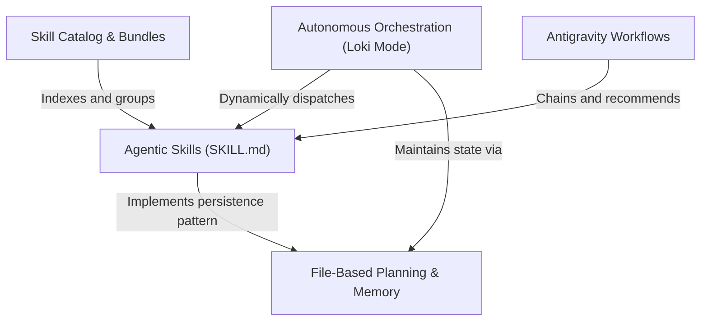

# Tutorial: antigravity-awesome-skills

**Antigravity Awesome Skills** acts as a comprehensive operating system for AI agents, providing a massive library of atomic **Agentic Skills** that transform generalist models into specialized experts (like Security Auditors or React Developers). The project organizes these skills into a searchable **Catalog & Bundles**, orchestrates them through structured **Antigravity Workflows** for multi-step goals, and enables fully autonomous software development via **Loki Mode**—a recursive system that manages sub-agents and persistent **File-Based Memory**.

**Source Repository:** [https://github.com/sickn33/antigravity-awesome-skills](https://github.com/sickn33/antigravity-awesome-skills)

## Chapters

1. [Agentic Skills (SKILL.md)](01_agentic_skills__skill_md_.md)
2. [Skill Catalog & Bundles](02_skill_catalog___bundles.md)
3. [Antigravity Workflows](03_antigravity_workflows.md)
4. [Autonomous Orchestration (Loki Mode)](04_autonomous_orchestration__loki_mode_.md)
5. [File-Based Planning & Memory](05_file_based_planning___memory.md)

---

Generated by [Code IQ](https://github.com/adityasoni99/Code-IQ)