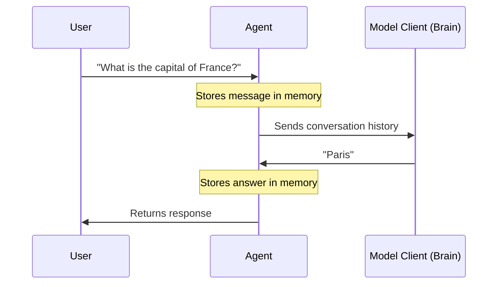

# Chapter 1: Agent

Welcome to the **Autogen** framework!

If you are looking to build applications powered by Large Language Models (LLMs) like GPT-4, you are in the right place. We start our journey with the most fundamental building block of the framework: the **Agent**.

## What is an Agent?

Think of an **Agent** as a **digital worker**.

In a human office, a worker has:
1.  **A Name/Role:** "The Receptionist" or "Bob".
2.  **Memory:** They remember what you told them five minutes ago.
3.  **Skills/Brain:** They can process information, answer questions, or use tools (like a calculator).
4.  **Communication:** They listen to requests and give answers.

In **Autogen**, an Agent does exactly this. It is a software entity that can receive a message, think about it (usually using an AI model), and send a reply.

### The Use Case: A Helpful Assistant

Imagine you want to create a bot that answers questions about geography. You don't just want a script that calls an API once; you want something that remembers the conversation and acts like a helpful assistant.

Instead of writing complex loops to manage chat history and API calls manually, we use an **Agent**.

## Creating Your First Agent

Let's look at the `AssistantAgent`. This is a pre-built agent included in Autogen designed to work easily with AI models.

### Step 1: The Setup

First, we need to import the necessary tools. We need the agent itself and a "Model Client" (which we will cover in detail in [Chapter 2](02_model_client.md)).

```python
import asyncio
from autogen_agentchat.agents import AssistantAgent
from autogen_ext.models.openai import OpenAIChatCompletionClient
```

### Step 2: Define the "Brain"

The agent needs a brain to think. We call this the **Model Client**. Here, we are telling the agent to use GPT-4.

```python
# Create the model client (the brain)
model_client = OpenAIChatCompletionClient(
    model="gpt-4",
    # api_key="YOUR_API_KEY"
)
```

### Step 3: Initialize the Agent

Now we create the digital worker. We give it a name and the brain we just created.

```python
# Create the agent
agent = AssistantAgent(
    name="geography_bot",
    model_client=model_client,
    system_message="You are a helpful geography expert."
)
```

*   **`name`**: How the system identifies this agent.
*   **`model_client`**: The AI model powering the agent.
*   **`system_message`**: The initial instruction telling the agent how to behave.

### Step 4: Run the Agent

Finally, we send a message to the agent and wait for the reply.

```python
async def main():
    # Send a task to the agent
    response = await agent.run(task="What is the capital of France?")
    
    # Print the result
    print(response.messages[-1].content)

# Run the async function
asyncio.run(main())
```

**Output:**
```text
The capital of France is Paris.
```

## How It Works: The Conversation Loop

When you call `agent.run()`, a specific sequence of events happens under the hood. The agent acts like a container that holds the conversation history and coordinates with the AI model.



1.  **Receive:** The Agent gets your message.
2.  **State Update:** It adds your message to its internal history (context).
3.  **Process:** It looks at the history and asks the Model Client for a completion.
4.  **Reply:** It receives the answer, saves it to history, and hands it back to you.

## Looking Under the Hood

For those who want to understand the internal machinery, the **Agent** in Autogen is defined by a standard **Protocol** (a set of rules).

Any object can be an Agent as long as it follows these rules, specifically implementing an `on_message` method.

### The `on_message` Handler

In the core code (e.g., `autogen_core/_agent.py`), an agent is defined by its ability to handle a message:

```python
# Simplified view of the Agent Protocol
class Agent(Protocol):
    async def on_message(self, message: Any, ctx: MessageContext) -> Any:
        """
        Receives a message and returns a response.
        """
        ...
```

The `AssistantAgent` we used earlier implements this method. When it receives a message, it automatically handles the complexity of talking to the AI model.

### State Management

Real conversations require memory. Agents have built-in capabilities to save and load their state.

```python
    async def save_state(self) -> Mapping[str, Any]:
        """Save the conversation history."""
        ...
```

This means you can pause an agent, save its memory to a file, and load it back up later to continue the conversation exactly where you left off.

## Summary

*   An **Agent** is an autonomous unit that sends and receives messages.
*   It maintains its own **state** (memory).
*   It typically uses a **Model Client** to generate intelligent responses.
*   It simplifies the loop of "User Input -> AI Processing -> AI Response".

In this chapter, we used a `model_client` without explaining it deeply. In the next chapter, we will explore exactly what that is and how to configure different "brains" for your agents.

[Next: Model Client](02_model_client.md)

---

Generated by [Code IQ](https://github.com/adityasoni99/Code-IQ)