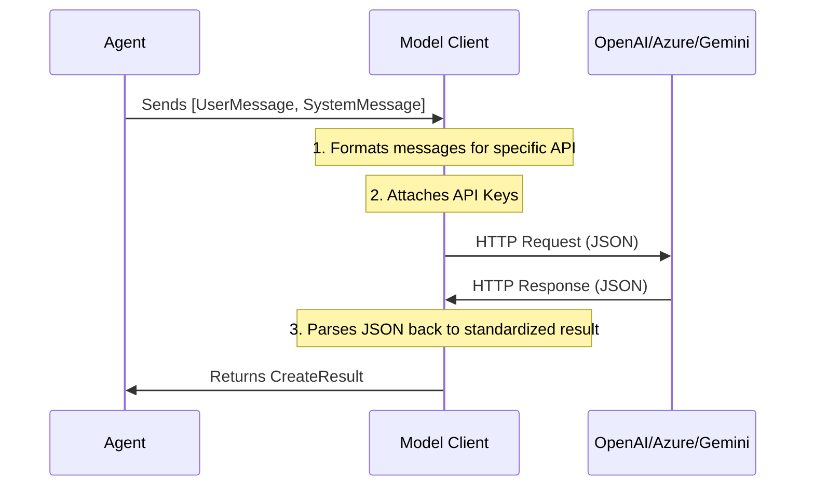

# Chapter 2: Model Client

In the previous chapter, [Agent](01_agent.md), we built a digital worker that could answer questions. We briefly initialized a "brain" for that worker, but we didn't explain how it works.

In this chapter, we will explore the **Model Client**.

## The Problem: Speaking Many Languages

Imagine you are building an application. Today, you want to use **GPT-4** (OpenAI). Tomorrow, your boss might want to switch to **Claude** (Anthropic) because it's cheaper, or a **Local Model** (like Llama) because of privacy concerns.

Each of these AI providers speaks a different "language" (API):
*   OpenAI expects specific JSON formats.
*   Google Gemini expects different parameters.
*   Local models might need a specific URL endpoint.

Without a **Model Client**, you would have to rewrite your entire agent every time you change the AI model.

## What is a Model Client?

The **Model Client** is a **universal adapter**.

Think of it like a **Universal Travel Adapter** for power outlets.
*   **Your Agent** is the appliance (hairdryer, laptop). It has one standard plug.
*   **The AI Providers** are the wall sockets. They are all different (UK, EU, US).
*   **The Model Client** connects your Agent to the specific AI Provider.

It handles authentication (API Keys), message formatting, and connection settings so your Agent doesn't have to worry about them.

## Use Case: Switching "Brains"

Let's say we have a generic task: "Tell a joke." We want to see how easy it is to define the configuration for the model.

### 1. The Standard: OpenAI

This is the most common client. It connects to models like GPT-4o or GPT-3.5-Turbo.

```python
from autogen_ext.models.openai import OpenAIChatCompletionClient

# Create the client
client = OpenAIChatCompletionClient(
    model="gpt-4o",
    # api_key="sk-...", # Optional if set in environment variables
)
```

### 2. The Enterprise: Azure OpenAI

Many companies use Microsoft Azure. The logic is the same, but the connection details differ.

```python
from autogen_ext.models.openai import AzureOpenAIChatCompletionClient

# Connect to a private enterprise deployment
client = AzureOpenAIChatCompletionClient(
    azure_deployment="my-gpt-deployment",
    model="gpt-4",
    api_version="2024-06-01",
    azure_endpoint="https://my-company.openai.azure.com/"
)
```

### 3. Using the Client Directly

Usually, an **Agent** uses the client. However, to understand what the client does, we can use it directly to send a message.

Note that the client expects a structured message (like `UserMessage`), not just a plain string.

```python
import asyncio
from autogen_core.models import UserMessage

async def main():
    # define the message
    msg = UserMessage(content="Hello!", source="user")
    
    # Ask the client to generate a response
    result = await client.create([msg])
    print(result.content)

asyncio.run(main())
```

**Output:**
```text
Hello! How can I help you today?
```

## Configuring Capabilities

The Model Client is also where you configure **how** the model thinks. You can tweak parameters to change the output style.

### Temperature (Creativity)

You can control randomness using `temperature` (usually between 0.0 and 1.0).

```python
# A very creative/random brain
creative_client = OpenAIChatCompletionClient(
    model="gpt-4o",
    temperature=0.9, 
)

# A very focused/deterministic brain
focused_client = OpenAIChatCompletionClient(
    model="gpt-4o",
    temperature=0.0,
)
```

## Under the Hood: The Translator

When you ask an Agent to "think," the Agent hands its memory to the Model Client. The Model Client performs a translation process.



### 1. Standardization

Internally, Autogen uses standard message types (like `UserMessage`, `AssistantMessage`).

The generic code in `autogen_core` defines the interface `ChatCompletionClient`. Any class that follows this rule can act as a brain.

### 2. The Conversion Logic

Let's look at a simplified version of how the `OpenAIChatCompletionClient` handles a request. This logic comes from `autogen_ext/models/openai/_openai_client.py`.

The client takes your generic messages and runs a conversion function:

```python
# Simplified internal logic from _openai_client.py
async def create(self, messages, ...):
    # 1. Convert Autogen messages to OpenAI dictionary format
    oai_messages = [
        to_oai_type(m, model=self.model) 
        for m in messages
    ]
    
    # 2. Call the actual API
    result = await self._client.chat.completions.create(
        messages=oai_messages,
        ...
    )
    
    # 3. Wrap and return the result
    return CreateResult(content=result.choices[0].message.content, ...)
```

The function `to_oai_type` is the "translator." It knows that a `UserMessage` should look like `{"role": "user", "content": "..."}` for OpenAI, while a Google Gemini client would translate it differently.

### 3. Handling Streams

The Model Client also handles **Streaming**. This is when the AI types out the answer character by character (like in ChatGPT).

The `create_stream` method in the client manages opening a persistent connection and yielding chunks of text as they arrive, so the Agent can process them in real-time.

## Summary

*   The **Model Client** acts as a bridge between your generic Agent code and specific AI providers (OpenAI, Azure, etc.).
*   It handles **Authentication** and **Formatting**.
*   It allows you to configure model parameters like `temperature` (creativity).
*   You can easily swap out the "brain" of an agent without rewriting the agent's logic.

Now that we have a digital worker (Agent) and a brain (Model Client), we need to give our worker the ability to **do things** in the real world, like calculating numbers or searching the web.

[Next: Tools and Capabilities](03_tools_and_capabilities.md)

---

Generated by [Code IQ](https://github.com/adityasoni99/Code-IQ)