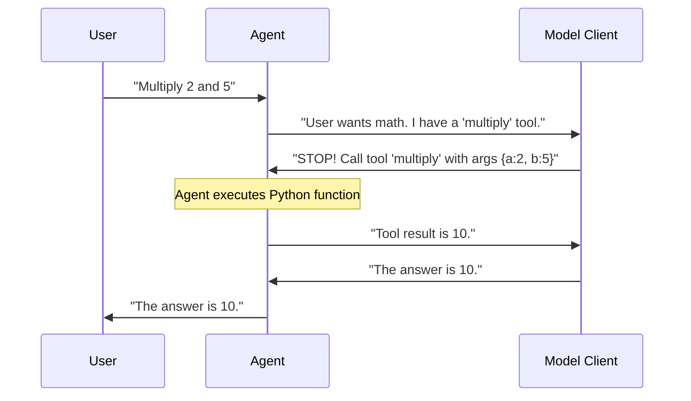

# Chapter 3: Tools and Capabilities

In [Chapter 2: Model Client](02_model_client.md), we gave our agent a "brain" capable of thinking and reasoning. However, you may have noticed a limitation: the brain is trapped in a box. It knows everything *up until its training cut-off date*, but it cannot check the current weather, search the web, or perform precise mathematical calculations (LLMs are notoriously bad at math!).

In this chapter, we will give our agent **Hands** and **Eyes**. We call these **Tools**.

## What is a Tool?

A **Tool** is a specific skill or function that you give to an agent. Think of your agent as a contractor and tools as their utility belt.

*   **Without Tools:** "I think 1234 * 5678 is roughly 7 million..." (The agent guesses).
*   **With a Calculator Tool:** "I will use the calculator. The exact answer is 7,006,652." (The agent acts).

## The Use Case: A Precision Calculator

Let's build an agent that doesn't just guess numbers but calculates them precisely. We will define a simple Python function and teach the agent how to use it.

### Step 1: Define the Function

First, we write a standard Python function. This is the logic we want the agent to execute.

```python
def multiply(a: int, b: int) -> int:
    """Multiplies two integers and returns the result."""
    return a * b
```

> **Note:** Type hints (like `: int`) and docstrings (`"""..."""`) are crucial. The agent uses these to understand how to use the tool!

### Step 2: Wrap it as a Tool

Autogen needs to wrap this function so the AI model understands it. We use `FunctionTool`.

```python
from autogen_core.tools import FunctionTool

# Create the tool
calculator_tool = FunctionTool(
    multiply, 
    description="Multiplies two numbers."
)
```

### Step 3: Equip the Agent

Now we return to our `AssistantAgent` from Chapter 1. Notice the new `tools` parameter.

```python
from autogen_agentchat.agents import AssistantAgent
# Assume model_client is already created (see Chapter 2)

agent = AssistantAgent(
    name="math_assistant",
    model_client=model_client,
    tools=[calculator_tool], # We hand over the utility belt here
    system_message="You are a helper that uses tools for math."
)
```

### Step 4: Run the Agent

When we ask a math question, the agent will recognize that it has a tool for this exact problem.

```python
import asyncio

async def main():
    response = await agent.run(task="What is 1234 times 5678?")
    print(response.messages[-1].content)

asyncio.run(main())
```

**Output:**
```text
The result is 7006652.
```

The agent didn't guess. It "called" your function, got the real number, and wrote the answer.

## Advanced Capabilities

Tools aren't limited to simple math. In the Autogen ecosystem, tools can be powerful subsystems.

### Web Surfing
Imagine a tool that can open a web browser. The `MultimodalWebSurfer` (available in `autogen-ext`) is a specialized agent that acts as a tool. It can:
1.  Navigate to a URL.
2.  Scroll up and down.
3.  Click buttons.
4.  "Read" the screen using vision capabilities.

### Code Execution
Sometimes you want the agent to write its own code to solve a problem. The `DockerCommandLineCodeExecutor` is a powerful tool that allows an agent to:
1.  Write a Python script.
2.  Run it inside a secure Docker container.
3.  Read the output.

This is safer than running code directly on your computer!

## Looking Under the Hood

How does a text-based AI model "click a button" or "run a function"? It works through a process called **Tool Calling** (or Function Calling).

### The Loop

The interaction isn't a straight line anymore; it's a loop.



1.  **Selection:** The Model Client looks at the user's prompt and the descriptions of available tools.
2.  **Request:** Instead of writing a reply, the Model Client outputs a special "Call Request" (e.g., `call: multiply(2, 5)`).
3.  **Execution:** The Agent pauses, runs the actual Python code, and captures the return value (e.g., `10`).
4.  **Resumption:** The Agent sends the result `10` back to the Model Client.
5.  **Final Answer:** The Model Client uses this new information to answer the user.

### Internal Implementation

In the code, tools are often defined by a standard interface. Let's look at a simplified view of how `autogen-ext` adapts external tools (like LangChain tools) to work with Autogen.

This snippet is based on `autogen_ext/tools/langchain/_langchain_adapter.py`.

```python
class LangChainToolAdapter(BaseTool):
    def __init__(self, langchain_tool):
        # We extract the name and description so the AI can read them
        self.name = langchain_tool.name
        self.description = langchain_tool.description
        self.func = langchain_tool.func

    async def run(self, args, cancellation_token):
        # When the agent calls this tool, we execute the internal function
        return self.func(**args)
```

The key take-away is that a **Tool** is just a standard object with:
1.  A **Schema** (Name, Description, Arguments) for the AI to read.
2.  A **Run Method** for the Agent to execute.

## Summary

*   **Tools** extend an agent's capabilities beyond text generation.
*   You can create simple tools using **Python functions**.
*   You can use complex pre-built tools for **Web Surfing** or **Code Execution**.
*   The Agent handles the flow of: `Think` -> `Call Tool` -> `Get Result` -> `Answer`.

Now that we have smart agents equipped with powerful tools, we can start grouping them together to tackle complex projects.

[Next: Teams and Orchestration](04_teams_and_orchestration.md)

---

Generated by [Code IQ](https://github.com/adityasoni99/Code-IQ)