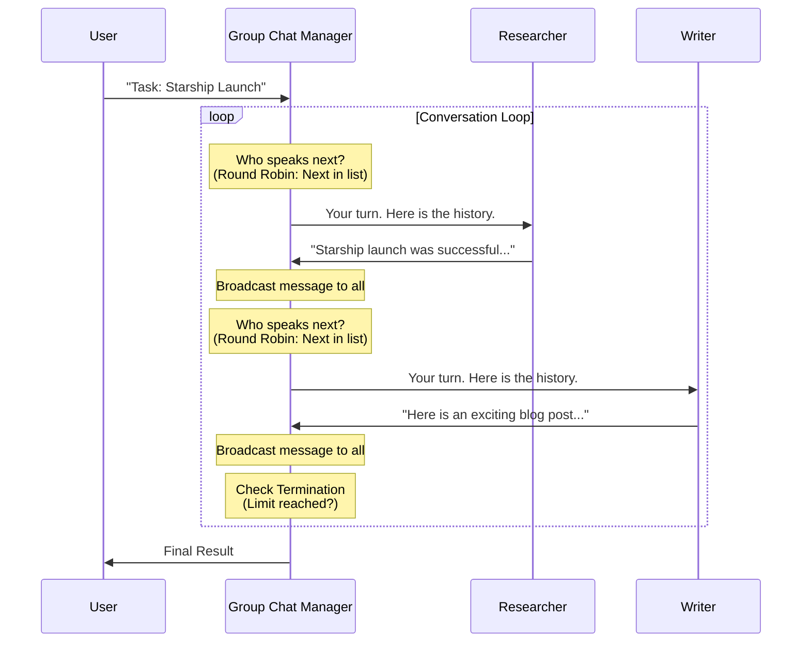

# Chapter 4: Teams and Orchestration

In the previous chapter, [Tools and Capabilities](03_tools_and_capabilities.md), we gave our agent a "utility belt" so it could interact with the outside world.

However, a single agent—even with tools—has limits. It's like a "one-man band." For complex projects, you don't hire one person to do everything; you hire a **Team**. You hire a researcher, a writer, and an editor, and you ask them to work together.

In this chapter, we will learn how to organize multiple agents into a collaborative **Team**.

## The Use Case: A Newsletter Team

Imagine you want to generate a short newsletter about "SpaceX". To do this well, you want two distinct personalities:

1.  **The Researcher:** Finds facts and presents them bluntly.
2.  **The Writer:** Takes those facts and writes an engaging blog post.

If we ask one agent to do both, it might get confused or hallucinate. By separating concerns, we get better results.

## What is a Team?

In Autogen, a **Team** is a container that holds multiple agents. Crucially, it includes an **Orchestrator** (or Manager).

Think of the **Orchestrator** as a meeting facilitator:
*   They decide who is in the room.
*   They decide who speaks next.
*   They ensure everyone hears what is being said.

## Creating Your First Team

We will use a **Round Robin Group Chat**. This is the simplest type of team. "Round Robin" simply means the agents take turns speaking in a circle: A -> B -> A -> B.

### Step 1: Create the Agents

First, we create our two specialists using the `AssistantAgent` we learned about in [Agent](01_agent.md).

```python
from autogen_agentchat.agents import AssistantAgent
from autogen_ext.models.openai import OpenAIChatCompletionClient

# Define the brain (see Chapter 2)
model_client = OpenAIChatCompletionClient(model="gpt-4o")

# 1. The Researcher
researcher = AssistantAgent(
    name="Researcher",
    model_client=model_client,
    system_message="You find facts. Be concise and factual."
)

# 2. The Writer
writer = AssistantAgent(
    name="Writer",
    model_client=model_client,
    system_message="You write engaging blog posts based on facts provided."
)
```

### Step 2: Define a Stop Condition

Teams need to know when to stop the meeting. If we don't tell them, they might compliment each other forever! We will cover this in depth in [Termination Conditions](05_termination_conditions.md), but for now, let's limit the conversation to **2 messages**.

```python
from autogen_agentchat.conditions import MaxMessageTermination

# Stop after 2 messages (1 from Researcher, 1 from Writer)
termination = MaxMessageTermination(max_messages=2)
```

### Step 3: Initialize the Team

Now we put the agents into a `RoundRobinGroupChat`.

```python
from autogen_agentchat.teams import RoundRobinGroupChat

# Create the team
team = RoundRobinGroupChat(
    participants=[researcher, writer],
    termination_condition=termination
)
```

### Step 4: Run the Team

We give the team a task. The request goes to the Team, and the Team Manager handles the agents.

```python
import asyncio

async def main():
    # Run the team task
    result = await team.run(task="Tell me about the latest Starship launch.")
    
    # Print who said what
    for message in result.messages:
        print(f"{message.source}: {message.content}\n")

asyncio.run(main())
```

**What happens?**
1.  **Researcher** goes first (because they are first in the list). They output facts about Starship.
2.  **Writer** goes next. They see the Researcher's message and write the blog post.
3.  The `MaxMessageTermination` condition is met (2 messages), so the team stops.

## How It Works: The Orchestration Loop

When you run a team, an invisible loop begins. The **Group Chat Manager** is the traffic cop controlling this loop.



### The Concept of "Broadcasting"

In a team, agents share a collective memory. When the Researcher speaks, the Manager takes that message and shows it to the Writer (and everyone else). This ensures that when it's the Writer's turn, they have the context needed to do their job.

## Looking Under the Hood

The magic of Autogen teams lies in how the **Manager** selects the next speaker.

### The Manager Implementation

In the core code (specifically `RoundRobinGroupChatManager`), the logic is very simple. It keeps an index (a counter) of who spoke last.

Here is a simplified explanation of the logic found in `autogen_agentchat/teams/_group_chat/_base_group_chat.py` and its implementations:

```python
class RoundRobinGroupChatManager:
    def __init__(self, participants):
        self.participants = participants
        self.next_speaker_index = 0

    def select_speaker(self, history):
        # 1. Pick the agent at the current index
        speaker = self.participants[self.next_speaker_index]
        
        # 2. Update the index for next time (loop back to 0 if at end)
        self.next_speaker_index = (self.next_speaker_index + 1) % len(self.participants)
        
        return speaker
```

### Smart Orchestration (Selector)

Round Robin is great for linear pipelines (A -> B -> C). But what if you have a **Developer**, a **Tester**, and a **Manager**?
1.  Developer writes code.
2.  Tester finds a bug.
3.  Tester should send it *back* to Developer (not to the Manager).

For this, Autogen supports **Selector Group Chats**. Instead of a simple counter, the Manager asks an LLM: *"Based on the conversation so far, who should speak next?"*

This allows for dynamic, non-linear conversations that adapt to the situation.

## Summary

*   **Teams** organize multiple Agents to work together.
*   The **Group Chat** is the room where agents meet.
*   The **Manager/Orchestrator** decides who speaks next.
*   **Round Robin** is a simple pattern where agents take turns in order.
*   **Broadcasting** ensures all agents see the full conversation history.

We used `MaxMessageTermination` in this chapter to stop our team. However, counting messages is a crude way to stop a conversation. Ideally, we want the team to stop when the job is *done*.

[Next: Termination Conditions](05_termination_conditions.md)

---

Generated by [Code IQ](https://github.com/adityasoni99/Code-IQ)