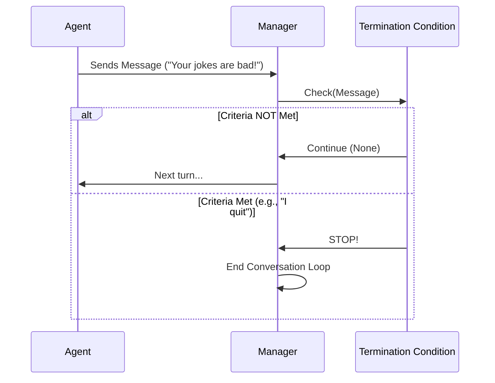

# Chapter 5: Termination Conditions

In the previous chapter, [Teams and Orchestration](04_teams_and_orchestration.md), we built a team of agents that could talk to each other. However, we used a very crude method to stop them: we simply pulled the plug after 2 messages.

## The Problem: Knowing When to Stop

Imagine you are on a phone call. You don't hang up exactly after 10 sentences. You hang up when the conversation is **finished**—usually when someone says "Goodbye" or "Talk to you later."

If you don't give your Agents a "Goodbye" signal, they might:
1.  **Loop Forever:** Complimenting each other endlessly.
2.  **Waste Money:** Every message costs tokens.
3.  **Crash:** Eventually hitting the maximum context limit of the model.

**Termination Conditions** are the rules that tell the Team Manager: *"The job is done. Stop the chat."*

## Use Case: The Comedy Club

Let's build a scenario where two agents, a **Comedian** and a **Heckler**, are trading insults.

We want the conversation to stop if **either**:
1.  The Comedian says "I quit" (Natural ending).
2.  They have exchanged 10 messages (Safety limit).

## Core Concepts

In Autogen, termination is handled by special classes that watch the conversation.

### 1. The Safety Net (`MaxMessageTermination`)
This acts like a timer. It stops the chat after a specific number of messages have been exchanged, regardless of what was said.

### 2. The Keyword Trigger (`TextMentionTermination`)
This watches the *content* of the messages. If it sees a specific phrase (like "TERMINATE" or "I quit"), it stops the chat.

### 3. Logical Operators (AND / OR)
You can combine conditions.
*   **OR (`|`)**: Stop if Condition A happens **OR** Condition B happens.
*   **AND (`&`)**: Stop only if Condition A **AND** Condition B happen at the same time.

## Implementing the Solution

Let's implement our Comedy Club rules.

### Step 1: Create the Agents

We need our two personalities. (We assume `model_client` is already set up as shown in [Chapter 2](02_model_client.md)).

```python
from autogen_agentchat.agents import AssistantAgent

comedian = AssistantAgent(
    name="Comedian",
    model_client=model_client,
    system_message="Tell jokes. If the crowd is too tough, say 'I quit'."
)

heckler = AssistantAgent(
    name="Heckler",
    model_client=model_client,
    system_message="You are a rude audience member. Insult the comedian."
)
```

### Step 2: Define the Conditions

Now we import the termination classes and configure them.

```python
from autogen_agentchat.conditions import MaxMessageTermination, TextMentionTermination

# Condition 1: The Safety Net (Stop after 10 messages total)
max_msg = MaxMessageTermination(max_messages=10)

# Condition 2: The Keyword (Stop if comedian gives up)
keyword = TextMentionTermination(text="I quit")
```

### Step 3: Combine with Logic

We want the chat to stop if *either* thing happens. We use the `|` (OR) operator.

```python
# Create a combined condition
stop_logic = max_msg | keyword
```

> **Note:** If we used `&` (AND), the chat would run until 10 messages passed **AND** someone said "I quit" at the exact same time. That is rarely what you want!

### Step 4: Run the Team

We pass this logic to our Team (Group Chat).

```python
from autogen_agentchat.teams import RoundRobinGroupChat

# Create the team with the termination logic
comedy_club = RoundRobinGroupChat(
    participants=[comedian, heckler],
    termination_condition=stop_logic
)

# Run it
import asyncio
await comedy_club.run(task="Start the show!")
```

**Output Scenario:**
The agents will chat. If the Heckler is too mean and the Comedian types "I quit", the `TextMentionTermination` triggers, and the script finishes immediately—even if only 3 messages were exchanged.

## Under the Hood

How does the system know when to check these rules?

Every time an agent speaks, the **Team Manager** pauses and asks the **Termination Condition**: *"Should we stop now?"*



### Internal Implementation

The code for this is located in `autogen_agentchat/base/_termination.py`.

At its heart, a `TerminationCondition` is just a class that implements a standard interface (Protocol).

#### The Protocol

```python
class TerminationCondition(ABC):
    @abstractmethod
    async def __call__(self, messages) -> StopMessage | None:
        """
        Check messages. Return StopMessage if done, else None.
        """
        ...
```

The `__call__` method makes the object act like a function. It looks at the latest messages. If the criteria are met, it returns a `StopMessage`.

#### How `OR` Logic Works

When you write `cond1 | cond2`, Autogen creates a special `OrTerminationCondition` wrapping both. Here is a simplified version of the internal logic:

```python
# Inside OrTerminationCondition class
async def __call__(self, messages):
    # Check all conditions in parallel
    results = await asyncio.gather(
        condition1(messages), 
        condition2(messages)
    )
    
    # If ANY condition returned a StopMessage, we stop.
    for result in results:
        if result is not None:
            return result # Stop!
            
    return None # Continue
```

This design pattern (Composite Pattern) allows you to chain as many conditions as you like: `cond1 | cond2 | cond3`.

### Stateful Conditions

Some conditions need memory. `MaxMessageTermination` needs to count.

```python
class MaxMessageTermination(TerminationCondition):
    def __init__(self, max_messages: int):
        self._max_messages = max_messages
        self._current_count = 0  # Internal state

    async def __call__(self, messages):
        self._current_count += 1
        if self._current_count >= self._max_messages:
             return StopMessage(content="Max messages reached", source="check")
        return None
```

Because of this internal state (`_current_count`), if you want to run the team a second time, you must **Reset** the condition.

```python
# Reset the counter to 0 before running again
await stop_logic.reset()
```

## Summary

*   **Termination Conditions** provide the "Exit Strategy" for your agents.
*   **`MaxMessageTermination`** acts as a safety limit.
*   **`TextMentionTermination`** allows for natural conversation endings.
*   You can combine conditions using **`|` (OR)** and **`&` (AND)**.
*   Under the hood, the Manager checks these conditions after every single message.

In this chapter, we treated messages as simple strings of text. But in Autogen, messages are actually rich objects containing metadata, source information, and even tool calls. In the next chapter, we will examine the lifeblood of the agent system.

[Next: Messages](06_messages.md)

---

Generated by [Code IQ](https://github.com/adityasoni99/Code-IQ)