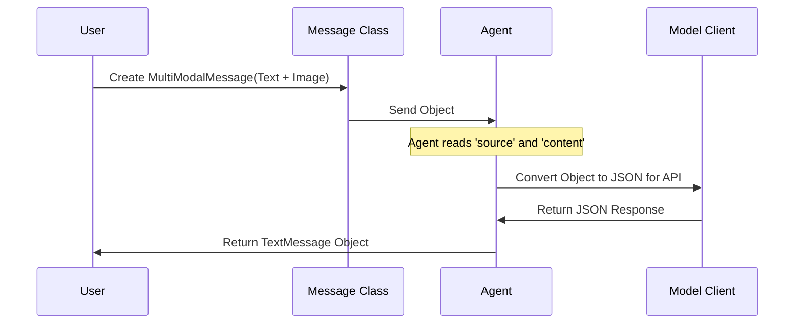

# Chapter 6: Messages

In [Chapter 5: Termination Conditions](05_termination_conditions.md), we learned how to control when a team stops talking. Up until now, we have treated the communication between agents as simple strings of text.

But in the real world, communication is more than just text. It involves images, documents, and hidden information like "Who sent this?" or "What time was it sent?".

In this chapter, we will look at **Messages**—the structured data packets that flow through the veins of Autogen.

## The Motivation: More Than Just Words

Imagine you are sending a letter.
*   **Plain Text:** You just write "Hello" on a napkin.
*   **Structured Message:** You put the letter in an envelope. You write the **Sender's Name** (Source), the **Date** (Timestamp), and you might enclose a **Photograph** (Multimodal content).

If we only used plain strings, we couldn't send images or track who said what in a large team. Autogen solves this by using **Message Objects**.

## Use Case: The Image Analyst

Let's say we want an agent to look at a picture and describe it. We cannot simply paste an image into a text string. We need a specific container that can hold both text and image data.

## Types of Messages

Autogen provides several built-in message types. Here are the two most common ones you will use:

1.  **`TextMessage`**: A standard message containing text.
2.  **`MultiModalMessage`**: A message containing text mixed with images.

### Step 1: Creating a Text Message

Usually, the `AssistantAgent` handles this for you, but you can create messages manually to simulate a user.

```python
from autogen_agentchat.messages import TextMessage

# Create a simple text message
msg = TextMessage(
    content="Hello, Agent!", 
    source="user"
)

print(msg.content)
```
**Output:**
```text
Hello, Agent!
```

### Step 2: Creating a MultiModal Message

To send an image, we use the `MultiModalMessage`. We also use the `Image` utility to load our picture safely.

```python
from autogen_core import Image
from autogen_agentchat.messages import MultiModalMessage

# 1. Load an image (local file or URL)
# For this example, imagine we have a file 'cat.png'
img = Image.from_file("cat.png")

# 2. Create the message with a list of content
vision_msg = MultiModalMessage(
    content=["Describe this picture.", img], 
    source="user"
)
```

### Step 3: Sending it to an Agent

Now, let's send this rich message to an agent. (We assume `model_client` is set up with a vision-capable model like GPT-4o, as seen in [Chapter 2: Model Client](02_model_client.md)).

```python
import asyncio
from autogen_agentchat.agents import AssistantAgent

# Setup the agent (assuming model_client exists)
vision_agent = AssistantAgent(
    name="VisionBot",
    model_client=model_client
)

async def main():
    # Pass the message object directly to on_messages
    response = await vision_agent.on_messages(
        [vision_msg], 
        cancellation_token=None
    )
    print(response.chat_message.content)

asyncio.run(main())
```

**Output:**
```text
I see a cute orange tabby cat sitting on a windowsill.
```

## Internal Structure: What's Inside?

A message isn't just content. It carries metadata that helps the system function.

If we inspect a message object, we find fields like `models_usage`. This acts like a receipt, telling you how many "tokens" (units of cost) were used to generate that message.

```python
# Inspecting the response from the agent
print(f"Sender: {response.chat_message.source}")
print(f"Cost: {response.chat_message.models_usage}")
```

**Output:**
```text
Sender: VisionBot
Cost: RequestUsage(prompt_tokens=50, completion_tokens=12)
```

## Looking Under the Hood

How does an image object travel from your Python script to the AI model? It goes through a process called **Serialization**.

The message object is converted into a standard dictionary (JSON) format, sent to the model, and the response is converted back.



### The `BaseMessage` Definition

In the source code (specifically `autogen_agentchat/messages.py`), all messages inherit from a parent class called `BaseChatMessage`.

```python
# Simplified from autogen_agentchat/messages.py
class BaseChatMessage(BaseMessage, ABC):
    source: str
    models_usage: RequestUsage | None = None
    
    def dump(self) -> Mapping[str, Any]:
        """Convert to a dictionary for storage/network."""
        return self.model_dump(mode="json")
```

The `dump()` method is crucial. It allows Autogen to save your conversation history to a database or send it over the internet to another computer.

### Protocol Buffers

If you look deeper into the system's core (`protos/agent_worker.proto`), you will see that Autogen is designed to be language-agnostic. While we are writing Python, the internal definition of a message uses **Protocol Buffers** (protobuf).

```protobuf
// From protos/agent_worker.proto
message Message {
    oneof message {
        RpcRequest request = 1;
        RpcResponse response = 2;
        io.cloudevents.v1.CloudEvent cloudEvent = 3;
    }
}
```

This might look complex, but it simply means that in the future, a Python Agent could send a `Message` to a C# Agent or a JavaScript Agent, and they would all understand each other because they agree on the strict structure of the packet.

### System Messages

There are also messages you don't usually create manually but will see in logs:
*   **`StopMessage`**: The signal used by [Termination Conditions](05_termination_conditions.md) to end a chat.
*   **`ToolCallSummaryMessage`**: Contains the results of the tools we used in [Chapter 3](03_tools_and_capabilities.md).

## Summary

*   **Messages** are structured containers, not just strings.
*   **`TextMessage`** is for standard conversation.
*   **`MultiModalMessage`** allows you to send images along with text.
*   Messages contain **Metadata** like `source` (who sent it) and `models_usage` (how much it cost).
*   Internally, messages can be **serialized** (turned into JSON/Bytes) to be sent across networks.

Now that we understand the data flowing through the system, and the agents processing that data, we are ready for the final piece of the puzzle: How do we run these agents in complex, distributed environments?

[Next: Agent Runtime](07_agent_runtime.md)

---

Generated by [Code IQ](https://github.com/adityasoni99/Code-IQ)