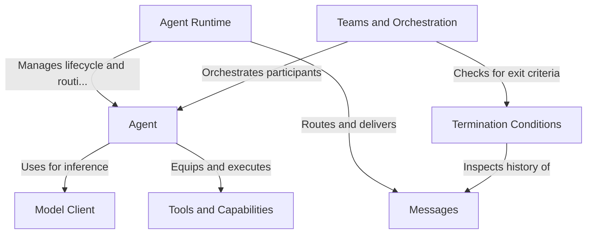

# Tutorial: autogen

**Autogen** is a framework designed to build autonomous **Agents** that can collaborate to solve tasks. It provides a robust **Runtime** layer to manage agent lifecycles and route **Messages**, allowing agents to communicate within **Teams** using various orchestration patterns. Agents leverage **Model Clients** to access LLM intelligence and **Tools** to perform actions, while **Termination Conditions** define when a conversation workflow is complete.

**Source Repository:** [https://github.com/microsoft/autogen](https://github.com/microsoft/autogen)

## Chapters

1. [Agent](01_agent.md)
2. [Model Client](02_model_client.md)
3. [Tools and Capabilities](03_tools_and_capabilities.md)
4. [Teams and Orchestration](04_teams_and_orchestration.md)
5. [Termination Conditions](05_termination_conditions.md)
6. [Messages](06_messages.md)
7. [Agent Runtime](07_agent_runtime.md)

---

Generated by [Code IQ](https://github.com/adityasoni99/Code-IQ)