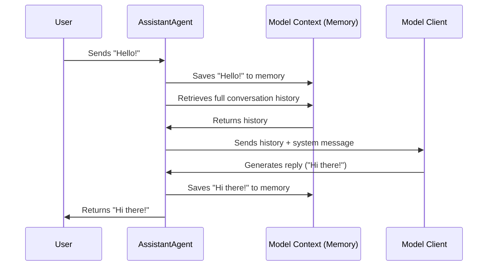

# Chapter 1: Agents (The Actors)

Welcome to the world of AutoGen! 

If you imagine a software application as a company, **Agents** are the employees. In a traditional script, the code follows a strict line-by-line instruction set (like a factory robot). In AutoGen, we create **Agents**—autonomous entities that can receive a task, think about it, use tools, and provide a result.

This chapter introduces the fundamental building block of the framework: the **Agent**.

## The Concept: Digital Employees

Why do we need Agents? 
Standard LLM (Large Language Model) calls are stateless and passive. You send a prompt, you get text. 

An **Agent** wraps that LLM with superpowers:
1.  **Identity:** It has a name and a persona (e.g., "Coder", "Reviewer").
2.  **Memory:** It remembers the conversation history (state).
3.  **Capabilities:** It can execute tools or code (the "hands").
4.  **Communication:** It follows a specific protocol to talk to other agents.

### The Two Main Types

While you can build custom agents, AutoGen provides two primary types to get started:

1.  **`AssistantAgent`**: The AI worker. It uses an LLM to "think" and generate answers.
2.  **`UserProxyAgent`**: The bridge. It represents *you* (the human) or executes code on behalf of the system.

## A Simple Use Case: The Greeter

Let's look at how to create a simple AI agent that acts as a helpful assistant. We want to send it a message ("Hello") and have it reply.

### 1. The Assistant Agent
The `AssistantAgent` is the thinker. It needs a "Brain" (a Model Client, which we will cover in detail in [Model Clients (The Brains)](02_model_clients__the_brains_.md)).

Here is how you define one in Python:

```python
from autogen_agentchat.agents import AssistantAgent
# We assume 'model_client' is defined (see Chapter 2)

# Create the agent
agent = AssistantAgent(
    name="my_assistant",
    model_client=model_client,
    system_message="You are a polite greeter."
)
```

**Explanation:**
*   `name`: How the system identifies this agent.
*   `model_client`: The LLM backend (e.g., OpenAI, Azure).
*   `system_message`: The instruction that defines the agent's personality.

### 2. Sending a Message
Agents interact via **Messages**. To get work done, you send a message to the agent.

```python
import asyncio
from autogen_agentchat.messages import TextMessage
from autogen_core import CancellationToken

async def run_chat():
    # Define the input message
    msg = TextMessage(content="Hello!", source="user")
    
    # Send message to agent and await response
    response = await agent.on_messages(
        [msg], 
        cancellation_token=CancellationToken()
    )
    print(response.chat_message.content)

# Output might be: "Hello! How can I help you today?"
```

**Explanation:**
*   `TextMessage`: A standard message container holding the text content.
*   `on_messages`: The method that triggers the agent to "work." It takes the input, processes it, and returns a response.

## Under the Hood: How an Agent Works

When you call `agent.on_messages(...)`, a specific workflow triggers inside the `AssistantAgent`. It doesn't just guess; it follows a structured process.

### The Workflow



### Internal Implementation

In the AutoGen core, an Agent isn't magic; it's a class that follows a **Protocol**. This ensures that different types of agents (Python, .NET, custom) can all talk to each other.

Looking at `autogen_core/_agent.py`, the base definition is very simple:

```python
@runtime_checkable
class Agent(Protocol):
    @property
    def metadata(self) -> AgentMetadata:
        ...

    async def on_message(self, message: Any, ctx: MessageContext) -> Any:
        """The core handler for incoming work."""
        ...
```

**What this means:**
Any class that implements `on_message` can be an Agent. It receives a message and context, and returns a result.

### The Assistant's Logic
The `AssistantAgent` (in `_assistant_agent.py`) implements this logic specifically to chat. Here is a simplified view of what happens inside its processing loop:

```python
# Simplified pseudocode of AssistantAgent logic
async def on_messages(self, messages, ...):
    # 1. Add new messages to internal memory
    await self._model_context.add_messages(messages)
    
    # 2. Prepare context for the LLM
    history = await self._model_context.get_messages()
    
    # 3. Ask the LLM to generate a result
    result = await self._model_client.create(history, ...)
    
    # 4. Save the result back to memory
    await self._model_context.add_message(result)
    
    # 5. Return the result
    return Response(chat_message=result)
```

This internal loop handles the "state" (memory) so you don't have to manually pass the full conversation history every time.

## The User Proxy Agent

Sometimes you need an agent that doesn't "think" with an LLM, but instead asks a human for input or executes code. This is the `UserProxyAgent`.

```python
from autogen_agentchat.agents import UserProxyAgent

# Create a proxy representing a human user
user_proxy = UserProxyAgent(
    name="user_proxy",
    description="A human user",
)
```

If another agent sends a message to `user_proxy`, the program will pause and wait for you to type a response in the terminal. This allows for **Human-in-the-loop** workflows, where an AI proposes a solution, and a human (via the UserProxyAgent) approves or rejects it.

## Summary

In this chapter, we learned:
1.  **Agents** are the fundamental actors in AutoGen.
2.  They combine **Identity**, **Memory**, and **Computation**.
3.  The **`AssistantAgent`** is your primary AI worker.
4.  The **`UserProxyAgent`** brings humans or code execution into the loop.

However, an `AssistantAgent` is useless without a brain. In the next chapter, we will learn how to connect these agents to powerful Large Language Models.

[Next Chapter: Model Clients (The Brains)](02_model_clients__the_brains_.md)

---

Generated by [Code IQ](https://github.com/adityasoni99/Code-IQ)