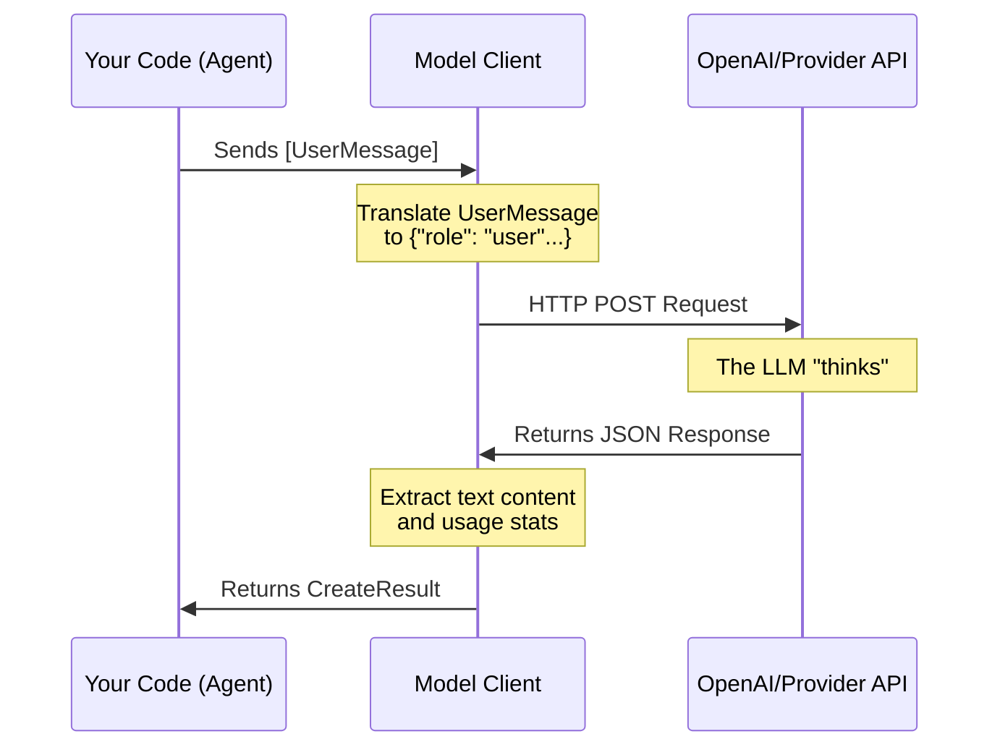

# Chapter 2: Model Clients (The Brains)

In the previous chapter, [Agents (The Actors)](01_agents__the_actors_.md), we created an `AssistantAgent`. However, we noted that an agent without a "brain" is just an empty shell. It needs a way to process information, understand language, and generate responses.

In this chapter, we explore **Model Clients**—the abstractions that connect your agents to powerful Large Language Models (LLMs) like GPT-4, Claude, or Gemini.

## The Problem: The "Tower of Babel"

Imagine you want to build an app that uses AI.
*   **OpenAI** expects input in a format like `{"role": "user", "content": "..."}`.
*   **Google Gemini** might expect `{"parts": [{"text": "..."}]}`.
*   **Anthropic** has its own unique schema.

If you hard-code your agent to talk to OpenAI, switching to a different provider later means rewriting your entire codebase. Furthermore, you have to manually handle:
1.  Counting tokens (to avoid hitting limits).
2.  Handling connection errors.
3.  Parsing the response JSON.

## The Solution: The Universal Adapter

In AutoGen, a **Model Client** acts as a universal adapter.

Think of your Agent as a lamp. Think of the LLM provider (OpenAI, Azure, etc.) as the wall socket. The Model Client is the travel adapter that lets you plug that lamp into any socket in the world without changing the lamp itself.

### Setting up a Brain

Let's look at how to set up the most common client: the `OpenAIChatCompletionClient`. This lives in the `autogen-ext` (extensions) package.

```python
import os
from autogen_ext.models.openai import OpenAIChatCompletionClient

# Define the "Brain"
model_client = OpenAIChatCompletionClient(
    model="gpt-4o",
    api_key=os.environ.get("OPENAI_API_KEY"), 
    # Optional: adjust creativity
    temperature=0.7, 
)
```

**What just happened?**
We created an object that knows exactly how to talk to the "gpt-4o" model. We didn't send a message yet; we just configured the connection.

## Using the Brain

While you usually pass this client to an Agent (as seen in Chapter 1), you can use it directly to understand what it does.

The client creates a standard way to send messages using `UserMessage`, `SystemMessage`, and `AssistantMessage`.

```python
import asyncio
from autogen_core.models import UserMessage

async def main():
    # 1. Create a standardized message
    message = UserMessage(content="What is the capital of France?", source="user")

    # 2. Ask the model to create a response
    result = await model_client.create([message])

    # 3. Print the result
    print(result.content) # Output: "The capital of France is Paris."

# asyncio.run(main())
```

**Key Takeaway:** Notice we didn't write any code specific to OpenAI's JSON format. We used `UserMessage`. If we swapped the client to an `AnthropicClient` (hypothetically), this code would remain exactly the same.

## Under the Hood: The Request Lifecycle

When you call `create()`, the Model Client performs a translation layer.



### Internal Implementation

If we peek inside the source code (specifically `_openai_client.py`), we can see how this translation works. The client implements a standardized protocol defined in `autogen_core`.

#### 1. Normalization
The client takes the generic AutoGen messages and converts them into the specific dictionary format the provider requires.

```python
# Simplified logic from _openai_client.py
def to_oai_type(message):
    if isinstance(message, UserMessage):
        return {"role": "user", "content": message.content}
    elif isinstance(message, SystemMessage):
        return {"role": "system", "content": message.content}
    # ... handles other types
```

#### 2. The Create Method
The `create` method orchestrates the call. It handles the asynchronous network request and wraps the raw data into a clean `CreateResult` object.

```python
# Simplified pseudocode of the client logic
async def create(self, messages, ...):
    # Convert messages to provider format
    oai_messages = [to_oai_type(m) for m in messages]
    
    # Call the actual API (e.g., via the official OpenAI SDK)
    response = await self._client.chat.completions.create(
        messages=oai_messages, 
        model=self._create_args["model"]
    )

    # Wrap the messy response in a clean object
    return CreateResult(
        content=response.choices[0].message.content,
        usage=response.usage
    )
```

## Advanced Features

The Model Client handles more than just text. It abstracts away several complex features so you don't have to build them from scratch.

### 1. Token Counting
LLMs have limits on how much text they can read. The client includes utilities to estimate token usage before you send a request.

```python
# Check how many tokens our message uses
count = model_client.count_tokens([message])
print(f"This message costs {count} tokens.")
```

### 2. Streaming
Waiting for a long response can feel slow. The client supports `create_stream`, which yields chunks of text as they are generated, allowing for "typewriter" effects in UI applications.

### 3. Swapping to Local Models
Because the interface is standard, you can use local models (like Llama 3 running on Ollama) by simply changing the configuration to point to a local server.

```python
# Example: Pointing to a local server mimicking OpenAI
local_client = OpenAIChatCompletionClient(
    model="llama-3-local",
    base_url="http://localhost:1234/v1", # Local address
    api_key="not-needed"
)
```

## Summary

In this chapter, we learned:
1.  **Model Clients** are the "brains" that power agents.
2.  They **standardize** how we talk to different AI providers (OpenAI, Azure, etc.).
3.  They handle the heavy lifting of **translating messages**, **counting tokens**, and **managing connections**.
4.  By using clients, your agents become **model-agnostic**.

Now our Agent has a body (Chapter 1) and a brain (Chapter 2). It can think and talk. But to be truly useful, an agent needs to interact with the world—it needs hands.

In the next chapter, we will give our agents the ability to write and run code.

[Next Chapter: Code Execution (The Hands)](03_code_execution__the_hands_.md)

---

Generated by [Code IQ](https://github.com/adityasoni99/Code-IQ)