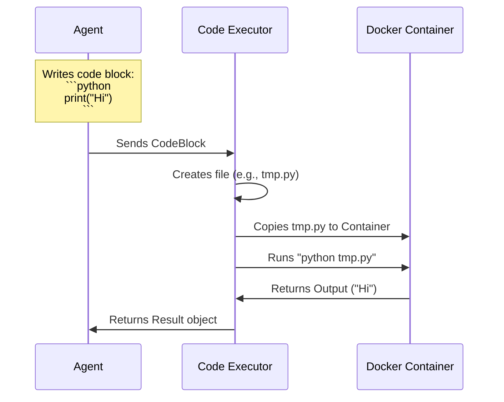

# Chapter 3: Code Execution (The Hands)

In the previous chapter, [Model Clients (The Brains)](02_model_clients__the_brains_.md), we gave our agents the ability to think using Large Language Models (LLMs).

However, a brain in a jar cannot change a lightbulb. Even the smartest LLM has limitations:
1.  **It is bad at math:** LLMs predict the next word, they don't use a calculator. They often guess answers to complex equations.
2.  **It cannot affect the world:** It can write a file name in text, but it can't actually create the file on your hard drive.

To solve this, we give agents **Code Execution** capabilities—the "Hands."

## The Concept: The Secure Sandbox

One of AutoGen's most powerful features is allowing agents to **write code** and **execute it** immediately.

Imagine you ask an agent: *"What is the 100th Fibonacci number?"*
*   **Without Hands:** The Agent tries to guess the number token-by-token (and often fails).
*   **With Hands:** The Agent writes a Python script to calculate it, runs the script, and reads the output.

### Why do we need a Sandbox?
If an AI writes code, you don't want it running directly on your laptop's main operating system. What if it accidentally deletes your files?

AutoGen provides a **Sandbox** (usually using **Docker**). It's like a chemistry lab fume hood. The agent can make a mess, run experiments, and create files inside the container, but your personal computer remains safe.

## Setting Up the Hands

To give an agent hands, we use a **Code Executor**. The most robust option is the `DockerCommandLineCodeExecutor`.

### Prerequisites
You need **Docker Desktop** installed and running on your machine for this to work.

### 1. Initialize the Executor
First, we create the environment where the code will run.

```python
from autogen_ext.code_executors.docker import DockerCommandLineCodeExecutor

# Create a "computer within a computer"
executor = DockerCommandLineCodeExecutor(
    image="python:3-slim",  # The environment (OS + Python)
    work_dir="coding",      # Where files are saved
)

# Start the Docker container
await executor.start()
```

**Explanation:**
*   `image`: We tell Docker to download a lightweight version of Linux with Python 3 installed.
*   `work_dir`: Any code the agent writes will be saved in a local folder named "coding".

### 2. Running Code
Normally, an Agent (Chapter 1) would generate the code. But to understand the "Hands," let's manually give the executor some work.

```python
from autogen_core.code_executor import CodeBlock
from autogen_core import CancellationToken

# Imagine the Agent wrote this:
code = "print('Hello from inside the Docker container!')"

# Wrap it in a CodeBlock
block = CodeBlock(language="python", code=code)

# Run it!
result = await executor.execute_code_blocks(
    code_blocks=[block],
    cancellation_token=CancellationToken()
)

print(result.output)
```

**Output:**
```text
Hello from inside the Docker container!
```

**What just happened?**
1.  AutoGen took the text string.
2.  It created a temporary Python file inside the Docker container.
3.  It ran the file.
4.  It captured the text "Hello..." and sent it back to Python.

## The Feedback Loop

The real magic happens when you combine the **Agent** (Chapter 1) with the **Executor**. This creates a feedback loop:

1.  **User:** "Calculate the sum of the first 50 prime numbers."
2.  **Agent:** Writes a Python script to do the math.
3.  **Executor:** Runs the script.
4.  **Agent:** Reads the output.
5.  **Agent:** Reports the final answer to the User.

If the code has an error (e.g., a syntax error), the Executor returns the error message. The Agent sees this, thinks "Oops, I made a typo," corrects the code, and runs it again. **This allows agents to debug themselves.**

## Under the Hood: How Execution Works

How does the text move from the Agent to the Sandbox and back?

### The Workflow



### Internal Implementation

Let's look inside `autogen_ext/code_executors/docker/_docker_code_executor.py` to see how this is built.

The core logic resides in the `_execute_code_dont_check_setup` method. It performs three main steps.

#### Step 1: Saving the File
The executor takes the code string and saves it to a file so the operating system can read it.

```python
# Simplified from _docker_code_executor.py
for code_block in code_blocks:
    # 1. Determine the filename (random or specified)
    filename = f"tmp_code_{hash}.py"
    
    # 2. Write the code to the workspace on your disk
    code_path = self.work_dir / filename
    with code_path.open("w") as fout:
        fout.write(code_block.code)
```

#### Step 2: Building the Command
It determines how to run that file. If it's Python, it uses `python`. If it's a shell script, it uses `sh`.

```python
# Simplified command generation
command = ["timeout", "60", "python", filename]
```
*It adds a `timeout` command so the agent doesn't accidentally create an infinite loop that runs forever!*

#### Step 3: Execution inside Docker
Finally, it uses the Docker library to execute that command inside the isolated container.

```python
# Simplified execution logic
exec_result = container.exec_run(command)

# Decode the result (bytes to string)
output = exec_result.output.decode("utf-8")
exit_code = exec_result.exit_code
```

### Stop! Cleanup Time
When using Docker, it is polite to clean up resources so you don't have unused containers eating up your RAM.

```python
await executor.stop()
```

## Supported Languages

While Python is the most common language for AI agents, the `DockerCommandLineCodeExecutor` is flexible. It determines how to run code based on the language label:

*   `python` -> Runs `python <file>`
*   `bash`, `sh`, `shell` -> Runs `sh <file>`
*   `pwsh` (PowerShell) -> Runs `pwsh <file>` (if installed in the image)

*(Note: For .NET developers, AutoGen also supports `dotnet-interactive` kernels to run C# code interactively, as seen in `InteractiveService.cs`, allowing for similar capabilities in a .NET environment.)*

## Summary

In this chapter, we learned:
1.  **Code Execution** gives agents "Hands" to perform actions and precise math.
2.  **Executors** provide a secure sandbox (like Docker) to prevent damage to your computer.
3.  The **Feedback Loop** allows agents to write, run, fix, and verify their own code.

We now have:
*   **Agents:** The Actors.
*   **Model Clients:** The Brains.
*   **Code Executors:** The Hands.

We can build a single smart agent. But complex tasks usually require a team of specialists. How do we make multiple agents talk to each other?

[Next Chapter: Teams and Group Chats (The Orchestration)](04_teams_and_group_chats__the_orchestration_.md)

---

Generated by [Code IQ](https://github.com/adityasoni99/Code-IQ)