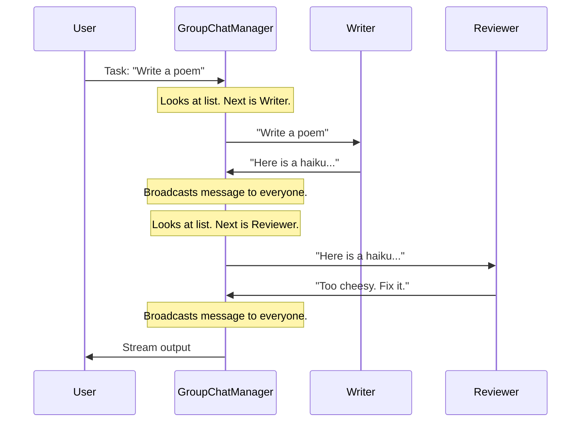

# Chapter 4: Teams and Group Chats (The Orchestration)

In the previous chapter, [Code Execution (The Hands)](03_code_execution__the_hands_.md), we gave our agents the ability to write and run code. We now have capable individual agents: a "Thinker" (Model Client) and a "Doer" (Code Executor).

But complex problems rarely require just one skill. Writing software requires a Coder and a Reviewer. Writing a blog post requires a Writer and an Editor.

In this chapter, we explore **Teams** (also called Group Chats)—the abstraction that manages how multiple agents talk to each other to solve a shared goal.

## The Concept: The Department Meeting

If an Agent is an **Employee**, a Team is a **Department Meeting**.

Imagine you put three people in a room:
1.  **Alice** (Writer)
2.  **Bob** (Editor)
3.  **Charlie** (Manager)

Without a process, everyone might talk at once, or Alice might wait forever for Bob to speak. You need **Orchestration**—a set of rules that defines:
*   Who speaks next?
*   How do they share information?
*   When is the meeting over?

In AutoGen, a `Team` wraps multiple agents and handles this flow for you.

## A Simple Use Case: Writer and Reviewer

Let's build a simple team to write a haiku. We need two agents:
1.  **Writer:** Generates the poem.
2.  **Reviewer:** Critiques it.

### 1. Define the Agents
First, we create our participants using what we learned in [Agents (The Actors)](01_agents__the_actors_.md).

```python
from autogen_agentchat.agents import AssistantAgent
# Assume 'model_client' is already defined (see Chapter 2)

# The Creative Agent
writer = AssistantAgent(
    name="Writer",
    model_client=model_client,
    system_message="You write haikus about technology."
)

# The Critical Agent
reviewer = AssistantAgent(
    name="Reviewer",
    model_client=model_client,
    system_message="You simply say 'Approving' or offer brief feedback."
)
```

### 2. The Orchestrator: Round Robin
Now we need a manager. The simplest management style is **Round Robin**. This means agents take turns in a circle: A -> B -> A -> B.

```python
from autogen_agentchat.teams import RoundRobinGroupChat

# Create the team
team = RoundRobinGroupChat(
    participants=[writer, reviewer],
    max_turns=3
)
```

**Explanation:**
*   `participants`: The list of agents involved.
*   `max_turns`: A safety limit. We only want them to exchange 3 messages total before stopping (Writer -> Reviewer -> Writer).

### 3. Running the Team
We run the team just like we run a single agent. The Team looks like a single entity from the outside.

```python
import asyncio

async def run_team():
    # Send the initial task
    stream = team.run_stream(task="Write a poem about Python.")
    
    # Print the conversation as it happens
    async for message in stream:
        print(f"{message.source}: {message.content}\n")

# Output:
# Writer: (Writes haiku)
# Reviewer: (Critiques haiku)
# Writer: (Refines haiku)
```

## Under the Hood: The Manager

How does the `RoundRobinGroupChat` know to switch from the Writer to the Reviewer?

It uses a hidden component often called the **Group Chat Manager**. When you run a team, you aren't talking to the agents directly; you are talking to the Manager, and the Manager routes the traffic.

### The Workflow



### Internal Implementation

Let's look into `autogen_agentchat/teams/_group_chat/_base_group_chat.py` to see how this works.

The `BaseGroupChat` class is the parent of `RoundRobinGroupChat`. It manages the loop.

#### 1. The Initialization
When the team starts, it registers all participants and creates a specific "topic" (channel) for communication.

```python
# Simplified logic from BaseGroupChat._init
async def _init(self, runtime):
    # Register the Manager
    await self._base_group_chat_manager_class.register(...)
    
    # Register every participant (Writer, Reviewer)
    for participant in self._participants:
        await ChatAgentContainer.register(..., agent=participant)
```

#### 2. The Loop
The core logic isn't a simple `for` loop in Python; it's an event-driven loop. However, conceptualized within `run_stream`, it processes messages as they arrive in a queue.

```python
# Simplified logic from BaseGroupChat.run_stream
async def run_stream(self, task, ...):
    # 1. Send the start signal to the Manager
    await self._runtime.send_message(GroupChatStart(messages=[task]), ...)
    
    # 2. Listen for results
    while True:
        # Wait for the next message from the Manager
        message = await self._output_message_queue.get()
        
        # Check if the team decided to stop
        if isinstance(message, GroupChatTermination):
            break
            
        yield message
```

The **Manager** (which runs in the background) is the one actually deciding *who* receives the message next. In `RoundRobinGroupChat`, the manager simply increments an index: `next_index = (current_index + 1) % num_agents`.

## Advanced Orchestration: MagenticOne

Round Robin is great for simple back-and-forth. But what if you have a complex team: a Coder, a Web Surfer, and a File Reader?

You don't want the Web Surfer to search the internet if the Coder just needs to fix a syntax error. You need a **Smart Orchestrator**.

AutoGen provides **MagenticOne**, a sophisticated team structure.

### The Generalist System
`MagenticOne` (found in `autogen_ext/teams/magentic_one.py`) uses a "Lead Orchestrator" agent. This lead agent acts like a project manager with a plan.

1.  **Task Ledger:** The Orchestrator maintains a to-do list.
2.  **Assignment:** It looks at the step and selects the best specialist (Surfer, Coder, etc.).
3.  **Reflection:** After the specialist finishes, the Orchestrator checks the result and updates the plan.

```python
from autogen_ext.teams.magentic_one import MagenticOne

# Create a smart team with built-in specialists
# Note: This automatically creates a WebSurfer, FileSurfer, and Coder
m1 = MagenticOne(client=model_client)

await m1.run(task="Check the stock price of MSFT and save it to a file.")
```

**What happens here?**
The Orchestrator realizes it needs external info -> Activates **WebSurfer**.
Surfer gets info -> Orchestrator sees info.
Orchestrator realizes it needs to save a file -> Activates **Coder** (or FileSurfer).
Coder writes file -> Orchestrator marks task done.

## Summary

In this chapter, we learned:
1.  **Teams** (Group Chats) allow multiple agents to work together.
2.  **Orchestration** is the logic that decides who speaks next.
3.  **Round Robin** is a simple, circular orchestration useful for review loops.
4.  **MagenticOne** is a complex, planning-based orchestration for general tasks.

You might have noticed a problem in our Round Robin example: we had to hard-code `max_turns=3`. If the Writer finishes in 1 turn, the team keeps going unnecessarily. If they need 10 turns, the team cuts them off early.

We need a way to stop the meeting exactly when the work is done.

[Next Chapter: Termination Conditions (The Stop Button)](05_termination_conditions__the_stop_button_.md)

---

Generated by [Code IQ](https://github.com/adityasoni99/Code-IQ)