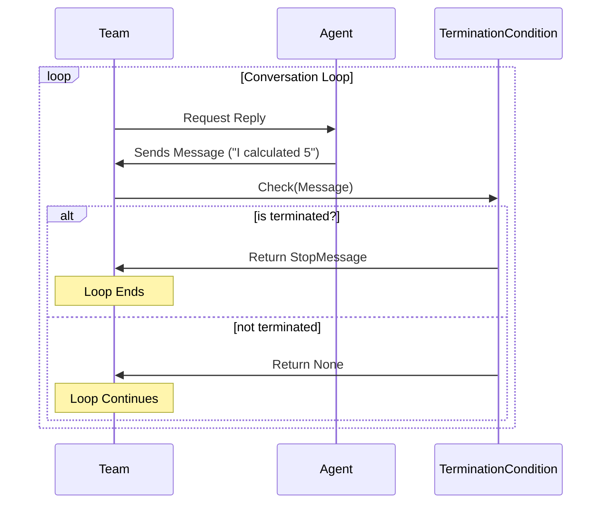

# Chapter 5: Termination Conditions (The Stop Button)

In the previous chapter, [Teams and Group Chats (The Orchestration)](04_teams_and_group_chats__the_orchestration_.md), we built a team of agents that passed messages back and forth. 

However, we faced a small problem: we had to guess how many turns the conversation needed (`max_turns`). 
*   If we guessed too low, the work got cut off. 
*   If we guessed too high, the agents kept chatting politely ("Is there anything else?" "No, thank you." "You are welcome.")—wasting time and money.

In this chapter, we introduce **Termination Conditions**. These are the rules that tell the system exactly when to stop.

## The Concept: The Referee

Think of an automated agent loop as a soccer match. The players (Agents) kick the ball (Messages) around. But players don't decide when the game ends; the **Referee** does.

The Referee watches every message. It blows the whistle if:
1.  **Time is up** (Maximum number of messages reached).
2.  **A Goal is scored** ( The problem is solved).

In AutoGen, Termination Conditions act as this referee.

## Basic Conditions

AutoGen provides built-in logic blocks to handle common stopping scenarios.

### 1. The Safety Net (`MaxMessageTermination`)
This is the simplest condition. It stops the loop after a specific number of messages. It prevents infinite loops where agents talk forever.

```python
from autogen_agentchat.conditions import MaxMessageTermination

# Stop after 10 messages total
max_msg = MaxMessageTermination(max_messages=10)
```

### 2. The Keyword Stop (`TextMentionTermination`)
This is the most common "Success" condition. You instruct your agent: *"When you finish the task, add the word 'TERMINATE' to your message."*

Then, you set up a condition to watch for that word.

```python
from autogen_agentchat.conditions import TextMentionTermination

# Stop if any message contains the word "TERMINATE"
text_term = TextMentionTermination(text="TERMINATE")
```

## Composing Logic (The "Or" Operator)

Real-world workflows usually need a combination of rules. You want the conversation to stop if the task is done **OR** if the conversation drags on too long.

We use the `|` (OR) operator to combine conditions.

```python
# Stop if "TERMINATE" is said OR if we hit 10 messages
stop_condition = text_term | max_msg
```

**Why is this powerful?**
It creates a bounded autonomous system. You give the agents a chance to finish (keyword trigger), but you guarantee it won't run forever (max message trigger).

## A Concrete Use Case: The Math Teacher

Let's build a workflow where a **Student Agent** tries to solve a problem, and a **Teacher Agent** verifies it. The conversation should only stop when the Teacher says "CORRECT".

### 1. Define the Agents
We set up a student and a teacher. Note the instructions given to the teacher.

```python
from autogen_agentchat.agents import AssistantAgent

# The Teacher
teacher = AssistantAgent(
    name="teacher",
    model_client=model_client, # Defined in Chapter 2
    system_message="Ask a math question. If the student answers correctly, say 'CORRECT'."
)

# The Student
student = AssistantAgent(
    name="student",
    model_client=model_client,
    system_message="You are a student. Solve the math problems."
)
```

### 2. Define the Stop Button
We want to stop specifically when the word "CORRECT" appears.

```python
from autogen_agentchat.conditions import TextMentionTermination

# The specific trigger to look for
stop_on_success = TextMentionTermination(text="CORRECT")
```

### 3. Run the Team with the Condition
We pass the `termination_condition` to the Team. The Team will check this condition after every single message.

```python
from autogen_agentchat.teams import RoundRobinGroupChat

# Create the team with the condition
team = RoundRobinGroupChat(
    participants=[teacher, student],
    termination_condition=stop_on_success
)

# Run it
await team.run(task="Start the class.")
```

**What happens?**
1.  Teacher: "What is 2 + 2?" (Condition check: False)
2.  Student: "It is 4." (Condition check: False)
3.  Teacher: "That is CORRECT." (Condition check: **True**)
4.  **STOP.**

## Under the Hood: How it Works

When you pass a condition to a Team, the Team consults the condition class before deciding whether to continue to the next agent.

### The Workflow



### Internal Implementation

Let's peek into `autogen_agentchat/base/_termination.py` to understand the magic.

The `TerminationCondition` is an abstract base class. It has one critical method: `__call__` (which makes the object behave like a function).

```python
# Simplified concept of the Base Class
class TerminationCondition(ABC):
    
    @abstractmethod
    async def __call__(self, messages) -> StopMessage | None:
        """
        Input: List of messages.
        Output: StopMessage if done, None if we should continue.
        """
        ...
```

### How `TextMentionTermination` works
It simply iterates through the messages to see if the string exists.

```python
# Pseudocode logic for Text Mention
async def __call__(self, messages):
    for msg in messages:
        if self.text in msg.content:
            # We found the keyword! Stop the chat.
            return StopMessage(content="Terminated by keyword", source="Termination")
    return None
```

### How the `|` (OR) Operator works
The code uses a clever Python feature called "Operator Overloading." When you type `A | B`, Python calls the `__or__` method.

In `_termination.py`, the `__or__` method creates a new class called `OrTerminationCondition` that wraps both rules.

```python
# Simplified from _termination.py
class OrTerminationCondition(TerminationCondition):
    def __init__(self, condition1, condition2):
        self._conditions = [condition1, condition2]

    async def __call__(self, messages):
        # Check all conditions in parallel
        results = await asyncio.gather(
            *[c(messages) for c in self._conditions]
        )
        
        # If ANY result is a StopMessage, we stop.
        for result in results:
            if result is not None:
                return result # STOP!
        
        return None
```

This implementation allows you to chain as many conditions as you want: `Cond1 | Cond2 | Cond3`.

## Summary

In this chapter, we learned:
1.  **Termination Conditions** act as the referee to stop agent loops.
2.  **`MaxMessageTermination`** prevents infinite loops (Time Limit).
3.  **`TextMentionTermination`** allows agents to trigger the stop themselves (Goal Scored).
4.  We can **Compose** conditions using `|` (OR) and `&` (AND) to create robust logic.

Now our agents can talk, think, work, and stop when they are done. But how exactly are these messages structured? What if we want to send an image, or a structured JSON object instead of just text?

[Next Chapter: Messages and Events (The Protocol)](06_messages_and_events__the_protocol_.md)

---

Generated by [Code IQ](https://github.com/adityasoni99/Code-IQ)