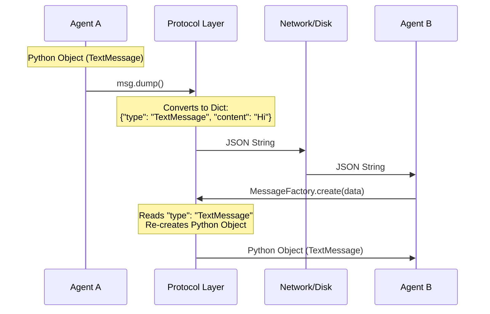

# Chapter 6: Messages and Events (The Protocol)

In the previous chapter, [Termination Conditions (The Stop Button)](05_termination_conditions__the_stop_button_.md), we learned how to act as a referee to stop a conversation.

However, up until now, we have mostly treated the conversation as simple strings of text ("Hello", "Stop"). As systems get complex, passing raw strings around becomes dangerous. Was that string a request to run code? Was it a search result? Was it an image?

In this chapter, we explore **Messages and Events**—the strict protocol that defines exactly *what* is being sent between agents.

## The Problem: The "Raw Text" Trap

Imagine a post office where every letter is just a blank piece of paper with no envelope.
*   You pick one up. Is it a bill? A love letter? A photo?
*   You have to read the entire content to figure out how to handle it.

In software, sending raw text causes similar confusion.
*   **Agent A:** "STOP" (Is this a command to stop, or just the word "stop" in a sentence?)
*   **Agent B:** "image.png" (Is this the filename, or should I display the actual image?)

## The Solution: The Envelope System

AutoGen solves this by wrapping content in **Typed Messages**. Think of these as official envelopes with colored stamps.
*   **`TextMessage`**: A standard blue envelope for conversation.
*   **`StopMessage`**: A red envelope that means "Halt."
*   **`MultiModalMessage`**: A heavy parcel containing images.

By checking the *type* of the message (the envelope), the system knows exactly what to do without guessing.

## The Hierarchy

Everything in AutoGen's communication layer inherits from a base definition. There are two main families you need to know:

1.  **Chat Messages (`BaseChatMessage`):** Messages meant for conversation. Agent A sends this to Agent B.
2.  **Agent Events (`BaseAgentEvent`):** Signals about what is happening. Use these for logging or UI updates (e.g., "I am thinking...").

### 1. Basic Text Messages
This is the bread and butter of the framework.

```python
from autogen_agentchat.messages import TextMessage

# A standard message
msg = TextMessage(
    content="Hello, world!", 
    source="user"
)

print(msg.type)    # Output: TextMessage
print(msg.content) # Output: Hello, world!
```

### 2. Multi-Modal Messages (Images)
Modern LLMs (like GPT-4o) have eyes. They can see images. We cannot simply paste an image into a text string, so we use a `MultiModalMessage`.

```python
from autogen_agentchat.messages import MultiModalMessage
from autogen_core import Image

# Create a message with text AND an image
msg = MultiModalMessage(
    content=[
        "Describe this image.",
        Image.from_file("cat.png")
    ],
    source="user"
)
```

**Why is this better?**
The Model Client (Chapter 2) sees this specific type and knows exactly how to format the image bytes for OpenAI or Google, saving you from complex encoding work.

### 3. System Signals
Some messages aren't for the *user* to read; they are instructions for the *system*.

*   **`StopMessage`**: Used by Termination Conditions (Chapter 5) to signal the end.
*   **`HandoffMessage`**: Used to transfer control to a specific agent (e.g., "I can't answer this, switching to the `ExpertAgent`").

```python
from autogen_agentchat.messages import StopMessage

# The system sees this and shuts down the loop
stop_signal = StopMessage(
    content="Task completed successfully.",
    source="Reviewer"
)
```

## Events vs. Messages

While **Messages** are directed at other agents ("Please fix this code"), **Events** are broadcasts to the world ("I am currently generating code").

Events are crucial for building User Interfaces (UI). You don't want the user staring at a blank screen while the agent works. You want to show a spinner or a log.

```python
from autogen_agentchat.messages import ThoughtEvent

# The agent broadcasts its internal monologue
event = ThoughtEvent(
    content="I need to calculate the radius first...",
    source="MathAgent"
)

# This is NOT sent to the other agent as chat. 
# It is sent to the UI/Console to show progress.
```

## Structured Messages (Strict Data)

Sometimes you don't want a poem or a sentence. You want strictly formatted data (JSON) to save into a database.

You can enforce this using `StructuredMessage`. This uses Pydantic (a Python data validation library) to define the "shape" of the data.

```python
from pydantic import BaseModel
from autogen_agentchat.messages import StructuredMessage

# 1. Define the shape of data you want
class UserInfo(BaseModel):
    name: str
    age: int

# 2. Wrap it in a message
msg = StructuredMessage(
    content=UserInfo(name="Alice", age=30),
    source="DatabaseAgent"
)

print(msg.content.age) # Output: 30 (It's a real integer, not a string!)
```

## Under the Hood: Serialization

How do these objects travel between agents, or even across the internet to a different server?

They must be **Serialized** (converted to a standard dictionary/JSON format) and **Deserialized** (converted back to a Python object).

### The Workflow



### Internal Implementation

Let's look at `autogen_agentchat/messages.py`.

Every message inherits from `BaseMessage`. This base class provides the magic `dump` and `load` methods.

```python
# Simplified internal logic
class BaseMessage(BaseModel):
    def dump(self) -> Dict[str, Any]:
        # Convert Python object to a Dictionary
        return self.model_dump(mode="json")
```

When a message is received (e.g., from a database or a network stream), the system doesn't know what it is yet. It uses the `MessageFactory` to inspect the `type` field.

```python
# Simplified logic from MessageFactory
class MessageFactory:
    def __init__(self):
        # A registry of all known envelopes
        self._types = {
            "TextMessage": TextMessage,
            "StopMessage": StopMessage,
            # ...
        }

    def create(self, data: Dict):
        # 1. Peek at the label
        msg_type = data.get("type") 
        
        # 2. Find the matching class
        cls = self._types[msg_type]
        
        # 3. Create the object
        return cls.load(data)
```

This factory pattern ensures that if you add a new custom message type, the system can still safely load and understand it as long as it is registered.

## Summary

In this chapter, we learned:
1.  **Typed Messages** act as envelopes that tell the system *how* to handle data.
2.  **`MultiModalMessage`** allows agents to see images.
3.  **Events** (like `ThoughtEvent`) are for observing the agent's progress, distinct from conversational **Messages**.
4.  **Serialization** allows these complex objects to be turned into simple text (JSON) for storage or transmission.

We have now covered the **Actors** (Agents), **Brains** (Models), **Hands** (Tools), **Orchestration** (Teams), **Rules** (Termination), and **Language** (Messages).

There is one final piece of the puzzle. Who actually delivers these messages? Who manages the memory and the background processes?

[Next Chapter: Agent Runtime (The Infrastructure)](07_agent_runtime__the_infrastructure_.md)

---

Generated by [Code IQ](https://github.com/adityasoni99/Code-IQ)