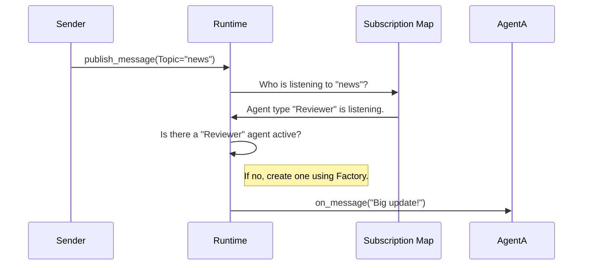

# Chapter 7: Agent Runtime (The Infrastructure)

In the previous chapter, [Messages and Events (The Protocol)](06_messages_and_events__the_protocol_.md), we learned about the "envelopes" (Typed Messages) that hold our data. We know *what* we are sending.

But **how** does the message actually get from Agent A to Agent B? 

Does Agent A need to know Agent B's IP address? Does Agent A need to know if Agent B is currently asleep or awake? If we have 100 agents, do they all need to be connected to each other?

In this chapter, we explore the **Agent Runtime**—the invisible "Operating System" that manages your agents, delivers messages, and connects everything together.

## The Problem: The Tangled Web

Imagine you are building a smart home system. You have a **LightSwitchAgent** and a **BulbAgent**.

**Without a Runtime (Tight Coupling):**
The Switch needs to import the Bulb's code directly.
```python
# Bad: The switch must know exactly who the bulb is
class Switch:
    def flip(self):
        bulb_agent.turn_on() 
```
If you move the Bulb to a different server, or if you want to add a second Bulb, you have to rewrite the Switch's code. This creates a "Spaghetti Code" mess.

## The Solution: The Phone Network

The **Agent Runtime** acts like a cell phone network. 
1.  **Addressing:** You dial a number (Agent ID), not a specific wire.
2.  **Delivery:** The network routes the call. You don't care which cell tower manages the connection.
3.  **Lifecycle:** If the person you are calling is asleep, the phone rings to wake them up.

In AutoGen, agents talk to the **Runtime**, and the Runtime talks to other agents.

## Core Concept 1: The AgentId

Before the Runtime can deliver mail, everyone needs an address. In AutoGen, this is the `AgentId`.

```python
from autogen_core import AgentId

# An address consists of a 'type' and a unique 'key'
# Analogy: Type="CustomerSupport", Key="Ticket-123"
coder_id = AgentId(type="coder", key="primary")
user_id = AgentId(type="user", key="console")
```

The `type` defines what *kind* of agent it is (e.g., "Coder").
The `key` distinguishes specific instances (e.g., "Coder for Alice" vs "Coder for Bob").

## Core Concept 2: Registration (The Factory)

The Runtime is smart. It doesn't keep all agents in memory (RAM) all the time. Instead, you give the Runtime a recipe (a **Factory**) for how to create an agent *if it's needed*.

This is called **Lazy Loading**.

```python
from autogen_core import SingleThreadedAgentRuntime

# 1. Create the infrastructure
runtime = SingleThreadedAgentRuntime()

# 2. Register the recipe
# "If anyone asks for a 'coder', run this function to make one."
await runtime.register_factory(
    type="coder",
    agent_factory=lambda: MyCoderAgent() 
)
```

**Why is this cool?**
You can register 10,000 different agent types. If you never send a message to them, they take up zero memory. They only exist when the phone rings.

## Core Concept 3: Sending a Message

Now, let's use the infrastructure to send a message. Notice that the sender doesn't touch the recipient agent directly.

```python
from autogen_core import TopicId
from autogen_agentchat.messages import TextMessage

# Send a direct message
await runtime.send_message(
    message=TextMessage(content="Write some code", source="user"),
    recipient=AgentId(type="coder", key="primary"),
    sender=AgentId(type="user", key="console")
)
```

The Runtime receives this, looks up "coder/primary", creates it (if it doesn't exist), and hands over the message.

## Core Concept 4: Pub/Sub (Broadcasting)

Sometimes, you don't want to call one person. You want to make an announcement on the radio. This is the **Publish-Subscribe (Pub/Sub)** model.

*   **Publisher:** Sends a message to a "Topic".
*   **Subscriber:** Listens to a "Topic".

### 1. Subscribing
First, an agent (or the system) tells the Runtime: "I want to hear about news."

```python
from autogen_core import Subscription, TypeSubscription, TopicId

# Subscribe all "Reviewer" agents to the "news" topic
sub = Subscription(
    id="sub1", 
    map=TypeSubscription(topic_type="news", agent_type="reviewer")
)

await runtime.add_subscription(sub)
```

### 2. Publishing
Now, anyone can publish to that topic.

```python
# Broadcast a message
await runtime.publish_message(
    message=TextMessage(content="Big update!", source="admin"),
    topic_id=TopicId(type="news", source="daily_briefing")
)
```

**The Result:** Every agent listening to "news" wakes up and processes the message. The sender has no idea who (or how many agents) listened.

## Under the Hood: How Routing Works

What happens inside the Runtime when you call `publish_message`? 

### The Workflow



### Internal Implementation (Python)

In `autogen_core/_agent_runtime.py`, the `publish_message` function acts as the switchboard operator.

```python
# Simplified logic from AgentRuntime
async def publish_message(self, message, topic_id, ...):
    # 1. Find all subscriptions that match this topic
    matched_subs = self._match_subscriptions(topic_id)
    
    # 2. Loop through every subscriber
    for agent_id in matched_subs:
        # 3. Get (or create) the agent instance
        agent = await self.try_get_underlying_agent_instance(agent_id)
        
        # 4. Deliver the message
        await agent.on_message(message, ...)
```

### Internal Implementation (.NET / C#)

The concept is identical in C#. In `InProcessRuntime.cs`, the logic handles the delivery loop.

```csharp
// Simplified from InProcessRuntime.cs
private async ValueTask PublishMessageServicer(MessageEnvelope envelope, ...)
{
    // 1. Check who is subscribed
    foreach (var sub in this.subscriptions.Values.Where(s => s.Matches(envelope.Topic)))
    {
        // 2. Map the topic to a specific Agent ID
        AgentId agentId = sub.MapToAgent(envelope.Topic);
        
        // 3. Ensure the agent exists (Lazy Loading)
        IHostableAgent agent = await this.EnsureAgentAsync(agentId);
        
        // 4. Deliver
        await agent.OnMessageAsync(envelope.Message, ...);
    }
}
```

## Distributed Systems (The Magic)

So far, we assumed everything is running on one computer (`InProcessRuntime` or `SingleThreadedAgentRuntime`).

But the `AgentRuntime` is designed as a **Protocol** (an interface). This means the implementation can change without breaking your agent code.

You can swap the "In-Process" runtime for a "gRPC" runtime (Networked).

*   **Worker A (Server 1):** Hosting the "Coder" agent.
*   **Worker B (Server 2):** Hosting the "Reviewer" agent.
*   **Gateway:** The central hub.

When Worker A publishes a message, it converts it to **Protobuf** (a binary format seen in `agent_worker.proto`), sends it over the network to the Gateway, which forwards it to Worker B.

Your Python code? It looks **exactly the same**. You just changed the Runtime configuration. This is the power of the Infrastructure abstraction.

## Summary

In this chapter, we learned:
1.  The **Agent Runtime** is the operating system that connects agents.
2.  It decouples senders from receivers using **Agent IDs** and **Topics**.
3.  **Lazy Loading** (via Factories) ensures agents only exist when needed.
4.  **Pub/Sub** allows for broadcasting events to many agents at once.
5.  This architecture allows agents to eventually run on **Distributed Systems** across different computers.

We have now completed the core tour of AutoGen!

*   [Ch1: Agents](01_agents__the_actors_.md) - The Actors
*   [Ch2: Models](02_model_clients__the_brains_.md) - The Brains
*   [Ch3: Code Execution](03_code_execution__the_hands_.md) - The Hands
*   [Ch4: Teams](04_teams_and_group_chats__the_orchestration_.md) - The Orchestration
*   [Ch5: Termination](05_termination_conditions__the_stop_button_.md) - The Stop Button
*   [Ch6: Messages](06_messages_and_events__the_protocol_.md) - The Protocol
*   **Ch7: Runtime** - The Infrastructure

You now possess all the building blocks to create intelligent, autonomous, and scalable AI systems. Happy coding!

---

Generated by [Code IQ](https://github.com/adityasoni99/Code-IQ)