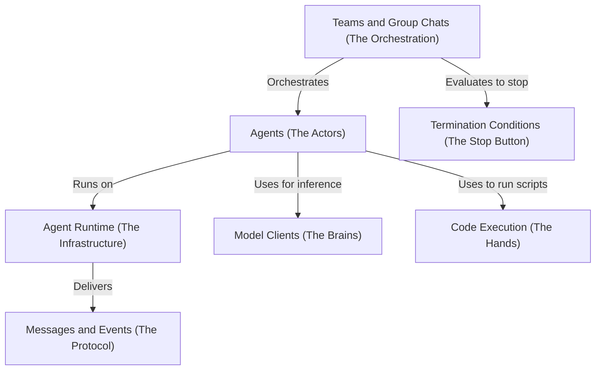

# Tutorial: autogen

**AutoGen** is a framework for building multi-agent AI systems where *Agents* act as autonomous units that can converse, execute code, and interact with LLMs. These agents are organized into *Teams* to collaborate on complex workflows, communicating via a structured *Agent Runtime* that handles message delivery and state management. The system supports modular components like *Model Clients* for swapping AI backends, *Code Executors* for running generated scripts, and *Termination Conditions* to control when a task is complete.

**Source Repository:** [https://github.com/microsoft/autogen](https://github.com/microsoft/autogen)

## Chapters

1. [Agents (The Actors)](01_agents__the_actors_.md)
2. [Model Clients (The Brains)](02_model_clients__the_brains_.md)
3. [Code Execution (The Hands)](03_code_execution__the_hands_.md)
4. [Teams and Group Chats (The Orchestration)](04_teams_and_group_chats__the_orchestration_.md)
5. [Termination Conditions (The Stop Button)](05_termination_conditions__the_stop_button_.md)
6. [Messages and Events (The Protocol)](06_messages_and_events__the_protocol_.md)
7. [Agent Runtime (The Infrastructure)](07_agent_runtime__the_infrastructure_.md)

---

Generated by [Code IQ](https://github.com/adityasoni99/Code-IQ)