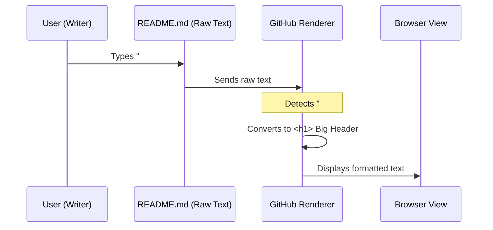

# Chapter 1: Update README.md

Welcome to the **Awesome Generative AI Guide**! If you are new to open-source projects, you are in the right place. We are going to build this guide step-by-step.

### The "Front Door" of Your Project

Imagine you are opening a new coffee shop. The **README.md** file is like your shop's **front window and welcome mat**. It tells passersby:
1.  What is this place?
2.  What is new on the menu?
3.  Where can I find specific items?

If your sign says "Grand Opening 2023" but it is currently **2025**, customers might think you are closed!

**The Goal**: In this chapter, we will update our "front door" to announce the **State of AI 2025**, and point visitors to two exciting new topics: **Agentic Search** and **AI Evaluation**.

---

### Step 1: The Headline Update

First, we need to make sure everyone knows this guide is current. We will update the main title and the introduction to reflect the new year.

**Edit the `README.md` file:**

```markdown
# Awesome Generative AI Guide 

## 🚀 State of AI 2025 Report

> The landscape of AI is shifting from Chatbots to Agents. 
> This year, we focus on autonomous search and rigorous evaluation.
```

**What happened here?**
*   The `#` symbol creates a huge main title.
*   The `##` symbol creates a subtitle.
*   The `>` symbol creates a "block quote," making the text look like a highlighted note.

---

### Step 2: Adding Announcements

Next, let's add a table to the "Announcements" or "Explore" section. This gives users a quick summary of what has changed recently. We want to highlight **Agentic Search** (AI that browses the web for you) and **AI Evaluation** (grading how smart the AI is).

**Add this table to `README.md`:**

```markdown
### 📅 Latest Announcements

| Date       | Topic | Description |
|------------|-------|-------------|
| Jan 2025   | **Agentic Search** | AI agents that autonomously browse and synthesize web data. |
| Jan 2025   | **AI Evaluation** | New benchmarks to test reasoning and multimodal skills. |
```

**Explanation:**
*   Markdown tables are built using pipes `|` to separate columns.
*   The dashes `------------` tell GitHub that the line above is the header.
*   **Bold** text is made by wrapping words in double asterisks: `**text**`.

---

### Step 3: Linking to Detailed Content

We have a massive list of research papers regarding AI Evaluation (like the file provided in the context: `research_updates/ai_evaluation_2025_table.md`).

**Do not** paste that whole list into the main README! It would be like dumping your entire inventory on the welcome mat. Instead, we create a **Link**.

**Add this to the "Contents" section:**

```markdown
## 📂 2025 Research Tracks

*   [🤖 Agentic Search](research_updates/agentic_search.md)
*   [⭐ AI Evaluation 2025 Papers](research_updates/ai_evaluation_2025_table.md)
```

**How it works:**
*   The text inside `[ ]` is what the user sees (the blue clickable text).
*   The text inside `( )` is the **path** to the file.
*   When a user clicks "AI Evaluation 2025 Papers", they are taken to the detailed list we saw in the context.

---

### Under the Hood: How Markdown Works

You might wonder, "I just typed plain text with some symbols. How does it turn into a pretty web page?"

Think of the **README.md** file as a recipe card, and **GitHub** as the chef. You write the instructions, and GitHub "renders" (cooks) the visual result.

Here is a simple flow of what happens when you save your file:



1.  **Raw Text**: You write simple characters (`#`, `*`, `|`).
2.  **Parsing**: GitHub reads the file character by character.
3.  **Rendering**: When it sees `[Name](file)`, it knows "Aha! This is a link," and generates the HTML code `<a href="file">Name</a>`.

### Conclusion

Congratulations! You have successfully updated the "front door" of the project. 
1.  We updated the **Header** for 2025.
2.  We added a **Table** for quick news.
3.  We created a **Link** to keep our main page clean while pointing to detailed data.

Now that our main sign is updated, we need to actually build the content we just promised. Let's create the folder structure for the new papers.

[Next Chapter: Create research_updates/2025_papers/README.md](02_create_research_updates_2025_papers_readme_md.md)

---

Generated by [Code IQ](https://github.com/adityasoni99/Code-IQ)