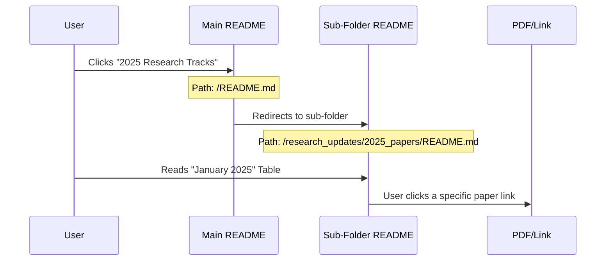

# Chapter 2: Create research_updates/2025_papers/README.md

Welcome back! In the previous chapter, [Update README.md](01_update_readme_md.md), we renovated the "front door" of our project. We told visitors that 2025 is here.

Now, we need to build the "room" where we keep the new 2025 content.

### Why do we need this file?

Imagine you have a backpack (your project). If you throw every single piece of paper into the main pocket, it becomes a mess. You can't find anything!

Instead, efficient organizers use **sub-folders**.
*   **Main README**: The Lobby. "Go here for 2025 papers."
*   **Sub-README (This Chapter)**: The Hallway for 2025. "Here are the papers for January, February, etc."

**The Goal**: We will create an index file inside a new folder. This file will list papers chronologically so users can easily see what happened in **January** and **February 2025**.

---

### Step 1: Create the Folder and File

In open-source projects, organization is key. We are going to create a nested structure.

1.  Create a folder named `research_updates`.
2.  Inside that, create a folder named `2025_papers`.
3.  Inside that, create a file named `README.md`.

**Path**: `research_updates/2025_papers/README.md`

> **Note**: In many code editors (like VS Code), you can just right-click and select "New File", then type the whole path with slashes to create folders automatically.

---

### Step 2: The Navigation Header

When users dive deep into folders, they sometimes get lost. It is polite to add a "Back" button.

**Add this to the top of your new `README.md`:**

```markdown
# 📂 2025 Research Papers Archive

[← Back to Main Page](../../README.md)

> A monthly archive of significant Generative AI research papers released in 2025.
```

**What is `../../`?**
*   `..` means "go up one folder".
*   `../../` means "go up two folders" (out of `2025_papers`, then out of `research_updates`) to get back to the root where the main `README.md` lives.

---

### Step 3: The February Updates

Now, let's add the content. Based on our research data, we have a significant survey on "Agentic RAG" from February.

**Add the February section:**

```markdown
## ❄️ February 2025

| Title | Tags | Description |
|-------|------|-------------|
| **Agentic RAG Survey** | `Agentic RAG` | Explores integrating autonomous AI agents into RAG pipelines using reflection and planning. |
```

**Explanation:**
*   We use a standard Markdown table.
*   We use "Backticks" (the `` ` `` symbol) around `Agentic RAG` to make it look like a code snippet or a tag. This helps categorize the paper visually.

---

### Step 4: The January Updates

Next, let's add the January papers. We have several exciting ones like "VideoRAG" and "Long Context vs RAG".

**Add the January section below the February section:**

```markdown
## ☃️ January 2025

| Title | Tags | Description |
|-------|------|-------------|
| **VideoRAG** | `Multimodal` | A framework to retrieve video content based on queries using Large Video Language Models. |
| **Long Context vs RAG** | `Evaluation` | Compares extending context windows vs using retrieval. Finds RAG better for general queries. |
```

**Why this order?**
Usually, in "News" or "Updates" files, we put the **newest** items at the top (Reverse Chronological Order). This way, frequent visitors see the fresh stuff first without scrolling.

---

### Under the Hood: Directory Navigation

How does the browser or GitHub know where to go when you click links? It follows a path, much like a treasure map.

Here is what happens when a user navigates from the Home page to a specific month's paper:



1.  **Main**: The user starts at the root.
2.  **Sub**: The browser looks into the folder `research_updates`, then `2025_papers`, and looks for a `README.md` (which is the default file shown in any folder on GitHub).
3.  **Paper**: From there, the user finds the specific content.

### Conclusion

You have now created a structured archive!
1.  We learned about **Nested Folders** to keep projects clean.
2.  We used **Relative Links** (`../../`) to create a navigation system.
3.  We organized data **Chronologically** for better readability.

Now that we have our monthly updates sorted, we need to update our specific "Topic" lists. We have a file dedicated entirely to **Survey Papers** (papers that summarize other papers), and it needs to know about that new February Agentic RAG survey.

[Next Chapter: Update research_updates/survey_papers.md](03_update_research_updates_survey_papers_md.md)

---

Generated by [Code IQ](https://github.com/adityasoni99/Code-IQ)