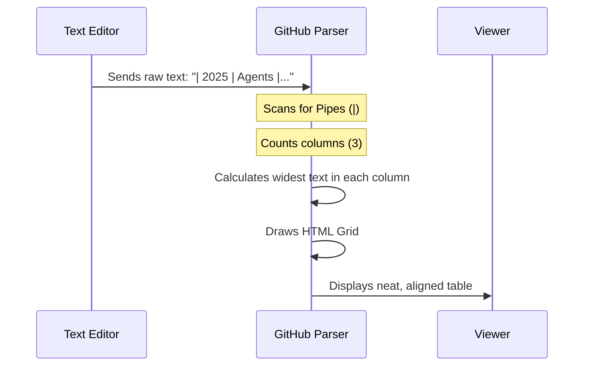

# Chapter 3: Update research_updates/survey_papers.md

Welcome to the final chapter of this tutorial series! 

In the previous chapter, [Create research_updates/2025_papers/README.md](02_create_research_updates_2025_papers_readme_md.md), we built a "Time Machine" — a way to look at research chronologically (January, February, etc.).

Now, we need to build the **"Topic Shelf."**

### The Motivation: The Newsstand vs. The Textbook

Think of a library:
1.  **The Newsstand (Chapter 2)**: This has the latest magazines. You go here to see "What just happened this month?"
2.  **The Textbook Section (This Chapter)**: This is organized by **Subject**. If you want to learn everything about "Biology," you don't check a magazine from 2021; you grab a comprehensive textbook or **Survey Paper**.

**What is a Survey Paper?**
A survey paper summarizes hundreds of other papers. It gives you a "Bird's Eye View" of a specific field.

**The Goal**: We will update our list of survey papers to include the hottest topics of late 2024 and 2025: **Scientific LLMs**, **Autonomous Research**, and **Small Language Models**.

---

### Step 1: Open the Survey List

First, locate the existing file `research_updates/survey_papers.md`. 

This file uses a **Markdown Table** to keep things organized. We are going to append new rows to this table.

**The existing table likely looks like this:**

```markdown
| Date | Category | Paper Title |
|------|----------|-------------|
| 2023 | RAG      | Retrieval-Augmented Generation for... |
```

---

### Step 2: Add Scientific LLMs

Scientific discovery is a major theme for 2025. We want to add a paper that explains how AI is acting as a laboratory assistant.

**Add this row to the bottom of the table:**

```markdown
| Late 2024 | **Science** | [Scientific LLMs Survey](link_to_paper) <br> *A review of LLMs in biology and chemistry.* |
```

**Breaking it down:**
*   `|` starts and ends the row.
*   `**Science**` makes the category bold.
*   `<br>` is a special HTML tag. It forces a **line break** inside a table cell (since pressing "Enter" would break the table structure).

---

### Step 3: Add Autonomous Research Agents

Next, let's add a survey about AI that can conduct its own research. This is often called "Agentic Research."

**Add this row below the previous one:**

```markdown
| 2025 | **Agents** | [Autonomous Research Agents](link_to_paper) <br> *Survey on agents that plan, code, and execute experiments.* |
```

**Why separate them?**
Even though this is also "Science," the category here is **Agents**. Categorizing by *technology* (Agents) vs *domain* (Science) helps users find exactly what they need.

---

### Step 4: Add Small Language Models (SLMs)

Finally, not everyone has a supercomputer. "Small Language Models" (models you can run on your laptop) are huge right now.

**Add this final row:**

```markdown
| 2025 | **SLMs** | [Small Language Models Survey](link_to_paper) <br> *Techniques for training efficient, high-performance small models.* |
```

---

### Under the Hood: Rendering Tables

Tables in Markdown can look messy in your code editor, but they look beautiful on the website. How does GitHub know how to line everything up?

1.  **The Pipe (`|`)**: Acts as a wall between columns.
2.  **The Dash (`-`)**: In the header (e.g., `|---|`), it defines the alignment.
3.  **The Cell Content**: GitHub squeezes or expands the column width to fit the text.

Here is the process:



### Tips for Clean Tables

When writing raw Markdown tables, your text doesn't *have* to align perfectly in your editor for it to work, but it helps readability.

**Messy but Valid:**
```markdown
| Date | Title |
|---|---|
| 2025 | A very long title about AI |
```

**Clean and Readable:**
```markdown
| Date | Title                      |
|------|----------------------------|
| 2025 | A very long title about AI |
```

Both produce the **exact same result** on the screen!

---

### Conclusion

Congratulations! You have completed the **Awesome Generative AI Guide** tutorial series.

Let's recap what you have achieved:
1.  **Chapter 1**: You updated the [README.md](01_update_readme_md.md), the "Front Door" of the project.
2.  **Chapter 2**: You created a [Time-Based Archive](02_create_research_updates_2025_papers_readme_md.md) using nested folders.
3.  **Chapter 3**: You updated a **Topic-Based List** by mastering Markdown tables.

You now possess the skills to maintain a documentation site, organize complex information, and contribute to open-source projects.

**Happy Coding and Researching!** 🚀

---

Generated by [Code IQ](https://github.com/adityasoni99/Code-IQ)