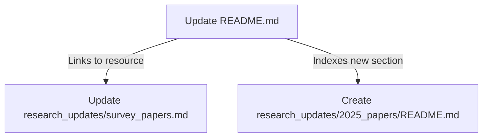

# Tutorial: awesome-generative-ai-guide

This project serves as a comprehensive **Generative AI** resource hub, offering curated lists of **research papers**, **free courses**, and **interview preparation** materials. It tracks the rapid evolution of the field through monthly updates, specialized sections for **AI evaluation** and **RAG**, and a central guide to the **State of AI 2025**.

**Source Repository:** [https://github.com/aishwaryanr/awesome-generative-ai-guide](https://github.com/aishwaryanr/awesome-generative-ai-guide)

## Chapters

1. [Update README.md](01_update_readme_md.md)
2. [Create research_updates/2025_papers/README.md](02_create_research_updates_2025_papers_readme_md.md)
3. [Update research_updates/survey_papers.md](03_update_research_updates_survey_papers_md.md)

---

Generated by [Code IQ](https://github.com/adityasoni99/Code-IQ)