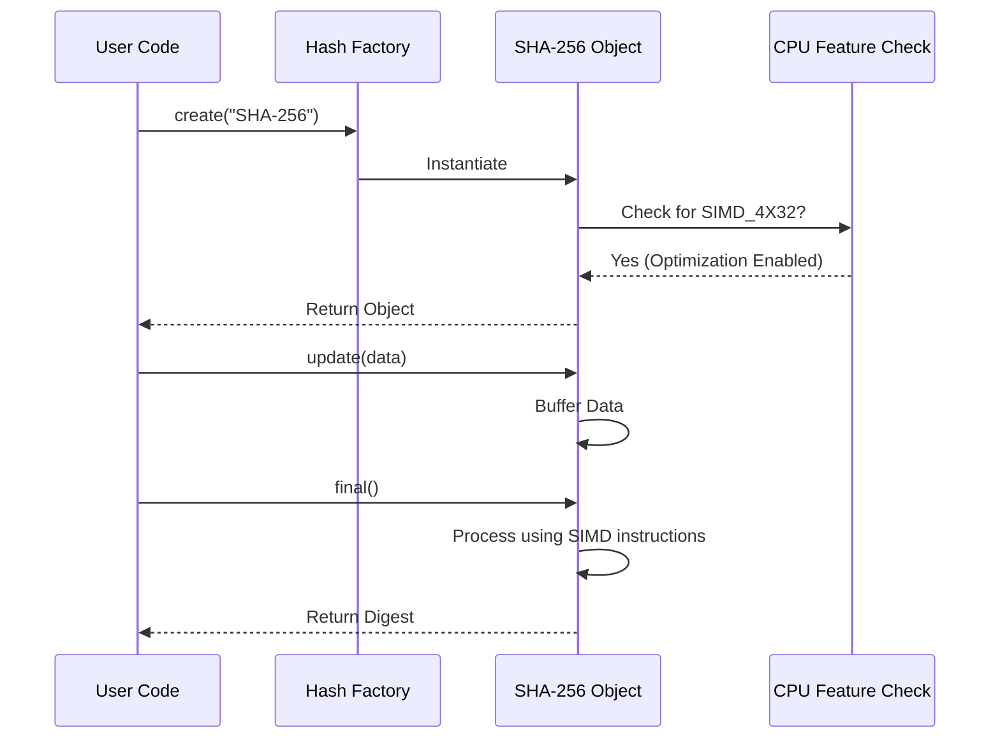

# Chapter 1: SHA-2 (Hash Function)

Welcome to the first chapter of your journey with **Botan**! We are starting with one of the most fundamental building blocks of cryptography: the **Hash Function**.

## Motivation: The Digital Fingerprint

Imagine you are sending a secret letter to a friend. You want to ensure that no one intercepted the letter and changed a few words while it was in transit. How can your friend verify that the message they received is exactly what you wrote?

In the digital world, we solve this with a **Hash Function**.

Think of a hash function as a **digital fingerprint machine**. You feed it any amount of data (a password, a picture, or a whole book), and it churns out a fixed-size string of characters called a **digest** (or hash).

If you change even a single comma in the input, the output hash changes completely.

### The Use Case
We want to verify the integrity of a message string: `"Botan is awesome!"`. We will use **SHA-256** (a variant of SHA-2) to generate its fingerprint.

## Key Concepts

Before we code, let's understand the two main players:

1.  **SHA-2 (Secure Hash Algorithm 2):** A standard family of hash functions. The most common version is **SHA-256**, which produces a 256-bit fingerprint.
2.  **SIMD (Single Instruction, Multiple Data):** A CPU feature that allows the processor to perform the same operation on multiple pieces of data at once. Botan uses this to make hashing incredibly fast.

## How to Use SHA-2 in Botan

Using SHA-2 in Botan is straightforward. We create a hash object, feed it data, and ask for the result.

### Step 1: Create the Hash Object

First, we need to ask Botan's factory to create a specific hash function instance for us.

```cpp
#include <botan/hash.h>
#include <iostream>

int main() {
   // Create an instance of SHA-256
   // 'auto' here will be std::unique_ptr<Botan::HashFunction>
   auto hash = Botan::HashFunction::create("SHA-256");

   std::cout << "Name: " << hash->name() << std::endl;
   return 0;
}
```
*Explanation:* `HashFunction::create` is a factory method. We pass the string name "SHA-256". If Botan supports it (which it definitely does), it returns a pointer to the hash object.

### Step 2: Update with Data

Now that we have the machine, let's feed it our message.

```cpp
   std::string message = "Botan is awesome!";

   // Feed the data into the hash function
   // We cast to uint8_t because crypto works on raw bytes
   hash->update((const uint8_t*)message.data(), message.size());
```
*Explanation:* The `update` method is like a funnel. You can call it once with all your data, or multiple times with chunks of data (e.g., reading a file line by line). It accumulates the data internally.

### Step 3: Finalize and Get Digest

Finally, we press the "finish" button to get our fingerprint.

```cpp
   // Create a container for the output (32 bytes for SHA-256)
   std::vector<uint8_t> digest(hash->output_length());

   // Finalize calculation and fill the vector
   hash->final(digest.data());

   // 'digest' now holds the unique fingerprint!
```
*Explanation:* `final` does two things: it performs the last mathematical calculations to seal the hash, and it writes the result into your provided buffer.

## Under the Hood: The SIMD Optimization

You might wonder, "How does Botan calculate this so quickly?"

SHA-256 works on 32-bit chunks of data. Standard C++ code processes these chunks one by one. However, modern CPUs have a superpower called **SIMD** (Single Instruction, Multiple Data).

Imagine moving boxes.
*   **Standard CPU:** Carries one box at a time.
*   **SIMD:** Uses a forklift to pick up 4 boxes at once.

Botan's implementation of SHA-2 specifically looks for **SIMD_4X32**. This means it tries to process 4 blocks of 32-bit data in parallel.

### Internal Workflow

Here is what happens when you create and use a SHA-2 object in Botan:



### Internal Implementation Code

Deep inside the library, Botan decides which "provider" (implementation strategy) to use. It prefers the SIMD provider if the hardware supports it.

Here is a simplified view of how that logic looks:

```cpp
// Simplified internal logic in botan/source/lib/hash/sha2_32/sha2_32.cpp

void SHA_256::compress_n(const uint8_t input[], size_t blocks) {
   // Check if the CPU supports the fancy 4x32 instructions
   if(Botan::CPUID::has_simd_32()) {
      // Use the super-fast SIMD implementation
      sha256_compress_4x32(m_digest, input, blocks);
   } 
   else {
      // Fallback to the standard (slower) generic implementation
      sha256_compress_generic(m_digest, input, blocks);
   }
}
```
*Explanation:* 
1.  **`compress_n`**: This is the internal function responsible for crunching the numbers.
2.  **`CPUID`**: Botan asks the CPU at runtime what features it has.
3.  **`has_simd_32()`**: If the CPU supports parallel 32-bit operations, Botan takes the "fast path."
4.  **Fallback**: If you are running on a very old computer, it safely defaults to the standard method.

This ensures that your application is always running at maximum speed for the specific hardware it is on, without you having to change your code!

## Summary

In this chapter, we learned:
1.  **Hash Functions** act as unique digital fingerprints for data.
2.  **SHA-256** is a standard, secure way to create these fingerprints.
3.  **Botan** automatically optimizes performance using **SIMD instructions** (like `SIMD_4X32`) to process data blocks in parallel.

Now that you know how to verify data integrity, let's learn how to keep data secret using encryption.

[Next Chapter: ChaCha (Stream Cipher)](02_chacha__stream_cipher_.md)

---

Generated by [Code IQ](https://github.com/adityasoni99/Code-IQ)