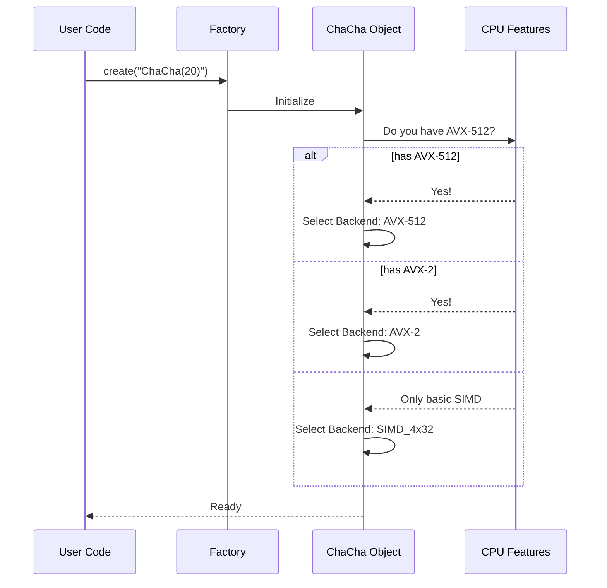

# Chapter 2: ChaCha (Stream Cipher)

Welcome back! In the previous chapter, [SHA-2 (Hash Function)](01_sha_2__hash_function_.md), we learned how to create a digital fingerprint to ensure our messages aren't tampered with.

But there is a missing piece. While a hash proves a message hasn't *changed*, it doesn't stop people from *reading* it. If you send a secret letter, you don't just want to know it arrived intact; you want to ensure the mail carrier can't read it.

## Motivation: The need for Speed and Secrecy

We want to send the message `"Meeting at midnight"`. We need to scramble this text so it looks like complete garbage to anyone looking at the network, but our friend can unscramble it back to the original text.

To do this, we use a **Stream Cipher**.

While there are many ways to encrypt data, **ChaCha** is a modern favorite. It is incredibly fast, very secure, and works excellently on mobile phones and computers alike.

### The Use Case
We will take a plain text message, encrypt it into unreadable bytes using a secret key, and then decrypt it back.

## Key Concepts

1.  **Stream Cipher:** Imagine you have a long tape of completely random letters (the **Keystream**). You lay this tape over your secret letter and combine them letter-by-letter. The result is scrambled. To read it, your friend needs the exact same tape of random letters to reverse the process.
2.  **ChaCha:** This is the machine that generates that "random tape." It takes a short **Key** and an **IV** (Initialization Vector) and expands them into an endless stream of pseudo-random noise to mix with your data.
3.  **Runtime Dispatch:** This is a fancy term for "Choosing the best tool for the job." ChaCha is computationally heavy. Botan checks your computer's hardware *while the program is running* to see if it can use super-fast instructions (like AVX2 or AVX512) to generate that noise.

## How to Use ChaCha in Botan

Using a stream cipher involves three steps: getting the cipher, setting the secret key, and processing the data.

### Step 1: Create the Cipher Object

Just like with the Hash function, we ask the factory for an instance of the algorithm.

```cpp
#include <botan/stream_cipher.h>
#include <botan/hex.h> /* for printing */

int main() {
   // Create an instance of ChaCha with 20 rounds (standard)
   auto cipher = Botan::StreamCipher::create("ChaCha(20)");
   
   // Check if it worked
   if(!cipher) return 1;
}
```
*Explanation:* We request "ChaCha(20)". The number 20 refers to how many times the internal engine "mixes" the numbers to ensure randomness. 20 is the industry standard for high security.

### Step 2: Set the Key and IV

A cipher needs a secret password (Key) and a unique starting number (IV or Nonce).

```cpp
   // Keys are usually 32 bytes (256 bits)
   std::vector<uint8_t> key = { /* ... 32 random bytes ... */ };
   
   // IVs (Initialization Vectors) allow you to reuse the Key safely
   std::vector<uint8_t> iv = { /* ... 8 or 12 random bytes ... */ };

   // Load them into the cipher
   cipher->set_key(key);
   cipher->set_iv(iv.data(), iv.size());
```
*Explanation:* `set_key` prepares the mathematical engine. `set_iv` ensures that even if you encrypt the same message twice with the same key, the output looks different (because you would change the IV).

### Step 3: Encrypt the Data

Stream ciphers usually work "in-place," meaning they overwrite your plaintext buffer with the ciphertext.

```cpp
   std::string msg = "Meeting at midnight";
   std::vector<uint8_t> buffer(msg.begin(), msg.end());

   // Encrypt! This modifies 'buffer' directly.
   cipher->cipher(buffer.data(), buffer.size());

   // 'buffer' now contains scrambled, unreadable bytes
```
*Explanation:* The `cipher` method generates the "random noise" we talked about earlier and combines it with your message. If you ran this exact same code again on the *encrypted* buffer, it would decrypt it back to "Meeting at midnight"!

## Under the Hood: Runtime CPU Dispatching

ChaCha involves a lot of addition, rotation, and XOR operations. Doing this one byte at a time is slow.

Modern CPUs have **SIMD** (Single Instruction, Multiple Data) features like **AVX2** or **AVX512**. These allow the CPU to process massive chunks of data (like 512 bits) in a single clock cycle.

Botan's ChaCha implementation is smart. It doesn't just contain one version of the code; it contains several versions optimized for different chips.

### The Decision Process

When you create a ChaCha object, Botan performs a quick interview with your CPU.



### Internal Implementation Code

This logic ensures that if you run your program on a brand-new server, it uses the blazing-fast AVX512 instructions. If you run the *exact same program* on an older laptop, it gracefully falls back to AVX2 or basic SIMD without crashing.

Here is a simplified look at how Botan routes the work internally:

```cpp
// Simplified from botan/source/lib/stream/chacha/chacha.cpp

void ChaCha::cipher(uint8_t bytes[], size_t length) {
   
   // Ideally, we want to use the strongest hardware acceleration available
   if(Botan::CPUID::has_avx512()) {
      // Process 16 blocks at a time (super fast!)
      chacha_avx512(bytes, length, m_state);
   }
   else if(Botan::CPUID::has_avx2()) {
      // Process 8 blocks at a time (very fast!)
      chacha_avx2(bytes, length, m_state);
   }
   else {
       // Fallback to standard 4-block SIMD
       chacha_simd32(bytes, length, m_state);
   }
}
```

*Explanation:* 
1.  **`CPUID`**: This is Botan's way of asking the hardware "Who are you?".
2.  **`chacha_avx512`**: This function is written using specific CPU instructions that handle huge amounts of data in parallel.
3.  **The Benefit**: You get the maximum possible speed for the machine you are currently using, automatically.

## Summary

In this chapter, we learned:
1.  **Stream Ciphers** like **ChaCha** encrypt data by mixing it with a stream of pseudo-random noise.
2.  To use it, we need a **Key** (secret) and an **IV** (unique starting point).
3.  **Botan** optimizes ChaCha by detecting your CPU features (like **AVX2** or **AVX512**) at runtime and choosing the fastest implementation available.

We have handled Integrity (SHA-2) and Confidentiality (ChaCha). But how do we safely store passwords? You shouldn't just hash them quickly!

[Next Chapter: Argon2 (Password Hashing)](03_argon2__password_hashing_.md)

---

Generated by [Code IQ](https://github.com/adityasoni99/Code-IQ)